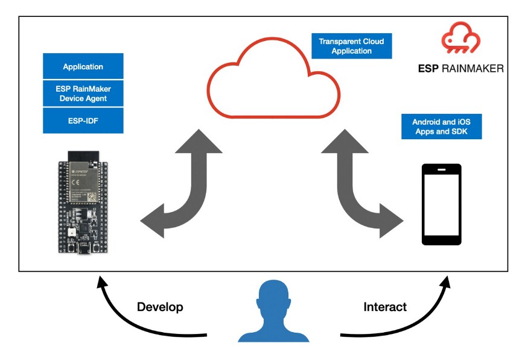
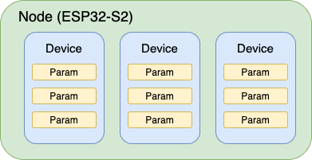
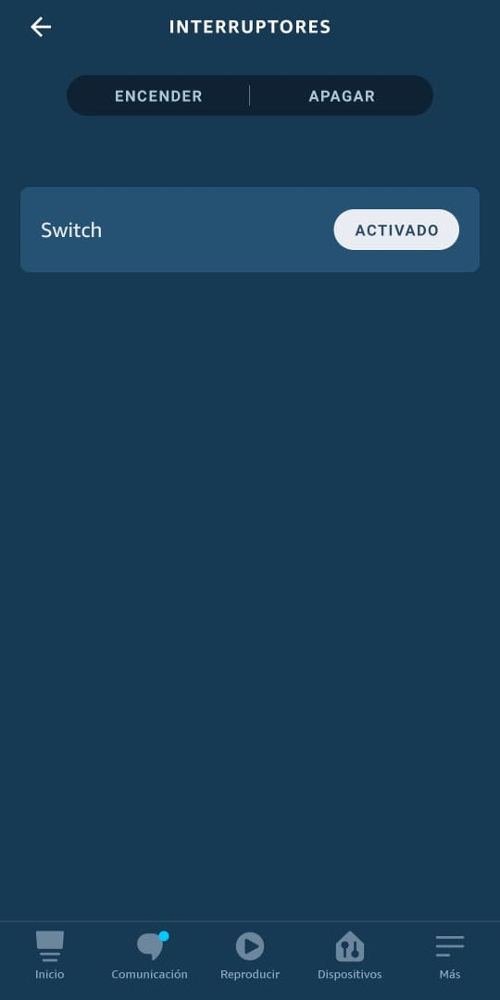
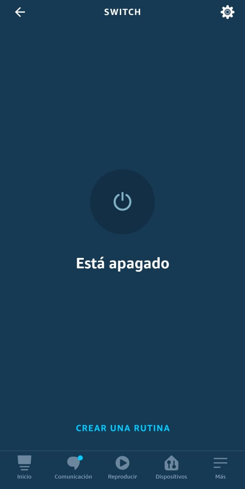
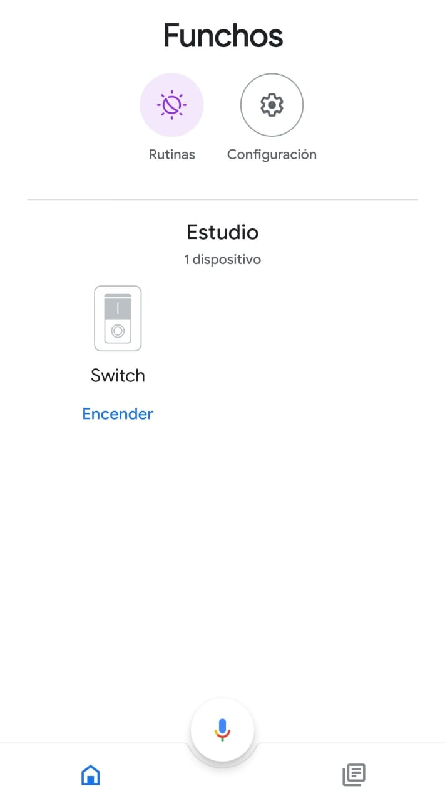
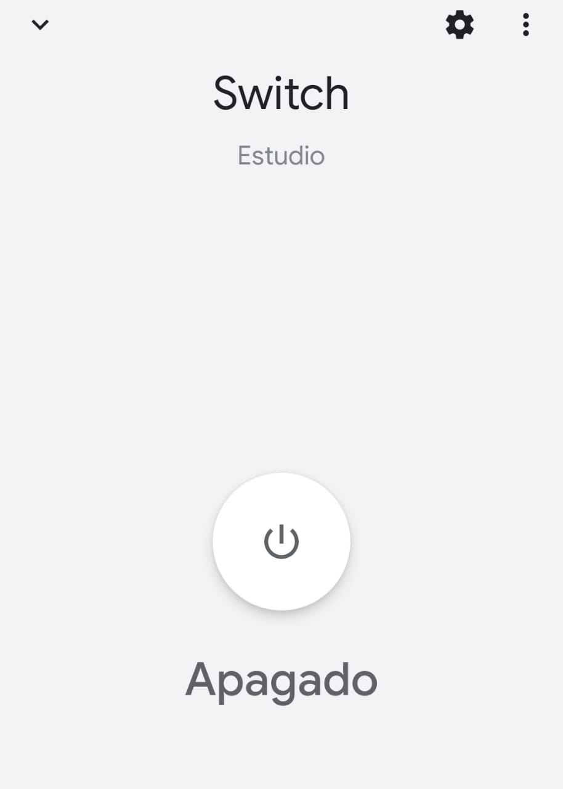

Anexo 1: rainmaker
=======================

.. warning:: ¿Para qué estudiar rainmaker?

   Vale la pena estudiar este framework del fabricante porque te permitirá 
   realizar ensayos rápidos o prototipos rápidos para probar en pequeños lotes
   una idea. SIN EMBARGO, el framework tiene en consideración todos los aspectos
   de producción que estudiamos en el curso.

   Vale la pena estudiarlo como un referente a la hora de que quieras hacer tu 
   propia arquitectura de aplicación IoT.

En este anexo te voy a dejar un framework construido sobre el ESP-IDF llamado 
`RainMaker <https://rainmaker.espressif.com/>`__. Este framework producido por Espressif 
te permitirá hacer aplicaciones IoT de manera rápida SIN tener que programar una 
aplicación móvil y sin tener que provisionar una infrastructure en la nube. SOLO te 
concentras en la programación del sistema embebido.

¿Qué viene incluido con RainMaker? 
------------------------------------

* Un SDK para programar el embebidos en C.
* Un SDK para programar clientes en python.
* Una aplicación móvil para Android y iOS LISTAS que se adaptan a cada aplicación 
  que hagas.
* Servicios en nube transparentes (listos para llevar) que utilizan un
  esquema serverless.

Ejercicio 1: ¿Cómo puedes comenzar?
--------------------------------------

Ya tienes todo lo que necesitas solo te falta descargar RainMaker y 
descargar la aplicación móvil en un celular.

Para Descargar RainMaker sigue estos pasos:

* En la carpeta donde tienes los proyectos del curso descarga 
  rainmaker:

    .. code-block: bash

        git clone --recursive https://github.com/espressif/esp-rainmaker.git

* Descarga la aplicación móvil de aquí:

    * `Android <https://play.google.com/store/apps/details?id=com.espressif.rainmaker>`__.
    * `iOS <https://apps.apple.com/app/esp-rainmaker/id1497491540>`__.

* Abre el proyecto switch y realiza las modificaciones según tu hardware. En mi caso 
  tengo el botón en el puerto 19 y su nivel activo es 0. Tengo el LED en el puerto 
  5 y el valor por defecto DEFAULT_POWER será false (que debes configurar en app_priv.h) 

  En app_driver.c :

  .. code-block:: c

    /* This is the button that is used for toggling the power */
    #define BUTTON_GPIO          19
    #define BUTTON_ACTIVE_LEVEL  0

    /* This is the GPIO on which the power will be set */
    #define OUTPUT_GPIO    5
    static bool g_power_state = DEFAULT_POWER;

  Nota que la línea ``#define BUTTON_GPIO  5`` era originalmente 
  ``#define BUTTON_GPIO CONFIG_EXAMPLE_BOARD_BUTTON_GPIO``. Por tanto, ya no podrás 
  configurar el puerto del botón utilizando menuconfig; sin embargo, lo hago así 
  porque el puerto del LED no está disponible para ser configurado por menuconfig y 
  si o si tendré que editar manualmente el archivo app_driver.c

* Ahora ejecuta menuconfig y modifica la zona horaria. Ingresa por 
  ``Component config``, ``ESP_RainMaker Common``, Default Timezone 
  y escribe ``America/Bogota``.

* Compila así (recuerda modificar tu puerto serial)

  .. code-block:: bash

    export ESPPPORT=/dev/TU_PUERTO_SERIAL
    idf.py set-target esp32
    idf.py erase_flash
    idf.py -b 921600 build flash monitor

  Nota: la opción ``set-target`` esp32 te permite seleccionar el microcontrolador 
  que utilizarás para probar. Ten presente que puedes usar también el esp32-s2 si 
  tuvieras esta tarjeta.

* Una vez la aplicación se ejecute, el ESP32 quedará en modo provisioning mediante 
  bluetooth low energy. Aquí vas a necesitar usar la aplicación móvil. Ten presente 
  que el esp32 puede quedarse un rato mostrando este mensaje: 
  ``W (1102) esp_claim: Generating the private key. This may take time.``. Finalmente, 
  debes ver algo similar a esto:

|

  .. image:: ../_static/qrProv.png
     :scale: 50%
     :align: center
     :alt: QR para provisionar

|

* Abre la aplicación móvil:

  * Crea una cuenta.
  * Add Device
  * Escanea el código QR. Si todo sale bien verás el mensaje ``Claiming un progress``
  * Ahora la aplicación te preguntará por la red WiFi a provisionar.
  * Si todo sale bien y tu dispositivo se conecta a Internet verás algo similar a esto:

    |
    
    .. image:: ../_static/rainMakerAppDevice.jpeg
      :alt: rainmaker device Browser
      :scale: 50%
      :align: center

    |

* Ahora puedes interactuar con el esp32 desde la aplicación móvil.
  Observa el reporte del esp32 en la terminal. Busca en la terminal 
  un mensaje relacionado con la sincronización del tiempo:

  .. code-block:: bash

    I (453732) esp_rmaker_time: SNTP Synchronised.
    I (453732) esp_rmaker_time: The current time is: Sun Mar 21 12:18:31 2021 -0500[>], DST: Yes.
    I (538702) esp_rmaker_param: Received params: {"Switch":{"Power":true}}
    I (538702) app_main: Received write request via : Cloud
    I (538702) app_main: Received value = true for Switch - Power
    I (538712) esp_rmaker_param: Reporting params: {"Switch":{"Power":true}}
    I (541882) esp_rmaker_param: Received params: {"Switch":{"Power":false}}

  Nota que la zona horaria corresponde a la nuestra: ``-0500[>],``.

Ejercicio 2: ¿Qué es rainmaker?
---------------------------------

En `este <https://medium.com/the-esp-journal/introducing-esp-rainmaker-8fa968bbb2de>`__ 
enlace puedes leer al respecto. La siguiente figura tomada del sitio anterior resumen 
un poco de qué se trata:

Ejercicio 3: mini-reto
------------------------

Luego de la lectura del ejercicio anterior, trata de resumir el flujo de desarrollo 
con rainmaker.

¿Si quieres controlar o leer externamente un actuador o sensor qué debes hacer?

Ejercicio 4: sobre el ejemplo switch
--------------------------------------------------

Revisa de nuevo los conceptos fundamentales de rainmaker en 
`este <https://rainmaker.espressif.com/docs/spec-concepts.html>`__ enlace.
En el ejemplo solo estamos usando un DEVICE, pero nota que un NODE podría tener 
varios DEVICES:

En el ejemplo switch, el device tiene dos parámetros ``standard``: nombre y power. Recuerda 
del ejercicio 2 que tu puedes definir tus propios parámetros. 

Además de devices con sus parámetros, a cada NODE le puedes asociar ``SERVICIOS``, por 
ejemplo OTA.

En `este <https://rainmaker.espressif.com/docs/firmware-dev.html>`__ enlace 
puedes estudiar cómo desarrollar tu propio programa usando rainmaker.

Ejercicio 5: comunicaciones entre el nodo y la nube
-----------------------------------------------------

En `este <https://rainmaker.espressif.com/docs/node-cloud-comm.html>`__ enlace puedes leer 
los detalles de comunicación entre el esp32 y la nube.

Ejercicio 6: user-node mapping
-------------------------------

¿Cómo se logra asociar un NODE a la aplicación móvil?

Analiza el siguiente `enlace <https://rainmaker.espressif.com/docs/user-node-mapping.html#user---node-mapping>`__.

Ejercicio 7: ¿Cómo se agreda un NODE a la nube
-------------------------------------------------

Se realiza mediante un proceso denominado claiming que puedes consultar 
`aquí <https://rainmaker.espressif.com/docs/claiming.html#claiming>`__. En particular, 
en el ejemplo de este anexo se utiliza la opción 
`Assisted Claiming <https://rainmaker.espressif.com/docs/claiming.html#assisted-claiming-esp32>`__.

Ejercicio 8: servicio de OTA
-------------------------------

Rainmaker permite acceder al dispositivo por medio de un 
`dashboard <https://dashboard.rainmaker.espressif.com/>`__ con el cual puedes hacer 
`OTA <https://rainmaker.espressif.com/docs/ota.html#ota-firmware-upgrades>`__. 
Ten presente que también puedes hacer OTA desde tu computador enviando la nueva 
imagen del programa a la nube de rainmaker.

Prueba el servicio de OTA con el dashboard así:

* Modifica el código (app_main.c) así:

.. code-block:: c

    /* Enable OTA */
    esp_rmaker_ota_config_t ota_config = {
        .server_cert = ESP_RMAKER_OTA_DEFAULT_SERVER_CERT,
    };
   // esp_rmaker_ota_enable(&ota_config, OTA_USING_PARAMS);
    esp_rmaker_ota_enable(&ota_config, OTA_USING_TOPICS);

* Realiza un build, flash and monitor para que el esp32 tenga 
  una nueva versión del firmware que soporte esta nueva modalidad de OTA.

* Realiza una pequeña modificación al código del proyecto de modo que puedas 
  verificar un nuevo comportamiento cuando hagas el OTA.

* Modifica la versión del proyecto en el CMakeLists.txt del proyecto:

  .. code-block:: bash 

      set(PROJECT_VER "1.1")

* Realiza únicamente un BUILD (ojo, no hagas flash) para generar la nueva 
  versión.

* Ingresa al `dashboard <https://dashboard.rainmaker.espressif.com/>`__. En 
  Firmware Images selecciona el botón Add Image. Asigna una Image Name cualquiera y
  un Type cualquiera. No tienes que llenar los campos de las sección Advanced. Ahora 
  selecciona la imagen (el ejecutable) que estará en la carpeta build del proyecto.

* Una vez el nuevo firmware sube a la nube correctamente selecciona Start OTA. 
  Ingresa un Job Name cualquiera, selecciona Nodes y escoge el node-id del nodo 
  que vas a actualizar. SELECCIONA Force Push para obligar a que la actualización 
  se haga de inmediato. Selecciona el botón Start OTA.

Ejercicio 9: servicio de OTA desde terminal
--------------------------------------------

También puedes hacer OTA desde la terminal utilizando la ``CLI`` de rainmaker.

Sigue estos pasos:

* Modifica el código (app_main.c) así:

.. code-block:: c

    /* Enable OTA */
    esp_rmaker_ota_config_t ota_config = {
        .server_cert = ESP_RMAKER_OTA_DEFAULT_SERVER_CERT,
    };
    esp_rmaker_ota_enable(&ota_config, OTA_USING_PARAMS);
   // esp_rmaker_ota_enable(&ota_config, OTA_USING_TOPICS);

* Realiza un build, flash and monitor para que el esp32 tenga 
  una nueva versión del firmware que soporte esta nueva modalidad de OTA.

* Realiza una pequeña modificación al código del proyecto de modo que puedas 
  verificar un nuevo comportamiento cuando hagas el OTA.

* Modifica la versión del proyecto en el CMakeLists.txt del proyecto:

  .. code-block:: bash 

      set(PROJECT_VER "1.2")

* Realiza únicamente un BUILD (ojo, no hagas flash) para generar la nueva 
  versión.

* Ingresa a la carpeta ``cli`` del directorio rainmaker. No olvides que debes 
  lanzar el ESP-IDF previamente desde el acceso directo (si estás en windows).

* Instala las dependencias

.. code-block:: bash

    pip3 install -r requirements.txt

* Realiza la operación de login. Notarás que se abre el Browser

  .. code-block:: bash

      ./rainmaker.py login

* Averigua el node-id de tu dispositivo en rainmaker: 

  .. code-block:: bash

      ./rainmaker.py getnodes

* Abre el monitor para que puedas ver la salida del esp32.

* Realiza la operación de OTA:
  
  .. code-block:: bash

      ./rainmaker.py otaupgrade 6wntTJZHwU82zSpKuLXKc8 ../examples/switch/build/switch.bin

  Ten en cuenta que esto puede tardar un poco y hacer varios reintentos:

  .. code-block:: bash

    Checking esp.service.ota in node config...
    Uploading OTA Firmware Image...This may take time...
    Could not connect. Please check your Internet connection.
    Retries left: 4
    Could not connect. Please check your Internet connection.
    Retries left: 3
    Could not connect. Please check your Internet connection.
    Retries left: 2
    Setting the OTA URL parameter...
    OTA Upgrade Started. This may take time.
    Getting OTA Status...
    [08:07:50] in-progress : Downloading Firmware Image
    [08:07:58] in-progress : Downloading Firmware Image
    [08:08:07] in-progress : Downloading Firmware Image
    [08:08:15] in-progress : Downloading Firmware Image
    [08:08:25] success : OTA Upgrade finished successfully

  Ten paciencia, si no te funciona prueba de nuevo.

Ejercicio 10: servicio de tiempo
-----------------------------------

Es un `servicio <https://rainmaker.espressif.com/docs/time-service.html#time-service>`__ 
que permite al node sincronizar la hora y la fecha utilizando 
SNTP y ajustarla según la zona horaria.

Ejercicio 11: programación de eventos
----------------------------------------

El ejemplo switch también permite 
`programar eventos <https://rainmaker.espressif.com/docs/scheduling.html>`__. Para hacerlo 
deberás utilizar la aplicación móvil (ícono schedules).

Ejercicio 12: que viene de nuevo en rainmaker
-----------------------------------------------

RainMaker es una herramienta en evolución, se 
`ven venir <https://rainmaker.espressif.com/docs/what-next.html>`__ cosas interesantes.

Ejercicio 13: arquitectura de la app en la nube
------------------------------------------------

`¿Cómo funciona rainmaker? <https://medium.com/the-esp-journal/esp-rainmaker-and-serverless-d144d8a71987>`__.

Ejercicio 14: alexa de Amazon
-------------------------------

El ejemplo que estamos utilizando soporta servicios externos como alexa. Para activar 
este servicio tendrás que:

* Instalar en tu celular la aplicación de Amazon alexa.
* Habilitar en alexa el skill de RainMaker `aquí <https://www.amazon.com/-/es/ESP-RainMaker/dp/B0881W7RPV>`__.
  o directamente en la aplicación móvil seleccionado la opción ``Más`` y luego Skills y juegos. 
  Busca esp rainmaker y ``ACTIVA SKILL``.
* Adicionar el dispositivo en tu app de alexa.

Una vez hagas todo esto ya estás listo. Podrás controlar tu dispositivo con alexa.

Ejercicio 15: google Google Voice Assistant
---------------------------------------------

Puedes hacer lo mismo con el asistente de voz de Google.

* Instala la aplicación Google Home.
* Crea un Hogar.
* Selecciona configuración.
* En la parte inferior busca ``FUNCIONA CON GOOGLE``.
* Busca esp RainMaker.
* Vincula con tu cuenta en RainMaker.
* Agrega los dispositivos. Te preguntará a qué habitación. 

Ya estás listo!

