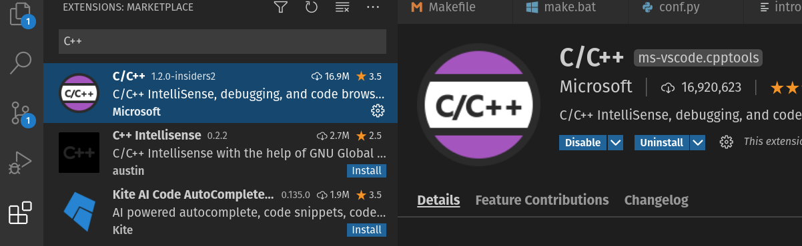

Unidad 1: presentación
========================

Sesión 1
-----------

En esta sesión vamos a presentarnos, presentar el curso, la comunidad IoT y 
algunas plataformas para la creación de aplicaciones embebidas en proyectos 
de IoT.

¿Nos presentamos todos?
^^^^^^^^^^^^^^^^^^^^^^^^

.. image:: ../_static/fotoJuan.jpg
  :scale: 25%
  :align: center
  :alt: foto Juan

Mi nombre es Juan Franco. Estudié Ingeniería electrónica en la UPB, una especialización 
en automatización en la UPB y una 
`Maestría en Ingeniería <https://drive.google.com/file/d/1NluYbZbiK93CLadUnfCeHgTPgRhkiRCA/view?usp=sharing>`__ 
con énfasis en sistemas embebidos en la Universidad de Antioquia. 

Llevo más de 20 años trabajando con sistemas embebidos.

Comunidad IoT Discord
^^^^^^^^^^^^^^^^^^^^^^^^

Para el curso he creado una comunidad en `Discord <https://discord.com/invite/vC5RaagNcE>`__ con 
3 canales, por ahora, donde realizaremos las sesiones sincrónicas semanales y tendremos un 
par de foros para preguntas y anuncios en general.

Una vez ingreses al `servidor <https://discord.com/invite/vC5RaagNcE>`__ debes esperar a que 
te asigne un rol. En ese momento tendrás acceso a los canales.

Presentación general del curso
^^^^^^^^^^^^^^^^^^^^^^^^^^^^^^^

La presentación del curso la encuentras en la Unidad :ref:`course-intro` al curso.

Alternativas para la construcción de aplicaciones
^^^^^^^^^^^^^^^^^^^^^^^^^^^^^^^^^^^^^^^^^^^^^^^^^^

En este curso hemos tomado varias decisiones relativas al hardware y al software que 
utilizaremos para la construcción del software embebido para las aplicaciones de IoT. 

Hemos seleccionado el microcontrolador `ESP32 <https://www.espressif.com/en/products/socs/esp32>`__ 
de la empresa `Espressif <https://www.espressif.com/>`__. Este microcontrolador soporta varias 
plataformas de software:

* `Arduino <https://github.com/espressif/arduino-esp32>`__.
* `Micropython <https://micropython.org/download/esp32>`__.
* `Zerynth <https://www.zerynth.com/>`__.
* `Mongoose OS <https://mongoose-os.com/>`__.
* `esp-idf <https://github.com/espressif/esp-idf>`__.

De estas, utilizaremos la plataforma esp-idf que es mantenida directamente por el 
fabricante del microcontrolador. Cabe anotar que las otras plataformas se basan en la 
esp-idf.

Hay otra plataforma de hardware/software que te quiero recomendar. De varias propuestas 
que he conocido, la de la empresa `Particle <https://www.particle.io/>`__ es una de 
las más completas y robustas para realizar aplicaciones comerciales. Es fácil el 
prototipado y luego el paso a producción también.

Te estarás preguntando ¿Por qué se seleccionó para el curso la opción ESP32/esp-idf?

Algunas razones (que podemos discutir):

* Costo (aunque esto es relativo: tiempo de desarrollo, tiempo al mercado, etc).
* Flexibilidad
* Plataformas probadas y de producción.

Ejercicios
-----------

En esta sección te voy a dejar ejercicios para que trabajes esta semana y en la sesión 
del viernes los revisemos y discutamos entre todos.

Ejercicio 1: reflexión sobre herramientas profesionales
^^^^^^^^^^^^^^^^^^^^^^^^^^^^^^^^^^^^^^^^^^^^^^^^^^^^^^^^

Como ya hemos discutido, este curso se estructura alrededor de un proyecto de PRODUCCIÓN. Aquí 
la palabra PRODUCCIÓN es clave. En Internet vas a encontrar MUCHOS recursos relacionados 
con la programación de sistemas embebidos y aplicaciones para IoT; sin embargo, es difícil 
encontrar información de calidad que te sirva como referencia para producir aplicaciones 
comerciales. 

Son varias las consideraciones que debes tener a la hora de diseñar un 
sistema embebido para uso comercial, entre ellas, las más importantes en relación 
al software son:

* Usar frameworks IoT de producción, probados para aplicaciones comerciales y con 
  buen soporte por parte del fabricante. ¿Qué es un framework? son el conjunto 
  de drivers para los periféricos del microcontrolador, el sistema operativo y 
  los componentes de software necesarios para construir aplicaciones IoT completas.
* Es ideal que el framework sea open source. No hay sistemas perfectos y siempre 
  es bueno que tengas la posibilidad de resolver problemas tu mismo.
* Debes considerar que la configuración (provisioning) del dispositivo sea escalable. 
  Por ejemplo, ¿Cómo vas a configurar las credenciales de la red WiFi? ¿Con una aplicación 
  móvil? ¿Vas a utilizar bluetooth? ¿Vas a utilizar un SoftAP y un portal de configuración?
* Debes tener la posibilidad de almacenar fácilmente información que permita identificar 
  de manera única al dispositivo.
* ¿Cómo vas a gestionar el almacenamiento de los certificados de seguridad?
* ¿Vas a encriptar tu programa? ¿Vas a encriptar los datos?
* ¿Las comunicaciones entre tu dispositivo y la nube son seguras?
* ¿Cómo devolver tu dispositivo a su configuración inicial de fábrica?
* Y una de las más importantes: ¿Cómo vas a actualizar de manera escalable y en el campo
  el software del dispositivo?

¿Ves por qué no es tan fácil hacer un producto IoT comercial?

Ejercicio 2: hardware a comprar para el curso
^^^^^^^^^^^^^^^^^^^^^^^^^^^^^^^^^^^^^^^^^^^^^^^^

¿Qué necesitas comprar para realizar el curso?

Ahora lee `aquí <https://docs.espressif.com/projects/esp-jumpstart/en/latest/introduction.html>`__  
de qué se trata el proyecto que vamos a construir.

En la siguiente imagen puedes ver un diagrama del proyecto: 

.. image:: ../_static/jumpstart-outlet.png
  :scale: 50%
  :align: center
  :alt: foto del proyecto

No es necesario que prepares un hardware exactamente igual a ese. En nuestro caso 
podemos simular la entrada y la salida. Por tanto, vamos a necesitar:

* Un sistema de desarrollo para el ESP32. Aquí te dejo varias opciones:

  * Yo tengo `este <https://www.didacticaselectronicas.com/index.php/comunicaciones/wi-fi/wifi-wi-fi-bluetooth-internet-iot-tarjetas-de-desarrollo-con-de-wifi-wi-fi-internet-y-bluetooth-con-esp32-esp-32-detail>`__, 
    pero vas a necesitar soldar los terminales o pedir que te lo vendan con los terminales soldados.
  * `Este otro <https://www.didacticaselectronicas.com/index.php/comunicaciones/bluetooth/tarjeta-de-desarrollo-esp32-wroom-32d-tarjetas-modulos-de-desarrollo-con-de-wifi-y-bluetooth-esp32u-con-conector-u-fl-tarjeta-comunicaci%C3%B3n-wi-fi-bluetooth-esp32u-iot-esp32-nodemcu-d0wd-detail>`__ 
    viene listo, pero no tiene el conector para la batería externa. Este conectar no lo necesitamos para 
    el curso, pero puede servirte más adelante.
  * `Este <https://www.sigmaelectronica.net/producto/esp-32/>`__ lo consigues en Bogotá.
  * En `este enlace <https://listado.mercadolibre.com.co/esp32#D[A:ESp32]>`__ puedes buscar 
    uno similar en mercado libre.

* Cable USB de buena calidad para conectar tu sistema de desarrollo al computador. ESTE requisito 
  es crítico para garantizar el bueno funcionamiento del proyecto. Personalmente yo tengo 
  `este <https://www.belkin.com/us/p/P-F2CU012/>`__ que lo venden en la papelería panamericana, pero 
  también lo he visto en Ktronix.

* Proboard

* Pulsador para insertar en el protoboard. Ten presente que tu sistema 
  de desarrollo puede tenerlo. Por ejemplo, 
  `este kit <https://www.didacticaselectronicas.com/index.php/comunicaciones/bluetooth/tarjeta-de-desarrollo-esp32-wroom-32d-tarjetas-modulos-de-desarrollo-con-de-wifi-y-bluetooth-esp32u-con-conector-u-fl-tarjeta-comunicaci%C3%B3n-wi-fi-bluetooth-esp32u-iot-esp32-nodemcu-d0wd-detail>`__ 
  ya tiene el pulsador (marcado con la etiqueta Boot en el silkscreen del 
  circuito impreso).

* LED de cualquier color para insertar en el protoboard. Ten presente que tu 
  sistema de desarrollo puede tener el LED. `Este <https://www.didacticaselectronicas.com/index.php/comunicaciones/wi-fi/wifi-wi-fi-bluetooth-internet-iot-tarjetas-de-desarrollo-con-de-wifi-wi-fi-internet-y-bluetooth-con-esp32-esp-32-detail>`__, 
  kit lo tiene en el puerto 5.

* Resistencia de 330 ohm para limitar la corriente que le entregaremos al LED. De nuevo, siempre 
  que no tengas el LED en el sistema de desarrollo.

* El pulsador no requiere resistencia de pull-up porque vamos a utilizar la resistencia de 
  pull-up interna y programable del ESP32.

* Cables para conectar todo lo anterior al sistema de desarrollo.

En mi caso te dejo un ejemplo de cómo quedó el montaje con mi sistema de desarrollo:

.. image:: ../_static/montaje-proto.jpg
  :scale: 50%
  :align: center
  :alt: montaje

Ejercicio 3: instalación del software
^^^^^^^^^^^^^^^^^^^^^^^^^^^^^^^^^^^^^^^^^

Ahora que ya tienes el hardware para trabajar, el paso siguiente es que instales 
las herramientas de software para programar el microcontrolador. Ten en presente 
que las herramientas funcionan en Windows, MacOS y Linux.

Hay varias versiones de las herramientas y el framework; sin embargo, la versión 
estable es la recomendada para producción: VERSIÓN 4.2 (no lo olvides).

La documentación que seguiremos para el curso está en 
`este sitio <https://docs.espressif.com/projects/esp-idf/en/stable/esp32/get-started/index.html>`__ 

Sigue los 10 pasos que encontrarás `aquí <https://docs.espressif.com/projects/esp-idf/en/stable/esp32/get-started/index.html>`__. 
para la instalación de la herramientas. Recuerda que hay instrucciones para cada sistema 
operativo.  

Ejercicio 4: editor de código
^^^^^^^^^^^^^^^^^^^^^^^^^^^^^^^^

En el ejercicio anterior instalaste dos cosas: el framework esp-idf y las herramientas 
para generar los programas ejecutables que correrá el ESP32. En este ejercicio vas 
a instalar un editor de código.

* Descarga e instala en tu sistemas operativo `Visual Studio Code <https://code.visualstudio.com/>`__. 
  Esta será la herramienta en la cual vas a escribir el código.

* Luego instala la extensión C/C++ que observas la siguiente imagen para mejorar 
  la experiencia de escritura de código C gracias a la característica de IntelliSense.
 

Ejercicio 5: programa de prueba
^^^^^^^^^^^^^^^^^^^^^^^^^^^^^^^^^^

En este ejercicio vas a crear una aplicación simple para probar la integración 
de todas las herramientas que hemos instalada hasta ahora.

* Copia el proyecto ``esp-idf/examples/get-started/hello_world`` en una carpeta 
  donde tendrás los proyectos del curso.

* Abre la carpeta del proyecto usando Visual Studio Code.

* Crea en la carpeta raíz del proyecto la carpeta ``.vscode`` y dentro de esa 
  carpeta el archivo ``c_cpp_properties.json``. Este último archivo te permitirá
  autocompletar el código, navegarlo, etc. Debes ver algo similar a esto:

  .. image:: ../_static/intelisense.png
    :scale: 50%
    :align: center
    :alt: C/C++ extension

  En cuanto al archivo ``c_cpp_properties.json``:

  .. code-block:: javascript
    :linenos:

      {
        "env":{
          "IDF_TOOLS":"/home/juanfranco/.espressif/tools",
          "IDF_PATH":"/home/juanfranco/esp-idf-course/esp-idf"
        },

        "configurations": [
          {
            "name": "Linux",
            "cStandard": "c11",
            "cppStandard": "c++17",
            "includePath": [
              "${IDF_PATH}/components/**",
              "${IDF_TOOLS}/xtensa-esp32-elf/esp-2020r3-8.4.0/xtensa-esp32-elf/**",
              "${workspaceFolder}/**"
            ],
              
            "browse": {
              "path": [
                "${IDF_PATH}/components",
                "${IDF_TOOLS}/xtensa-esp32-elf/esp-2020r3-8.4.0/xtensa-esp32-elf",
                "${workspaceFolder}"
              ],
            "limitSymbolsToIncludedHeaders": false
            }
          }
        ],
        "version": 4
      }

* En el archivo ``c_cpp_properties.json`` debes ajustar unas rutas para que 
  queden acordes a tu computador:

  .. code-block:: javascript
    :linenos:

      "env":{
          "IDF_TOOLS":"/home/juanfranco/.espressif/tools",
          "IDF_PATH":"/home/juanfranco/esp-idf-course/esp-idf"
      }

* Ahora abre el archivo hello_world_main.c y reemplaza el código por este otro:

  .. code-block:: c 
    :linenos:

    #include <stdio.h>
    #include "freertos/FreeRTOS.h"
    #include "freertos/task.h"

    void app_main(void)
    {
        for(uint8_t i = 0; i < 10; i++){
            printf("Counter: %d\n", i);
            vTaskDelay(pdMS_TO_TICKS(1000));
        }
    }

* Abre la terminal: 

  * Si estás trabajando en Windows, recuerda que el instalador 
    creó por ti un acceso directo llamado ``ESP-IDF Command Prompt``. Usa ese 
    acceso directo para abrir la terminal en Windows. 
  
  * Si estás trabajando en Linux:
    
    * Si no instalaste las herramientas en el directorio ``$HOME/.espressif``,  
      define la variable de entorno IDF_TOOLS_PATH para que 
      apunte al directorio donde las tienes:

      .. code-block:: bash

          export IDF_TOOLS_PATH = .espressif_PATH

    * Ejecuta el comando (no olvides escribir el ``.`` y luego la ruta.

      .. code-block:: bash

          . $HOME/esp/esp-idf/export.sh
    
      Si creaste un alias para este comando en el archivo ``.bashrc`` ejecútalo:

      .. code-block:: bash 

          get_idf

* Cámbiate al directorio donde está el proyecto y ejecuta los comandos:

  .. code-block:: bash 

      idf.py build
      idf.py -p /dev/ttyUSB0 -b 921600 flash monitor

  Si todo sale bien deberías ver algo así:

  .. image:: ../_static/hello_project.png
    :scale: 100%
    :align: center
    :alt: resultado de la prueba

* Para terminar el programa monitor presiona ``CRTL + }``.

Ejercicio 6: anexo-hardware
^^^^^^^^^^^^^^^^^^^^^^^^^^^^^

En este curso estamos enfocados en los aspectos de programación de una aplicación 
embebida para IoT; sin embargo, si te queda tiempo y estás interesado en la parte de hardware, 
Te voy a invitar a que SIEMPRE, SIEMPRE despliegues una aplicación comercial con un 
Watchdog Timer externo. Déjame insistir por favor: SIEMPRE.

Te voy a dejar algunos enlaces para que revises luego, PERO por favor, míralos:

* El `concepto de Watchdog Timer <http://www.ganssle.com/item/great-watchdog-timers.htm>`__ 
  en general.

* Un ejemplo de uso de un `Watchdog Timer externo <https://community.particle.io/t/improving-electron-reliability-external-watchdog-timer/34221>`__ 

* Un ejemplo de un `producto comercial <https://docs.particle.io/datasheets/asset-tracking/tracker-som-datasheet/>`__ 
  que podrías utilizar para aplicaciones de tracking.

Sesión 2
-----------

En esta sesión vamos a responder dudas que tengas sobre los ejercicios de esta semana 
y a discutir algunos conceptos clave del lenguaje de programación C que necesitarás 
para el proyecto del curso.

