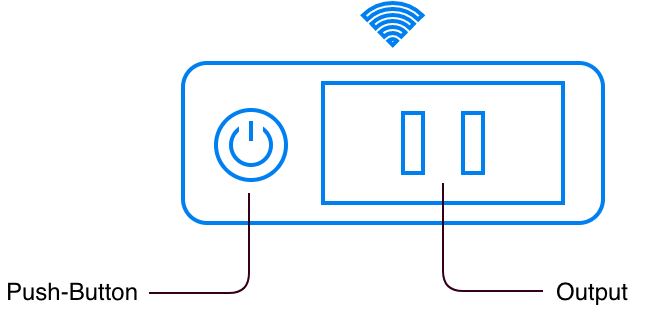
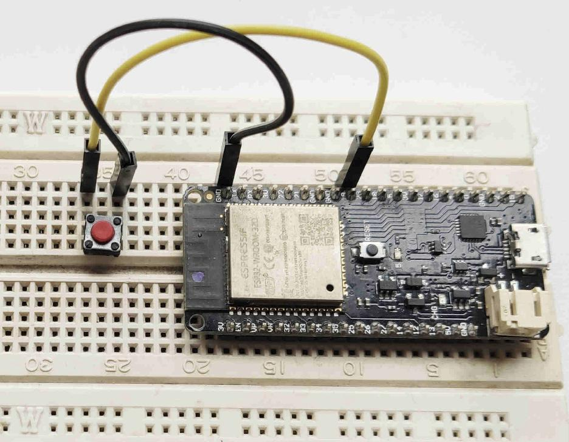

Unidad 1: presentación
========================

Sesión 1
-----------

En esta sesión vamos a presentarnos, presentar el curso, la comunidad IoT y 
algunas plataformas para la creación de aplicaciones embebidas en proyectos 
de IoT.

¿Nos presentamos todos?
^^^^^^^^^^^^^^^^^^^^^^^^

Mi nombre es Juan Franco. Estudié Ingeniería electrónica en la UPB, una especialización 
en automatización en la UPB y una 
`Maestría en Ingeniería <https://drive.google.com/file/d/1NluYbZbiK93CLadUnfCeHgTPgRhkiRCA/view?usp=sharing>`__ 
con énfasis en sistemas embebidos en la Universidad de Antioquia. 

Llevo más de 20 años trabajando con sistemas embebidos.

Comunidad IoT Discord
^^^^^^^^^^^^^^^^^^^^^^^^

Para el curso he creado una comunidad en `Discord <https://discord.com/invite/vC5RaagNcE>`__ con 
3 canales, por ahora, donde realizaremos las sesiones sincrónicas semanales y tendremos un 
par de foros para preguntas y anuncios en general.

Una vez ingreses al `servidor <https://discord.com/invite/vC5RaagNcE>`__ debes esperar a que 
te asigne un rol. En ese momento tendrás acceso a los canales.

Presentación general del curso
^^^^^^^^^^^^^^^^^^^^^^^^^^^^^^^

La presentación del curso la encuentras en la Unidad :ref:`course-intro` al curso.

Alternativas para la construcción de aplicaciones
^^^^^^^^^^^^^^^^^^^^^^^^^^^^^^^^^^^^^^^^^^^^^^^^^^

En este curso hemos tomado varias decisiones relativas al hardware y al software que 
utilizaremos para la construcción del software embebido para las aplicaciones de IoT. 

Hemos seleccionado el microcontrolador `ESP32 <https://www.espressif.com/en/products/socs/esp32>`__ 
de la empresa `Espressif <https://www.espressif.com/>`__. Este microcontrolador soporta varias 
plataformas de software:

* `Arduino <https://github.com/espressif/arduino-esp32>`__.
* `Micropython <https://micropython.org/download/esp32>`__.
* `Zerynth <https://www.zerynth.com/>`__.
* `Mongoose OS <https://mongoose-os.com/>`__.
* `esp-idf <https://github.com/espressif/esp-idf>`__.

De estas, utilizaremos la plataforma esp-idf que es mantenida directamente por el 
fabricante del microcontrolador. Cabe anotar que las otras plataformas se basan en la 
esp-idf.

Hay otra plataforma de hardware/software que te quiero recomendar. De varias propuestas 
que he conocido, la de la empresa `Particle <https://www.particle.io/>`__ es una de 
las más completas y robustas para realizar aplicaciones comerciales. Es fácil el 
prototipado y luego el paso a producción también.

Te estarás preguntando ¿Por qué se seleccionó para el curso la opción ESP32/esp-idf?

Algunas razones (que podemos discutir):

* Costo (aunque esto es relativo: tiempo de desarrollo, tiempo al mercado, etc).
* Flexibilidad
* Plataformas probadas y de producción.

Ejercicios
-----------

En esta sección te voy a dejar ejercicios para que trabajes esta semana y en la sesión 
del viernes los revisemos y discutamos entre todos.

Ejercicio 1
^^^^^^^^^^^^

Como ya hemos discutido, este curso se estructura alrededor de un proyecto de PRODUCCIÓN. Aquí 
la palabra PRODUCCIÓN es clave. En Internet vas a encontrar MUCHOS recursos relacionados 
con la programación de sistemas embebidos y aplicaciones para IoT; sin embargo, es difícil 
encontrar información de calidad que te sirva como referencia para producir aplicaciones 
comerciales. 

Son varias las consideraciones que debes tener a la hora de diseñar un 
sistema embebido para uso comercial, entre ellas, las más importantes en relación 
al software son:

* Usar frameworks IoT de producción, probados para aplicaciones comerciales y con 
  buen soporte por parte del fabricante.
* Es ideal que el framework sea open source. No hay sistemas perfectos y siempre 
  es bueno que tengas la posibilidad de resolver problemas tu mismo.
* Debes considerar que la configuración (provisioning) del dispositivo sea escalable. 
  Por ejemplo, ¿Cómo vas a configurar las credenciales de la red WiFi? ¿Con una aplicación 
  móvil? ¿Vas a utilizar bluetooth? ¿Vas a utilizar un SoftAP y un portal de configuración?
* Debes tener la posibilidad de almacenar fácilmente información que permita identificar 
  de manera única al dispositivo.
* ¿Cómo vas a gestionar el almacenamiento de los certificados de seguridad?
* ¿Vas a encriptar tu programa? ¿Vas a encriptar los datos?
* ¿Las comunicaciones entre tu dispositivo y la nube son seguras?
* ¿Cómo devolver tu dispositivo a su configuración inicial de fábrica?
* Y una de las más importantes: ¿Cómo vas a actualizar de manera escalable y en el campo
  el software del dispositivo?

¿Ves por qué no es tan fácil hacer un producto IoT comercial?

Ejercicio 2
^^^^^^^^^^^^

¿Qué necesitas comprar para realizar el curso?

Ahora lee `aquí <https://docs.espressif.com/projects/esp-jumpstart/en/latest/introduction.html>`__  
de qué se trata el proyecto que vamos a construir.

En la siguiente imagen puedes ver un diagrama del proyecto: 

No es necesario que prepares un hardware exactamente igual a ese. En nuestro caso 
podemos simular la entrada y la salida. Por tanto, vamos a necesitar:

* Un sistema de desarrollo para el ESP32. Aquí te dejo varias opciones:

  * Yo tengo `este <https://www.didacticaselectronicas.com/index.php/comunicaciones/wi-fi/wifi-wi-fi-bluetooth-internet-iot-tarjetas-de-desarrollo-con-de-wifi-wi-fi-internet-y-bluetooth-con-esp32-esp-32-detail>`__, 
    pero vas a necesitar soldar los terminales o pedir que te lo vendan con los terminales soldados.
  * `Este otro <https://www.didacticaselectronicas.com/index.php/comunicaciones/bluetooth/tarjeta-de-desarrollo-esp32-wroom-32d-tarjetas-modulos-de-desarrollo-con-de-wifi-y-bluetooth-esp32u-con-conector-u-fl-tarjeta-comunicaci%C3%B3n-wi-fi-bluetooth-esp32u-iot-esp32-nodemcu-d0wd-detail>`__ 
    viene listo, pero no tiene el conector para la batería externa. Este conectar no lo necesitamos para 
    el curso, pero puede servirte más adelante.
  * `Este <https://www.sigmaelectronica.net/producto/esp-32/>`__ lo consigues en Bogotá.
  * En `este enlace <https://listado.mercadolibre.com.co/esp32#D[A:ESp32]>`__ puedes buscar 
    uno similar en mercado libre.

* Cable USB de buena calidad para conectar tu sistema de desarrollo al computador. ESTE requisito 
  es crítico para garantizar el bueno funcionamiento del proyecto. Personalmente yo tengo 
  `este <https://www.belkin.com/us/p/P-F2CU012/>`__ que lo venden en la papelería panamericana, pero 
  también lo he visto en Ktronix.

* Proboard

* Pulsador para insertar en el protoboard. Ten presente que tu sistema 
  de desarrollo puede tenerlo. Por ejemplo, 
  `este kit <https://www.didacticaselectronicas.com/index.php/comunicaciones/bluetooth/tarjeta-de-desarrollo-esp32-wroom-32d-tarjetas-modulos-de-desarrollo-con-de-wifi-y-bluetooth-esp32u-con-conector-u-fl-tarjeta-comunicaci%C3%B3n-wi-fi-bluetooth-esp32u-iot-esp32-nodemcu-d0wd-detail>`__ 
  ya tiene el pulsador (marcado con la etiqueta Boot en el silkscreen del 
  circuito impreso).

* LED de cualquier color para insertar en el protoboard. Ten presente que tu 
  sistema de desarrollo puede tener el LED. `Este <https://www.didacticaselectronicas.com/index.php/comunicaciones/wi-fi/wifi-wi-fi-bluetooth-internet-iot-tarjetas-de-desarrollo-con-de-wifi-wi-fi-internet-y-bluetooth-con-esp32-esp-32-detail>`__, 
  kit lo tiene en el puerto 5.

* Resistencia de 330 ohm para limitar la corriente que le entregaremos al LED. De nuevo, siempre 
  que no tengas el LED en el sistema de desarrollo.

* El pulsador no requiere resistencia de pull-up porque vamos a utilizar la resistencia de 
  pull-up interna y programable del ESP32.

* Cables para conectar todo lo anterior al sistema de desarrollo.

En mi caso te dejo un ejemplo de cómo quedó el montaje con mi sistema de desarrollo:

..
  .. blockdiag::

      blockdiag {

      # node connections
      patient <- sensors [folded];
      sensors -> ESP32 -> notification -> doctor;
      ESP32 -> cloud -> database;

      # node attributes
      patient [shape=actor];
      sensors [shape=flowchart.input, color=lightyellow];
      ESP32 [shape=roundedbox, width=60, height=60, color="#BC1F28", fontsize=14];
      notification [shape=mail];
      doctor [shape=actor];
      cloud [shape=cloud, color=lightblue];
      database [shape=flowchart.database, color=lightgrey];

      }

  .. blockdiag::

      blockdiag admin {
          // Set node metrix
          node_width = 100;
          node_height = 50;
          default_shape = roundedbox;

          top_page -> config -> config_edit -> config_confirm -> top_page;
      }

  .. blockdiag::
    :desctable:

    blockdiag {
        A -> B -> C;
        A [description = "browsers in each client"];
        B [description = "web server"];
        C [description = "database server"];
    }

  .. seqdiag::

      seqdiag admin {
        A -> B -> C;
      }

  .. wavedrom::
      :caption: My wave figure

          { "signal": [
                  { "name": "clk",  "wave": "P......" },
                  { "name": "bus",  "wave": "x.==.=x", "data": ["head", "body", "tail", "data"] },
                  { "name": "wire", "wave": "0.1..0." }
          ]}

  .. packetdiag::

    packetdiag {
      0-7: Source Port
      8-15: Destination Port
      16-31: Sequence Number
      32-35: AckNo
      36-39: Offset
      40-47: Reserved
    }

  .. rackdiag::

    rackdiag {
      8U;

      1: UPS [2U];
      3: DB Server
      4: Web Server
      5: Web Server
      6: Web Server
      7: Load Balancer
      8: L3 Switch
    }

  .. nwdiag::

    nwdiag {
      network dmz {
          address = "210.x.x.x/24"

          web01 [address = "210.x.x.1"];
          web02 [address = "210.x.x.2"];
      }
      network internal {
          address = "172.x.x.x/24";

          web01 [address = "172.x.x.1"];
          db01;
          app01;
      }
    }

  .. packetdiag::

    packetdiag {
      colwidth = 32
      node_height = 72

      0-15: Source Port
      16-31: Destination Port
      32-63: Sequence Number
      64-95: Acknowledgment Number
      96-99: Data Offset
      100-105: Reserved
      106: URG [rotate = 270]
      107: ACK [rotate = 270]
      108: PSH [rotate = 270]
      109: RST [rotate = 270]
      110: SYN [rotate = 270]
      111: FIN [rotate = 270]
      112-127: Window
      128-143: Checksum
      144-159: Urgent Pointer
      160-191: (Options and Padding)
      192-223: data [colheight = 3]
      }