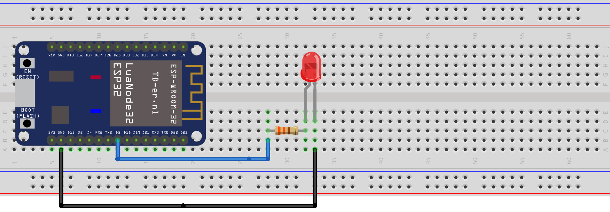
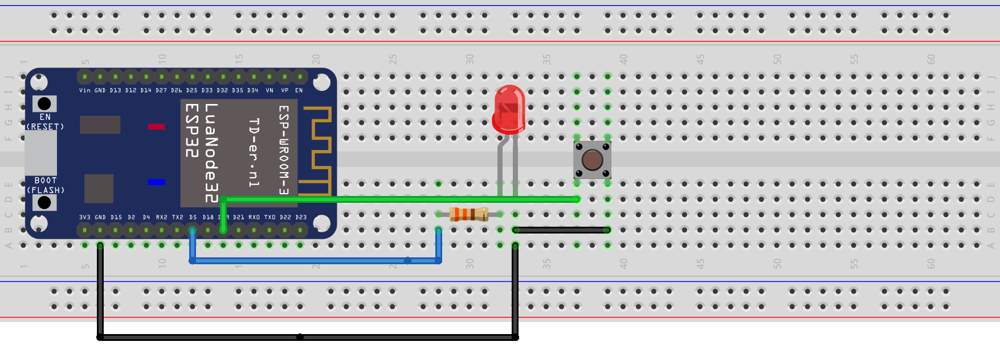

Unidad 2: hello world
=============================================

Sesión 1
-----------

En esta sesión haremos los siguiente:

#. Demo de la aplicación 1_hello_world funcionando.
#. ¿Cómo obtengo el código del proyecto?
#. Observaremos el repositorio del fabricante.
#. ¿Cómo hago I/O básica?

    * Escribir un pin.
    * Leer un pin.
    * Interactuar con el usuario 
      usando el puerto serial.

Ejercicios
-----------

Ejercicios 1: salida digital
^^^^^^^^^^^^^^^^^^^^^^^^^^^^^^

En este ejercicio vamos a realizar un programa que encienda y apague un LED 
a 1 Hz.

Lo primero que deberás hacer es conectar al puerto 5 del microcontrolador un 
LED con la resistencia de 330 ohm. Dependiendo del sistema de desarrollo que 
hayas comprado es posible que ya tengas el LED.

Ahora escribe el siguiente código y lee los comentarios con los pasos 
que debes seguir.

.. code-block:: c
    :linenos:

    #include <stdio.h>

    // 1. Incluir los archivos de cabecera necesarios
    #include "freertos/FreeRTOS.h"
    #include "freertos/task.h"
    #include "driver/gpio.h"

    // 2. Definir el PIN de salida ha utilizar
    #define PIN 5

    void app_main(void)
    {
        // 3. asociar el pin del micro con el circuito de GPIO
        gpio_pad_select_gpio(PIN);
        
        // 4. Configurar el puerto como salida.
        gpio_set_direction(PIN, GPIO_MODE_OUTPUT);

        uint8_t portLevel = 0;

        while(1)
        {
            // 5. Manda al puerto el valor de salida
            gpio_set_level(PIN, portLevel);
            portLevel = !portLevel;
            // 6. Espera en cada nivel del LED 500 ms
            vTaskDelay(500/portTICK_PERIOD_MS);
        }
    }    

Ejercicio 2: entrada digital
^^^^^^^^^^^^^^^^^^^^^^^^^^^^^^

Ahora vas a leer el estado de un pulsador y enviaras dicho 
estado por el puerto serial. Debes hacer la lectura cada 
segundo.

Debes asegurarte que tu pulsador tiene patas largas y entra 
adecuadamente en el protoboard, de lo contrario tendrás lecturas 
erráticas debido al mal contacto entre el pulsador y el protoboard.

Ahora escribe el siguiente código y lee los comentarios con los pasos 
que debes seguir.

.. code-block:: c
    :linenos:

    #include <stdio.h>

    // 1. Incluir los archivos de cabecera necesarios
    #include "freertos/FreeRTOS.h"
    #include "freertos/task.h"
    #include "driver/gpio.h"
    #include "esp_log.h"

    // 2. Definir el PIN de entrada a utilizar
    #define PULSADOR_PIN 19

    void app_main(void)
    {
        // 3. asociar el pin del micro con el circuito de GPIO
        gpio_pad_select_gpio(PULSADOR_PIN);

        // 4. Configurar el puerto como entrada.
        gpio_set_direction(PULSADOR_PIN, GPIO_MODE_INPUT);
        
        // 5. Habilitar la resistencia interna de pull up
        gpio_pullup_en(PULSADOR_PIN);

        int pulsadorState;

        while(1)
        {

            // 6. Lee el estado del pulsador
            pulsadorState = gpio_get_level(PULSADOR_PIN);

            // 7. Reportar por el puerto serial
            printf("Estado del pulsador: %d\n", pulsadorState);
            
            // 8. Espera un segundo para volver a leer
            vTaskDelay(1000/portTICK_PERIOD_MS);
        }    
    }

Ejercicio 3: reto
^^^^^^^^^^^^^^^^^^

Ahora que ya sabes escribir y leer puertos del microcontrolador 
te propongo que hagas un programa que lea el estado del pulsador y 
si este está presionado encienda el LED, de lo contrario lo apague.

Ejercicio 4: leer el puerto serial
^^^^^^^^^^^^^^^^^^^^^^^^^^^^^^^^^^^^

El siguiente programa leerá un mensaje que el usuario escriba 
en el monitor serial. Si el mensaje es hola, el microcontrolador 
deberá responder con la palabra mundo, de lo contrario responderá 
con la frase: no entiendo.

.. code-block:: c
    :linenos:

    #include <stdio.h>
    #include "freertos/FreeRTOS.h"
    #include "freertos/task.h"
    #include "driver/gpio.h"
    #include "esp_log.h"
    #include "string.h"

    void app_main(void)
    {
        int c;
        char message[16];
        uint8_t counter = 0;
    
        while(1)
        {
            c = getchar();
    
            if(c != EOF){

                if( '\n' == c)
                {
                    // Termina el mensaje con 0                
                    message[counter] = 0;
                    // Verifica si el mensaje es hola
                    if ( strncmp (message, "hola", strlen("hola") ) == 0)
                    {
                        printf(" mundo\n");
                    }
                    else
                    {
                        printf("no entiendo\n");
                    }
                    counter = 0;
                }
                else
                {
                    // Solo guarda un carácter si hay espacio 
                    if( counter < ( sizeof(message) - 1 ) )
                    {
                        message[counter] = c;
                        counter++;
                    }
                }
            }

            vTaskDelay(100/portTICK_PERIOD_MS);
        }
    }

En este programa ten presente los siguientes puntos:

* La función ``getchar`` intentará obtener un byte del puerto serial. Si 
  el byte existe lo retornará. Si no existe retornará un EOF (end of file) 
  que corresponde a un ``-1``.
* La variable en la cual almacenamos el valor retornado por ``getchar`` es 
  un ``int``. En el ESP32 los ``int`` son variables de 32 bits que puede 
  almacenar número negativos. Esto es necesario para poder contener el EOF; 
  sin embargo, cuando hay un byte en el puerto serial, dicho byte es 
  almacenado en la variable ``int`` como un entero de 8 bits sin signo correspondiente, 
  precisamente, al byte recibido.
* Nota que el arreglo ``message`` puede almacenar 16 bytes, de los cuales, 15 serán 
  para almacenar los bytes que llegan del puerto serial, excepto el ``ENTER`` que  
  decidimos no guardar, y uno será para terminar la secuencia de caracteres en 0. 
  Terminar una cadena de caracteres en 0 es fundamental en C para poder identificar 
  el punto final de la secuencia.

Ejercicio 5: reto
^^^^^^^^^^^^^^^^^^^^

Ahora que ya sabes escribir y leer un pin del microcontrolador y 
enviar y recibir mensajes por el puerto serial te voy a proponer 
que hagas un programa que te permita hacer los siguiente:

* Al enviar la cadena de caracteres ``ledOn`` por el puerto serial 
  enciende un LED.
* Al enviar la cadena de caracteres ``ledOff`` por el puerto serial 
  apaga el LED.
* Al enviar la cadena de caracteres ``readButton`` por el puerto serial 
  lee el estado del pulsador y lo escribe en el puerto serial.

Ejercicio 6: reto
^^^^^^^^^^^^^^^^^^^^

Ahora vas a añadir más comandos al programa anterior. Abre el ejemplo 
hello_world que está en la carpeta examples del framework. Con 
la información que hay allí incorpora los siguientes comandos y escribe 
el resultado en el puerto serial:

* Leer la revisión del chip: ``rev``.
* Leer la versión de framework : ``idf``.
* Leer si está habilitado el bluetooth clásico.
* Leer si está habilitado el bluetooth low energy.
* Leer si está habilitado el WiFi.
* Leer la cantidad de memoria flash.

Un minireto extra porque deberás buscar en el API del fabricante que 
función te da esta información:

* Leer la dirección MAC del microcontrolador.

Ejercicio 7: build 
^^^^^^^^^^^^^^^^^^^^

Para entender cómo se hace el BUILD de una aplicación dale una mirada a 
`este <https://docs.espressif.com/projects/esp-idf/en/stable/esp32/api-guides/build-system.html>`__ 
enlace. No tienes que leer todo el documento, pero si lo suficiente para 
que entiendas cómo podrías iniciar un proyecto de cero, es decir, si fueras a incluir 
uno por uno cada archivo para configurar y construir (build) un proyecto.

Ejercicio 8: build/reto 
^^^^^^^^^^^^^^^^^^^^^^^^^^^

En la unidad anterior te propuse que copiaras uno de los proyectos 
que trae como ejemplo el esp-idf (``hello_world``). Con el conocimiento del ejercicio 
anterior, te propongo que intentes crear un proyecto desde cero, es decir, crea una 
carpeta y luego incluye uno a uno los archivos necesarios para definir el proyecto. 
Realiza un programa simple y comprueba que es posible construir y grabar el programa 
en la memoria del microcontrolador.

Sesión 2
-----------

En esta sesión vamos a resolver dudas sobre los ejercicios y escuchar aportes, 
comentarios y/o experiencias de todos.

