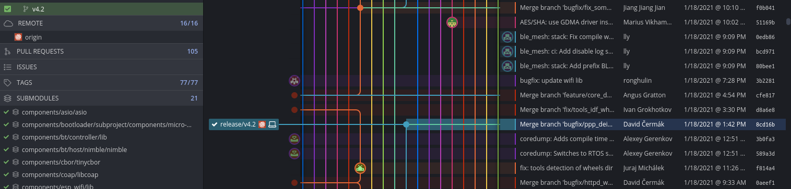

Unidad 2: hello world
=============================================

Sesión 1
-----------

En esta sesión haremos los siguiente:

#. Demo de la aplicación 1_hello_world funcionando.
#. ¿Cómo obtengo el código del proyecto?
#. Observaremos el repositorio del fabricante.
#. ¿Cómo hago I/O básica?

    * Escribir un pin.
    * Leer un pin.
    * Interactuar con el usuario 
      usando el puerto serial.

Ejercicios
-----------

Ejercicios 1: salida digital
^^^^^^^^^^^^^^^^^^^^^^^^^^^^^^

En este ejercicio vamos a realizar un programa que encienda y apague un LED 
a 1 Hz.

Lo primero que deberás hacer es conectar al puerto 5 del microcontrolador un 
LED con la resistencia de 330 ohm. Dependiendo del sistema de desarrollo que 
hayas comprado es posible que ya tengas el LED.

.. image:: ../_static/esp-iot.png
    :align: center
    :alt: montaje
    :scale: 50%

Ahora escribe el siguiente código y lee los comentarios con los pasos 
que debes seguir.

.. code-block:: c
    :linenos:

    #include <stdio.h>

    // 1. Incluir los archivos de cabecera necesarios
    #include "freertos/FreeRTOS.h"
    #include "freertos/task.h"
    #include "driver/gpio.h"

    // 2. Definir el PIN de salida ha utilizar
    #define PIN 5

    void app_main(void)
    {
        // 3. asociar el pin del micro con el circuito de GPIO
        gpio_pad_select_gpio(PIN);
        
        // 4. Configurar el puerto como salida.
        gpio_set_direction(PIN, GPIO_MODE_OUTPUT);

        uint8_t portLevel = 0;

        while(1)
        {
            // 5. Manda al puerto el valor de salida
            gpio_set_level(PIN, portLevel);
            portLevel = !portLevel;
            // 6. Espera en cada nivel del LED 500 ms
            vTaskDelay(500/portTICK_PERIOD_MS);
        }
    }    

Ejercicio 2: entrada digital
^^^^^^^^^^^^^^^^^^^^^^^^^^^^^^

Ahora vas a leer el estado de un pulsador y enviaras dicho 
estado por el puerto serial. Debes hacer la lectura cada 
segundo.

Debes asegurarte que tu pulsador tiene patas largas y entra 
adecuadamente en el protoboard, de lo contrario tendrás lecturas 
erráticas debido al mal contacto entre el pulsador y el protoboard.

.. image:: ../_static/esp-iot-pulsador.png
    :align: center
    :alt: montaje
    :scale: 50%

Ahora escribe el siguiente código y lee los comentarios con los pasos 
que debes seguir.

.. code-block:: c
    :linenos:

    #include <stdio.h>

    // 1. Incluir los archivos de cabecera necesarios
    #include "freertos/FreeRTOS.h"
    #include "freertos/task.h"
    #include "driver/gpio.h"
    #include "esp_log.h"

    // 2. Definir el PIN de entrada a utilizar
    #define PULSADOR_PIN 19

    void app_main(void)
    {
        // 3. asociar el pin del micro con el circuito de GPIO
        gpio_pad_select_gpio(PULSADOR_PIN);

        // 4. Configurar el puerto como entrada.
        gpio_set_direction(PULSADOR_PIN, GPIO_MODE_INPUT);
        
        // 5. Habilitar la resistencia interna de pull up
        gpio_pullup_en(PULSADOR_PIN);

        int pulsadorState;

        while(1)
        {

            // 6. Lee el estado del pulsador
            pulsadorState = gpio_get_level(PULSADOR_PIN);

            // 7. Reportar por el puerto serial
            printf("Estado del pulsador: %d\n", pulsadorState);
            
            // 8. Espera un segundo para volver a leer
            vTaskDelay(1000/portTICK_PERIOD_MS);
        }    
    }

Ejercicio 3: reto
^^^^^^^^^^^^^^^^^^

Ahora que ya sabes escribir y leer puertos del microcontrolador 
te propongo que hagas un programa que lea el estado del pulsador y 
si este está presionado encienda el LED, de lo contrario lo apague.

Ejercicio 4: leer el puerto serial
^^^^^^^^^^^^^^^^^^^^^^^^^^^^^^^^^^^^

El siguiente programa leerá un mensaje que el usuario escriba 
en el monitor serial. Si el mensaje es hola, el microcontrolador 
deberá responder con la palabra mundo, de lo contrario responderá 
con la frase: no entiendo.

.. code-block:: c
    :linenos:

    #include <stdio.h>
    #include "freertos/FreeRTOS.h"
    #include "freertos/task.h"
    #include "driver/gpio.h"
    #include "esp_log.h"
    #include "string.h"

    void app_main(void)
    {
        int c;
        char message[16];
        uint8_t counter = 0;
    
        while(1)
        {
            c = getchar();
    
            if(c != EOF){

                if( '\n' == c)
                {
                    // Termina el mensaje con 0                
                    message[counter] = 0;
                    // Verifica si el mensaje es hola
                    if ( strncmp (message, "hola", strlen("hola") ) == 0)
                    {
                        printf(" mundo\n");
                    }
                    else
                    {
                        printf("no entiendo\n");
                    }
                    counter = 0;
                }
                else
                {
                    // Solo guarda un carácter si hay espacio 
                    if( counter < ( sizeof(message) - 1 ) )
                    {
                        message[counter] = c;
                        counter++;
                    }
                }
            }

            vTaskDelay(100/portTICK_PERIOD_MS);
        }
    }

En este programa ten presente los siguientes puntos:

* La función ``getchar`` intentará obtener un byte del puerto serial. Si 
  el byte existe lo retornará. Si no existe retornará un EOF (end of file) 
  que corresponde a un ``-1``.
* La variable en la cual almacenamos el valor retornado por ``getchar`` es 
  un ``int``. En el ESP32 los ``int`` son variables de 32 bits que puede 
  almacenar número negativos. Esto es necesario para poder contener el EOF; 
  sin embargo, cuando hay un byte en el puerto serial, dicho byte es 
  almacenado en la variable ``int`` como un entero de 8 bits sin signo correspondiente, 
  precisamente, al byte recibido.
* Nota que el arreglo ``message`` puede almacenar 16 bytes, de los cuales, 15 serán 
  para almacenar los bytes que llegan del puerto serial, excepto el ``ENTER`` que  
  decidimos no guardar, y uno será para terminar la secuencia de caracteres en 0. 
  Terminar una cadena de caracteres en 0 es fundamental en C para poder identificar 
  el punto final de la secuencia.

Ejercicio 5: reto
^^^^^^^^^^^^^^^^^^^^

Ahora que ya sabes escribir y leer un pin del microcontrolador y 
enviar y recibir mensajes por el puerto serial te voy a proponer 
que hagas un programa que te permita hacer los siguiente:

* Al enviar la cadena de caracteres ``ledOn`` por el puerto serial 
  enciende un LED.
* Al enviar la cadena de caracteres ``ledOff`` por el puerto serial 
  apaga el LED.
* Al enviar la cadena de caracteres ``readButton`` por el puerto serial 
  lee el estado del pulsador y lo escribe en el puerto serial.

Ejercicio 6: reto
^^^^^^^^^^^^^^^^^^^^

Ahora vas a añadir más comandos al programa anterior. Abre el ejemplo 
hello_world que está en la carpeta examples del framework. Con 
la información que hay allí incorpora los siguientes comandos y escribe 
el resultado en el puerto serial:

* Leer la revisión del chip: ``rev``.
* Leer la versión de framework : ``idf``.
* Leer si está habilitado el bluetooth clásico.
* Leer si está habilitado el bluetooth low energy.
* Leer si está habilitado el WiFi.
* Leer la cantidad de memoria flash.

Un minireto extra porque deberás buscar en el API del fabricante que 
función te da esta información:

* Leer la dirección MAC del microcontrolador.

Ejercicio 7: build 
^^^^^^^^^^^^^^^^^^^^

Para entender cómo se hace el BUILD de una aplicación dale una mirada a 
`este <https://docs.espressif.com/projects/esp-idf/en/stable/esp32/api-guides/build-system.html>`__ 
enlace. No tienes que leer todo el documento, pero si lo suficiente para 
que entiendas cómo podrías iniciar un proyecto de cero, es decir, si fueras a incluir 
uno por uno cada archivo para configurar y construir (build) un proyecto.

Ejercicio 8: build/reto 
^^^^^^^^^^^^^^^^^^^^^^^^^^^

En la unidad anterior te propuse que copiaras uno de los proyectos 
que trae como ejemplo el esp-idf (``hello_world``). Con el conocimiento del ejercicio 
anterior, te propongo que intentes crear un proyecto desde cero, es decir, crea una 
carpeta y luego incluye uno a uno los archivos necesarios para definir el proyecto. 
Realiza un programa simple y comprueba que es posible construir y grabar el programa 
en la memoria del microcontrolador.

Ejercicio 9: proyecto de curso
^^^^^^^^^^^^^^^^^^^^^^^^^^^^^^^^^^

Ahora vas a comenzar el proyecto de curso: ``ESP-Jumpstart``. NO HAGAS nada por favor, solo 
lee el contenido de `este <https://docs.espressif.com/projects/esp-jumpstart/en/latest/introduction.html>`__ 
enlace donde se introduce el proyecto.

Luego lee `este <https://docs.espressif.com/projects/esp-jumpstart/en/latest/gettingstarted.html#>`__ 
otro enlace. POR FAVOR, no hagas nada, solo lee. En los siguientes ejercicios te diré 
que harás.

Reflexiona con estas preguntas:

* En la introducción te dicen que el proyecto que haremos en el curso es un proyecto de 
  producción. ¿Qué deberías cambiar para personalizar tu proyecto?
* En el proyecto de curso ¿Vamos a controlar remotamente al microcontrolador?
* En el proyecto de curso ¿Vamos a actualizar remotamente el programa grabado en la memoria 
  del microcontrolador?
* ¿Cuál es la diferencia entre el ESP-IDF y el Toolchain del compilador?
* Al instalar el entorno de trabajo para el ESP-IDF te pedí que instalaras 
  la versión 4.2 del ESP-IDF; sin embargo, en la documentación del proyecto sugieren 
  la versión 4.0. Lee de `este <https://docs.espressif.com/projects/esp-idf/en/stable/esp32/versions.html>`__    
  enlace hasta la sección ``Support Periods``. ¿Cuál será la diferencia entre la versión 
  4.0 y la versión 4.2?

Ejercicio 10: versión del ESP-IDF
^^^^^^^^^^^^^^^^^^^^^^^^^^^^^^^^^^

Abre el acceso directo al ESP-IDF que tienes en el escritorio de Windows. Si estás en Linux 
no olvides ejecutar el alias get_idf para adicionar al path el entorno de trabajo.

Navega hasta el último ejercicio en el que has trabajado. Graba el microcontrolador y ejecuta 
el programa monitor. Termina el programa monitor. Sube por el terminal hasta encontrar el punto 
donde lanzaste el monitor:

.. code-block:: bash

    juanfranco@pop-os:~/esp-idf-course/projects/testsClass$ idf.py monitor
    Executing action: monitor
    Choosing default port b'/dev/ttyUSB0' (use '-p PORT' option to set a specific serial port)
    Running idf_monitor in directory /home/juanfranco/esp-idf-course/projects/testsClass
    Executing "/home/juanfranco/.espressif/python_env/idf4.2_py3.8_env/bin/python /home/juanfranco/esp-idf-course/esp-idf/tools/idf_monitor.py -p /dev/ttyUSB0 -b 115200 --toolchain-prefix xtensa-esp32-elf- /home/juanfranco/esp-idf-course/projects/testsClass/build/hello-world.elf -m '/home/juanfranco/.espressif/python_env/idf4.2_py3.8_env/bin/python' '/home/juanfranco/esp-idf-course/esp-idf/tools/idf.py'"...
    --- idf_monitor on /dev/ttyUSB0 115200 ---
    --- Quit: Ctrl+] | Menu: Ctrl+T | Help: Ctrl+T followed by Ctrl+H ---
    ets Jun  8 2016 00:22:57

    rst:0x1 (POWERON_RESET),boot:0x13 (SPI_FAST_FLASH_BOOT)
    configsip: 0, SPIWP:0xee
    clk_drv:0x00,q_drv:0x00,d_drv:0x00,cs0_drv:0x00,hd_drv:0x00,wp_drv:0x00
    mode:DIO, clock div:2
    load:0x3fff0030,len:4
    load:0x3fff0034,len:7200
    ho 0 tail 12 room 4
    load:0x40078000,len:13212
    load:0x40080400,len:4568
    0x40080400: _init at ??:?

    entry 0x400806f4
    I (30) boot: ESP-IDF v4.2-238-g8cd16b60f 2nd stage bootloader

Observa la última línea: 

.. code-block:: bash

    I (30) boot: ESP-IDF v4.2-238-g8cd16b60f 2nd stage bootloader

Este te dice la versión del esp-idf que está usando tu programa.

Ahora escribe el comando: 

.. code-block:: bash

    idf.py --version 
    
Debería ver algo similar a esto: 

.. code-block:: bash

    ESP-IDF v4.2-238-g8cd16b60f 

Nota entonces que las versiones deben coincidir.

¿Pero qué significa lo que ves?

* v4.2 es la versión del framework
* 238 es el número de commits en el repositorio público después de 
  que el fabricante liberara la versión. Eso quiere decir que se han 
  realizado 238 actualizaciones con mejoras o correcciones a bugs.
* g8cd16b60f es el SHA (el hash) del commit correspondiente a esta 
  versión del esp-idf que estamos usando.

En este punto te preguntarás. ¿Para qué estamos mirando todo esto? Por que 
en un ambiente de producción de una aplicación embebida para IoT debes tener 
control sobre estos aspectos para poder dar el soporte apropiado a tus 
productos.

Ejercicio 11: actualización del esp-idf 
^^^^^^^^^^^^^^^^^^^^^^^^^^^^^^^^^^^^^^^^^

Abre de nuevo el acceso directo al ESP-IDF. Verifica que estás en la carpeta 
del framework. Ejecuta el comando:

.. code-block:: bash

    git branch

Deberías ver algo así:

.. code-block:: bash

    * release/v4.2

¿Qué indica esto? Que tu esp-idf está en la versión 4.2, es decir,
que tenemos ``checkout`` la versión 4.2 en nuestro computador. ¿En nuestro 
computador tenemos más versiones? Tendrás que verificarlo. Ejecuta este comando:

.. code-block:: bash

    git branch -a

Deberías ver algo así:

.. code-block:: bash

    * release/v4.2
    remotes/origin/HEAD -> origin/master
    remotes/origin/audio/stack_on_psram_v3.3
    remotes/origin/ble_mesh_release/esp-ble-mesh-v0.6.1
    remotes/origin/customer/maintain_v4.0_xiaomi_tsf_issue
    remotes/origin/customer/maintain_xiaomi_11kv_v4.0.2
    remotes/origin/feature/ftm_support
    remotes/origin/ftm
    remotes/origin/master
    remotes/origin/release/v2.0
    remotes/origin/release/v2.1
    remotes/origin/release/v3.0
    remotes/origin/release/v3.1
    remotes/origin/release/v3.2
    remotes/origin/release/v3.3
    remotes/origin/release/v4.0
    remotes/origin/release/v4.1
    remotes/origin/release/v4.2

En mi caso, solo tengo en el computador la versión v4.2 y el ``*`` al lado 
izquierdo de la versión v4.2 indica que es la versión activa. ¿Ves que hay 
otras entradas que dicen ``remotes``? estas son otras versiones del esp-idf que 
están en la cuenta en GitHub del fabricante, pero localmente, solo tenemos la 
4.2.

Ahora escribe

.. code-block:: bash

    git status

En mi caso el resultado es:

.. code-block:: bash

    On branch release/v4.2
    Your branch is up to date with 'origin/release/v4.2'.

    nothing to commit, working tree clean

¿Qué quiere decir lo que ves? quiere decir que la rama activa 
en este momento es la release/v4.2 y que está actualizada con 
la rama origin/release/v4.2 que se encuentra en Internet y es 
administrada por parte del fabricante. ¿Qué implica esto? Implica 
que el código que tenemos en nuestro computador está sincronizado 
con el código del fabricante y está actualizado.

¿Y si no fuera así? ¿Si no estuviera sincronizado? Primero debes decidir 
si realmente quieres la actualización. Una buena razón para querer la 
actualización es cuando el fabricante ha corregido errores o problemas. 

En este punto te voy a recomendar que instales un cliente gráfico de Git.
A mi me gusta `este <https://www.gitkraken.com/>`__ pero puedes usar otro 
si gustas.

Una vez instales el cliente gráfico, abre el repositorio local del esp-idf.

Si tu repositorio local y el remoto del fabricante está actualizado verás 
algo similar a esto:

Nota cómo el ícono de un computador y el logo del fabricante están en la 
misma fila. Esto indica que están actualizados. Si no es así vas a darle doble 
click a la rama release/v4.2 que tiene el ícono del computador para asegurarte que es 
la rama activa. Luego darás click en el botón pull. Si te pide que envíes algo 
dale click en enviar. Si todo sale bien verás que ahora los íconos estarán en la 
misma fila y por tanto tendrás los repositorios sincronizados.

Por último vas a actualizar los submódulos que tenga el repositorio. ¿Qué 
es un submódulo? Pues es un repositorio dentro de otro repositorio.

No olvides que debes estar en la raíz de la carpeta del esp-idf. Escribe 
este comando y ya está.

.. code-block:: bash

    git submodule update --init --recursive

Ejercicio 12: descarga del proyecto del curso 
^^^^^^^^^^^^^^^^^^^^^^^^^^^^^^^^^^^^^^^^^^^^^^^^

Ahora vamos a descargar todo el código del proyecto del curso. La idea es que 
coloques este código en la carpeta donde has venido guardando todos los códigos 
de los ejercicios. 

Abre la carpeta raíz donde están todos tus ejercicios y escribe:

.. code-block:: bash

    git clone --recursive https://github.com/espressif/esp-jumpstart

Abre la carpeta esp-jumstart. Ahí estará el proyecto completo del curso 
dividido en 7 partes:

.. code-block:: bash

    1_hello_world  3_wifi_connection  5_cloud  7_mfg       components  LICENSE       README.md
    2_drivers      4_network_config   6_ota    CHANGES.md  docs        README_cn.md

Ejercicio 13: corre el proyecto 1_hello_world
^^^^^^^^^^^^^^^^^^^^^^^^^^^^^^^^^^^^^^^^^^^^^^^^

Ahora abre el proyecto 1_hello_world. Realiza el build, flash, monitor.

Analiza el programa. En este punto del curso deberías entender qué hace.

Ejercicio 14: ¿Cómo llegamos a app_main?
^^^^^^^^^^^^^^^^^^^^^^^^^^^^^^^^^^^^^^^^^^^

En este punto ya te has dado cuenta que el programa inicia ejecutando 
la función app_main. ¿Pero quién llama a esa función? ¿Qué pasa antes de 
que app_main sea llamada?

Lee `este <https://docs.espressif.com/projects/esp-idf/en/stable/esp32/api-guides/general-notes.html>`__ 
enlace.

La idea no es que entiendas cada detalle que se discute en la lectura, pero si que reflexiones 
sobre algunas cuestiones importantes para nuestro proyecto de curso.

¿Cuántos core simétricos (similares) tiene el ESP32?  

Son dos core. Uno se llama PRO y el otro CPU.

¿Qué es un bootloader? 

Es un programa que se encarga de cargar otro programa.

¿Por qué hay dos booloaders?

El primer bootloader viene grabado en una memoria interna del ESP32 (ROM). El objetivo de ese 
bootloader es cargar un segundo bootloader que puede programar el propio usuario. En tu 
caso el bootloader ya está programado por el fabricante. 

¿Para qué sirve ese segundo booloader? 

Sirve para flexibilizar el proceso de carga de tu aplicación. Por ejemplo, considera que 
encontraste un error en tu programa y deseas hacer una actualización remota para corregir
ese error. Para hacerlo, vas a necesitar que el programa que actualmente ejecuta el ESP32 
descargue la nueva versión y la grabe en la memoria. En este punto pueden ocurrir dos cosas.
La primera es que el programa se descargue y se grabe correctamente en la memoria. La segunda 
es que por algún motivo no se pueda descargar o grabar correctamente. En el segundo caso, 
vas a querer que el ESP32 al menos ejecute el programa que tiene ahora, aunque tenga 
errores. En el primer caso, vas a querer ejecutar el nuevo programa. Y he aquí la pregunta del 
millón, cuando el ESP32 se reinicie ¿Cuál aplicación se ejecutará? Pues precisamente 
esa puede ser una función del segundo bootloader, es decir, elegir cuál de las dos versiones 
ejecutar. Bien, y si no tuvieras dos aplicaciones grabadas en la memoria sino 3 ¿Cómo 
haría el ESP32 para seleccionar cuál ejecutar? De nuevo, el segundo booloader podría incluir 
un mecanismo que lea el estado de algunos pines externos del ESP32 que le indiquen cuál 
aplicación elegir. Entonces ¿Ves el punto? el segundo bootloader te da flexibilidad.

¿Qué es FreeRTOS?

`FreeRTOS <https://freertos.org/>`__ es un sistema operativo de tiempo real. Una de sus 
funciones principales es administrar el uso de los recursos de procesamiento del ESP32, 
es decir, los core PRO y APP. Para hacer uso de esos recursos, se debe crear una 
abstracción en el programa llamada TAREA. En principio, tu no tiene que crear ninguna 
tarea porque en el código del esp-idf se crea una tarea por ti denominada MAIN TASK.

¿Qué es una tarea?

Es una abstracción del sistema operativo que permite ejecutar un flujo de instrucciones 
de manera independiente a otras tareas o flujos de instrucciones.

¿Qué es un flujo de instrucciones? 

Es una secuencia de operaciones de bajo nivel (lenguaje de máquina) que debe ejecutar 
un core de la CPU. Esas instrucciones son producidas en el proceso de construcción de 
los programas.

¿Qué parte del sistema operativo decide qué tarea será ejecutada y en cuál core de la CPU?

Esa función la tiene el ``scheduler`` que es la parte del sistema operativo encargada de 
administrar los recursos de procesamiento. 

Ahora observa parte del código de MAIN TASK:

.. code-block:: c
    :linenos:

    static void main_task(void* args)
    {
        #if !CONFIG_FREERTOS_UNICORE
            // Wait for FreeRTOS initialization to finish on APP CPU, before replacing its startup stack
            while (port_xSchedulerRunning[1] == 0) {
                ;
            }
        #endif
        .
        .
        .
        .

        #ifdef CONFIG_ESP_TASK_WDT_CHECK_IDLE_TASK_CPU1
            TaskHandle_t idle_1 = xTaskGetIdleTaskHandleForCPU(1);
            if(idle_1 != NULL){
                ESP_ERROR_CHECK(esp_task_wdt_add(idle_1));
            }
        #endif

            app_main();
            vTaskDelete(NULL);
    }

MAIN TASK llama a la función app_main.

Ejercicio 15: lenguaje C- structs y pointers 
^^^^^^^^^^^^^^^^^^^^^^^^^^^^^^^^^^^^^^^^^^^^^^

Estos dos conceptos del lenguaje C son fundamentales para comprender 
el proyecto del curso.

Comencemos con el concepto de estructura o struct. Esta facilidad 
del lenguaje nos permite crear nuestros propios tipos de datos compuestos

Considera el siguiente código tomado de un `ejemplo <https://github.com/espressif/esp-idf/blob/6e776946d01ec0d081d09000c36d23ec1d318c06/examples/peripherals/gpio/generic_gpio/main/gpio_example_main.c>`__ 
del fabricante:

.. code-block:: c
    :linenos:

    #define GPIO_OUTPUT_IO_0    18
    #define GPIO_OUTPUT_IO_1    19
    #define GPIO_OUTPUT_PIN_SEL  ((1ULL<<GPIO_OUTPUT_IO_0) | (1ULL<<GPIO_OUTPUT_IO_1))

    void app_main(void)
    {
        gpio_config_t io_conf;
        io_conf.intr_type = GPIO_INTR_DISABLE;
        io_conf.mode = GPIO_MODE_OUTPUT;
        io_conf.pin_bit_mask = GPIO_OUTPUT_PIN_SEL;
        io_conf.pull_down_en = 0;
        io_conf.pull_up_en = 0;
        gpio_config(&io_conf);
        .
        .
        .

El código anterior muestra cómo configurar el pin 18 y 19 del ESP32 como dos pines de 
salida.

Para ello nota que estamos definiendo una nueva variable llamada ``io_conf``. Dicha 
variable es un STRUCT definida así:

.. code-block:: c
    :linenos:

    typedef struct {
        uint64_t pin_bit_mask;          /*!< GPIO pin: set with bit mask, each bit maps to a GPIO */
        gpio_mode_t mode;               /*!< GPIO mode: set input/output mode                     */
        gpio_pullup_t pull_up_en;       /*!< GPIO pull-up                                         */
        gpio_pulldown_t pull_down_en;   /*!< GPIO pull-down                                       */
        gpio_int_type_t intr_type;      /*!< GPIO interrupt type                                  */
    } gpio_config_t;

Como puedes ver ``gpio_config_t`` es el nombre de la struct que te permite 
crear un nuevo tipo de dato compuesto por otros tipos de datos: ``uint64_t``, 
``gpio_mode_t``, ``gpio_pullup_t``, ``gpio_pulldown_t`` y ``gpio_int_type_``. 

Ahora veamos los pointers. Nota la línea de código:

.. code-block:: c
    :linenos:

    gpio_config(&io_conf);

La función ``gpio_config`` está definida así:

.. code-block:: c
    :linenos:

    esp_err_t gpio_config(const gpio_config_t *pGPIOConfig)

``gpio_config`` devuelve un error de tipo ``esp_err_t`` y recibe 
la dirección de una variable de tipo ``gpio_config_t``.

Entonces un pointer es una variable que sirve para almacenar la dirección 
de otra variable.

Un pointer lo declaras así:

.. code-block:: c
    :linenos:

    gpio_config_t *pGPIOConfig;

``pGPIOConfig`` es el nombre de la variable que almacenará la dirección de una struct 
de tipo ``gpio_config_t``. Observa la diferencia con esta declaración:gpio_config_t io_conf;

.. code-block:: c
    :linenos:

    gpio_config_t io_conf;

``io_conf`` es una variable que almacena una struct de tipo ``gpio_config_t``. 

¿Ves la diferencia? Al colocar un ``*`` antes del nombre de la variable, estás 
indicando que la variable será un pointer o una variable que almacena direcciones 
de variables.

¿Cómo obtengo la dirección de una variable?

Es muy fácil. Solo debes utilizar el operador ``&`` antes del nombre de la variable 
y listo.

Observa de nuevo:

.. code-block:: c
    :linenos:

    gpio_config(&io_conf);

Y

.. code-block:: c
    :linenos:

    esp_err_t gpio_config(const gpio_config_t *pGPIOConfig)

``&io_conf`` devuelve la dirección de ``io_conf`` que será almacenada 
en  la variable ``pGPIOConfig`` al llamar a la función ``gpio_config``.

Ejercicio 16: un ejemplo más simple de pointers
^^^^^^^^^^^^^^^^^^^^^^^^^^^^^^^^^^^^^^^^^^^^^^^^^

Considera el siguiente fragmento de código:

.. code-block:: c
    :linenos:

    int var = 10;
    int *pvar = &var;
    *pvar = *pvar + 10;
    printf("var: %d\n", var);

``var`` es una variable de tipo ``int``. ``pvar`` es una variable 
que almacena direcciones de variable de tipo ``int``.

La expresión ``*pvar`` permite referirnos a la variable. Por tanto, 
``*pvar`` permite leer o escribir directamente la variable.

Nota que ``*pvar`` es diferente a ``int *pvar``. En ``*pvar`` estás 
accediendo a la variable cuya dirección está almacenada en ``pvar``
y en ``int *pvar`` estás declarando una variable que almacenará 
la dirección de otra variable de tipo ``int``.

El resultado del programa programa anterior es que ``var`` será 
igual a 20.

Ejercicio 17: reto
^^^^^^^^^^^^^^^^^^^^

Crea un programa que le pase a una función la dirección de un ``int``. 
Antes de llamar la función inicializa el ``int`` en 10, 
imprime el valor, en la función cámbialo, a 20 y luego de la función 
imprime de nuevo el ``int`` 

Sesión 2
-----------

En esta sesión vamos a resolver dudas sobre los ejercicios y escuchar aportes, 
comentarios y/o experiencias de todos.

