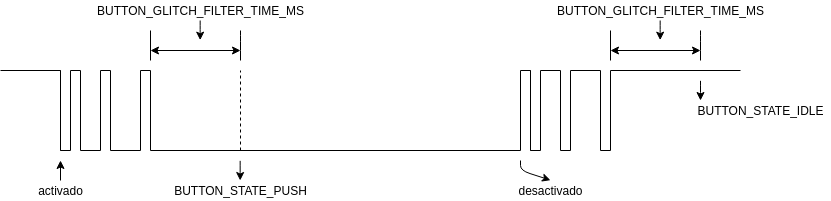

Unidad 3: drivers
===================

Sesión 1
-----------

En esta sesión haremos lo siguiente: 

* Vamos a comenzar con el análisis de la segunda parte del proyecto de curso: ``2_drivers``.

  * Ajustes para ejecutarlo.
  * Estructura del proyecto.

* Introducción a la técnica de modelado utilizando máquinas de estado.

Ejercicios
-----------

Ejercicios 1: ejercicio 6 de la unidad 2
^^^^^^^^^^^^^^^^^^^^^^^^^^^^^^^^^^^^^^^^^^^

Te dejo una posible solución al ejercicio 6 de la unidad 2 para que estudies con detenimiento:

.. code-block:: c
    :linenos:

      #include <stdio.h>
      #include "freertos/FreeRTOS.h"
      #include "freertos/task.h"
      #include "driver/gpio.h"
      #include "string.h"
      #include "esp_system.h"
      #include "esp_spi_flash.h"

      #define LED_PIN 5
      #define BUTTON_PIN 19

      void app_main(void)
      {

          uint8_t portLevel = 1;
          uint8_t mac[6];

          gpio_pad_select_gpio(LED_PIN);
          gpio_set_level(LED_PIN, portLevel);
          gpio_set_direction(LED_PIN, GPIO_MODE_OUTPUT);

          gpio_pad_select_gpio(BUTTON_PIN);
          gpio_set_direction(BUTTON_PIN, GPIO_MODE_INPUT);
          gpio_pullup_en(BUTTON_PIN);

          esp_chip_info_t chip_info;
          esp_chip_info(&chip_info);
          esp_efuse_mac_get_default(mac);

          int c;
          char message[16];
          uint8_t counter = 0; 

          while(1)
          {
              c = getchar();
              if(c != EOF)
              {
                  if( '\n' == c)
                  {
                      message[counter] = 0;
                      if ( strncmp (message, "ledOn", strlen("ledOn") ) == 0)
                      {
                          portLevel = 0;
                          gpio_set_level(LED_PIN, portLevel);
                          
                      }
                      else if( strncmp (message, "ledOff", strlen("ledOff") ) == 0 )
                      {
                          portLevel = 1;
                          gpio_set_level(LED_PIN, portLevel);
                      }
                      else if( strncmp (message, "readButton", strlen("readButton") ) == 0 )
                      {
                          printf("Button state is: %s\n", gpio_get_level(BUTTON_PIN) ? "UP" : "DOWN" );

                      }
                      else if( strncmp (message, "rev", strlen("rev") ) == 0 )
                      {
                          printf("Chip revision: %d\n", chip_info.revision);
                      }
                      else if( strncmp (message, "idf", strlen("idf") ) == 0 )
                      {
                          printf("idf version: %s\n", esp_get_idf_version());
                      }
                      else if( strncmp (message, "bt", strlen("bt") ) == 0 )
                      {
                          printf("Bluetooth support: %s\n", chip_info.features & CHIP_FEATURE_BT ? "si":"no");
                      }
                      else if( strncmp (message, "ble", strlen("ble") ) == 0 )
                      {
                          printf("BLE support: %s\n", chip_info.features & CHIP_FEATURE_BLE ? "si":"no");
                      }
                      else if( strncmp (message, "wifi", strlen("wifi") ) == 0 )
                      {
                          printf("Wifi support: %s\n", chip_info.features & CHIP_FEATURE_WIFI_BGN ? "si":"no");
                      }
                      else if( strncmp (message, "flash", strlen("flash") ) == 0 )
                      {
                          printf("flash size %dMB\n", spi_flash_get_chip_size() / (1024 * 1024)) ;
                      }
                      else if( strncmp (message, "mac", strlen("mac") ) == 0 )
                      {

                          printf("mac add: %02x:%02x:%02x:%02x:%02x:%02x\n", mac[0], mac[1],mac[2],mac[3],mac[4],mac[5]);
                      }

                      counter = 0;
                  }
                  else
                  {
                      if( counter < ( sizeof(message) - 1 ) )
                      {
                          message[counter] = c;
                          counter++;
                      }
                  }
              }
              vTaskDelay(100/portTICK_PERIOD_MS);
          }
      }

Ejercicio 2: ejercicio 3 de la unidad 2
^^^^^^^^^^^^^^^^^^^^^^^^^^^^^^^^^^^^^^^^^^^

Estudia con mucho cuidado esta solución al ejercicio 23 de la unidad 2. Aquí te presento 
a manera de introducción una técnica de modelado de software conocida como máquinas de 
estado.

La siguiente figura muestra un posible modelo de la solución al problema:

.. image:: ../_static/u2-ej23-state.png
    :scale: 75%
    :align: center
    :alt: diagrama de estados de una solución

Y una posible implementación de la máquina de estados es esta:

.. code-block:: c
    :linenos:

      #include <stdio.h>
      #include "freertos/FreeRTOS.h"
      #include "freertos/task.h"
      #include "driver/gpio.h"
      #include "string.h"
      #include "esp_system.h"
      #include "esp_spi_flash.h"

      int suma(int a, int b);
      int resta(int a, int b);
      int multi(int a, int b);
      char * readSerialString(void);

      typedef enum {
          INIT = 0,
          WAITING_OP1,
          WAITING_OP2,
          WAITING_FUNC,
      } app_state_t;

      void app_main(void)
      {
          static app_state_t appState = INIT;
          static int op1;
          static int op2;

          while(1)
          {
              switch(appState)
              {
                  case INIT: 
                  {
                      printf("Enter op1 as integer: \n");
                      appState = WAITING_OP1;
                      break;
                  }

                  case WAITING_OP1:
                  {
                      char *pString = readSerialString();
                      if(pString != NULL)
                      {
                        uint8_t status = sscanf(pString,"%d",&op1);
                        if(status == 1)
                        {
                            appState = WAITING_OP2;
                            printf("%d\n", op1);
                            printf("Enter op2 as integer: \n");
                        }
                        else
                        {
                            printf("Bad op1. Enter an int\n");
                            printf("Enter op1 as integer: \n");
                        }
                      }
                      
                      break;
                  }

                  case WAITING_OP2:
                  {
                      char *pString = readSerialString();
                      if(pString != NULL)
                      {
                        uint8_t status = sscanf(pString,"%d",&op2);
                        if(status == 1)
                        {
                            appState = WAITING_FUNC;
                            printf("%d\n", op2);
                            printf("Enter +,-,*: \n");
                        }
                        else
                        {
                            printf("Bad op2. Enter an int\n");
                            printf("Enter op2 as integer: \n");
                        }
                      }
                      
                      break;
                  }

                  case WAITING_FUNC:
                  {
                      char *pString = readSerialString();
                      if(pString != NULL)
                      {   
                        char func;
                        uint8_t status = sscanf(pString,"%c",&func);
                        if(status == 1)
                        {
                            printf("%c\n", func);

                            int (*pfunction)(int, int) = NULL;

                            if('+' == func)
                            {
                                pfunction = suma;
                            }
                            else if('-' == func)
                            {
                                pfunction = resta; 
                            }
                            else if ('*' == func)
                            {
                                pfunction = multi;
                            }

                            if(pfunction != NULL)
                            {
                                  printf("Resultado: %d %c %d = %d\n", op1,func, op2, pfunction(op1,op2));  
                                  printf("Enter op1 as integer: \n");
                                  appState = WAITING_OP1;  
                            } 
                            else 
                            {
                                  printf("Bad function\n");
                                  printf("Enter +,-,*: \n");
                            }
                        }
                      }

                      break;
                  }

                  default:
                  {
                      printf("State machine error \n");
                      break;
                  }
        
              }

              vTaskDelay(100/portTICK_PERIOD_MS);
          }
      }

      int suma(int a, int b)
      {
          return a + b;
      }

      int resta(int a, int b)
      {
          return a - b;
      }

      int multi(int a, int b)
      {
          return a*b;
      }

      char * readSerialString(void)
      {
          static char message[16];
          static uint8_t counter = 0;
          char *returnValue = NULL;

          int c = getchar();

          if (c != EOF)
          {
              if ('\n' == c)
              {
                  message[counter] = 0;
                  returnValue = message;
                  counter = 0;
              }
              else
              {
                  if (counter < (sizeof(message) - 1))
                  {
                      message[counter] = c;
                      counter++;
                  }
              }
          }
          return returnValue;
      }

Ejercicio 3: estructura de ``2_drivers``: CMakeLists.txt
^^^^^^^^^^^^^^^^^^^^^^^^^^^^^^^^^^^^^^^^^^^^^^^^^^^^^^^^^^^

Hagamos una exploración de partes del proyecto ``2_drivers``: 

* En la carpeta main se modifica el archivo CMakeLists.txt para incluir en el proceso 
  de construcción otros archivos .c 
  
  .. code-block:: bash

      set(COMPONENT_SRCS "app_main.c"
              "app_driver.c"
      )

  Ten en cuenta que la propia carpeta main es UN COMPONENTE, no olvides que una aplicación 
  para el ESP32 utilizando el esp-idf no es más que una colección de componentes con los 
  cuales se genera el ejecutable que grabaremos en la memoria del microcontrolador.

  En este caso, en el CMakeLists.txt de main estás indicando que el componente 
  tiene dos archivos .c: ``app_main.c`` y ``app_driver.c``

* ¿Cómo se transforman los archivos .c de una aplicación a un ejecutable que será almacenado 
  en la memoria del microcontrolador? Esta es una pregunta a la que podrías dedicarle un bueno rato; 
  sin embargo, te cuento rápidamente cómo es el proceso para que podamos seguir avanzando. Mira 
  con detenimiento la siguiente figura que muestra los pasos:

  .. image:: ../_static/c-build-pipe.png
      :scale: 75%
      :align: center
      :alt: flujo de compilación en c

|

  Como puedes ver, el proceso se compone de 4 pasos. Primero, el preprocesador procesa todas 
  las DIRECTIVAS. En la figura, el archivo ``archivo.c`` tiene la directiva ``#include``. Nota 
  que el preprocesador simplemente genera un nuevo archivo intermedio que contiene la información 
  de ``archivo.c`` y el contenido ``archivo2.h``. Segundo, el archivo de salida del preprocesador 
  es compilado y se genera código ensamblador, que no es más que una representación simbólica 
  del lenguaje de máquina. Tercero, el archivo se ensambla, es decir, se transforma de lenguaje 
  de máquina simbólico a lo que usualmente denominamos unos y ceros. Mira en la figura de nuevo 
  el contenido del archivo de salida de la fase de ensamblado. Observa esta línea: 

  .. code-block:: bash

      017d  mov.n a7, a1

  ``017d`` es la representación binaria de la instrucción en lenguaje ensamblador ``mov.n a7, a1``. Finalmente, 
  el cuarto paso es el enlazado. El enlazador toma TODOS los archivo ensamblados del proyecto, los combina 
  y genera el ``archivo_ejecutable`` que grabaremos en la memoria del microcontrolador.

* Volvamos al archivo ``CMakeLists.txt`` del componente ``main``. Nota las siguientes líneas:

  .. code-block:: bash

        set(JUMPSTART_BOARD "board_esp32_devkitc.h") 
        component_compile_options("-DJUMPSTART_BOARD=\"${JUMPSTART_BOARD}\"")

  ``set(JUMPSTART_BOARD "board_esp32_devkitc.h")`` crea la constante ``JUMPSTART_BOARD`` de tal manera 
  que en otras partes del archivo ``CMakeLists.txt`` podamos usar ``JUMPSTART_BOARD`` en vez de ``board_esp32_devkitc.h``.
  Observa que ``board_esp32_devkitc.h`` está en la carpeta main y contiene información específica del sistema 
  de desarrollo que estamos utilizando como los puertos del pulsador y del LED y 
  cuál es el nivel lógico que produce el pulsador al ser presionado, es decir, cuál es el nivel lógico del pulsador 
  al activarse. En mi caso el LED estará en el pin 5, el pulsador en el pin 19 y el estado activo del pulsador será 0.

  .. code-block:: c

        #define JUMPSTART_BOARD_BUTTON_GPIO          19
        #define JUMPSTART_BOARD_BUTTON_ACTIVE_LEVEL  0
        #define JUMPSTART_BOARD_OUTPUT_GPIO          5 

  Nota también la línea ``component_compile_options("-DJUMPSTART_BOARD=\"${JUMPSTART_BOARD}\"")``. Esta información 
  se la pasaremos al COMPILADOR cuando compile el componente ``main``.

  Para que entiendas mucho mejor lo anterior te voy a explicar con un ejemplo sencillo. Considera este código:

  .. code-block:: c
      :linenos:

      #include INCLUDE

      void app_main()
      {
          int c = suma(VALOR1,VALOR2);
      }
      
  Nota que no estamos indicando en el propio código qué es ``INCLUDE``, ``VALOR1`` y ``VALOR2``. Cuando compilemos 
  este programa tendremos un error. Sin embargo, es posible indicarle al compilador qué valor tendrán esas constantes. 
  Si estuviéramos llamando explícitamente al preprocesador haríamos esto:

  .. code-block:: bash

      xtensa-esp32-elf-gcc -DVALOR1=2 -DVALOR2=3 -DINCLUDE=\"archivo2.h\" -E archivo.c

  Con este comando le decimos qué valores tendrán ``INCLUDE``, ``VALOR1`` y ``VALOR2``. Una vez preprocesado el 
  archivo tendremos esto:

  .. code-block:: c
      :linenos:

      int suma(int a, int b);

      void app_main()
      {
          int c = suma(2,3);
      }

  Ten presente que al construir el código del componente no tenemos que llamar manualmente al preprocesador porque 
  al hacer ``idf.py build`` todo el proceso ocurre de manera automática por nosotros ¡HERMOSO! 
  ¿Ahora vez lo que estamos haciendo con ``component_compile_options("-DJUMPSTART_BOARD=\"${JUMPSTART_BOARD}\"")``?

* Ahora vamos para el archivo CMakeLists.txt en el directorio principal del proyecto:

  .. code-block:: bash

      # The following lines of boilerplate have to be in your project's
      # CMakeLists in this exact order for cmake to work correctly
      cmake_minimum_required(VERSION 3.5)

      set(EXTRA_COMPONENT_DIRS ${CMAKE_CURRENT_LIST_DIR}/../components)

      include($ENV{IDF_PATH}/tools/cmake/project.cmake)
      project(2_drivers)

  Nota que solo hay una novedad con respecto al proyecto de la unidad anterior: 
  ``set(EXTRA_COMPONENT_DIRS ${CMAKE_CURRENT_LIST_DIR}/../components)``. Este comando 
  permite adicionar componentes extra al proyecto. En este caso, estamos utilizando 
  el componete button que está en la carpeta ``components`` ubicada en el directorio 
  padre del directorio del proyecto.

Ejercicio 4: configuración de componentes
^^^^^^^^^^^^^^^^^^^^^^^^^^^^^^^^^^^^^^^^^^

Recuerda que una aplicación para el ESP32 basada en el esp-idf es una combinación de 
`componentes <https://docs.espressif.com/projects/esp-idf/en/stable/esp32/api-guides/build-system.html#overview>`__. En 
el proyecto de esta unidad estamos utilizando varios componentes, entre ellos el componente button. ¿Qué es un 
componente? Según Espressif, es una pieza modular de código independiente que se compila como una biblioteca 
estática y es enlazada, en el proceso de ENLACE, con otros componentes y archivos para generar el archivo ejecutable. 
¿Recuerdas la figura del ejercicio anterior donde se ven los pasos de transformación del código fuente al archivo 
ejecutable? Pues bien, en el último paso correspondiente al enlazado, 
además de los archivos ``.o`` el enlazador puede tomar también archivos ``.a``. Los archivos ``.a`` son colecciones 
de archivos ``.o`` denominados bibliotecas estáticas. Ahora, los componentes SE PUEDEN CONFIGURAR. Te muestro cómo.

Considera el siguiente código del componente button definido en ``button.c``:

.. code-block:: c
    :linenos:

    #define BUTTON_GLITCH_FILTER_TIME_MS   CONFIG_IO_GLITCH_FILTER_TIME_MS
    static const char *TAG = "button";

La constante ``#define BUTTON_GLITCH_FILTER_TIME_MS`` está definida como ``CONFIG_IO_GLITCH_FILTER_TIME_MS``; sin embargo,
¿En dónde está definida ``CONFIG_IO_GLITCH_FILTER_TIME_MS``? Esa constante se GENERA en el proceso de construcción 
del ejecutable antes de la etapa de PREPROCESADO. Esto se consigue gracias al archivo ``Kconfig`` que tienen 
aquellos componentes configurables. Por ejemplo, para el caso del componente button este es el archivo  ``Kconfig``:

.. code-block:: bash

    menu "Button"
        config IO_GLITCH_FILTER_TIME_MS
            int "IO glitch filter timer ms (10~100)"
            range 10 100
            default 50
    endmenu

Al realizar el proceso de construcción del ejecutable, las constantes definidas en los archivos ``Kconfig`` de todos 
los componentes son generadas y agrupadas en el archivo ``sdkconfig`` que queda en el directorio raíz del proyecto. 
Esto permite que el desarrollador pueda verificar la configuración de los componentes. Adicionalmente, en la carpeta ``build/config``  
se generará el archivo sdkconfig.h con las constantes ya listas para ingresar a la fase de PREPROCESADO. Para configurar 
cada componente se ejecuta el siguiente comando:

.. code-block:: bash

    idf.py menuconfig

Volviendo al componente button. Su archivo ``Kconfig`` define varios asuntos:

* ``menu "Button"``: crea una entrada para configurar el componente button con ``menuconfig``.
* ``config IO_GLITCH_FILTER_TIME_MS``: define una constante a configurar del componente.
* ``int "IO glitch filter timer ms (10~100)"``: la constante es tipo ``int`` y da una descripción.
* ``range 10 100``: los posibles valores que puede tomar la constante.
* ``default 50``: es el valor que tendrá por defecto la constante si no se configura.

Luego de realizar la operación ``idf.py menuconfig`` así quedan parte de los archivos.

``sdkconfig``:

.. code-block:: bash

    ...
    #
    # Button
    #
    CONFIG_IO_GLITCH_FILTER_TIME_MS=50
    # end of Button
    ...

``sdkconfig.h``:

.. code-block:: bash

    ...

    #define CONFIG_WIFI_PROV_AUTOSTOP_TIMEOUT 30
    #define CONFIG_WPA_MBEDTLS_CRYPTO 1
    
    #define CONFIG_IO_GLITCH_FILTER_TIME_MS 50
    
    #define CONFIG_AWS_IOT_MQTT_HOST ""
    #define CONFIG_AWS_IOT_MQTT_PORT 8883
    ...

Ejercicio 5: hardware para el proyecto
^^^^^^^^^^^^^^^^^^^^^^^^^^^^^^^^^^^^^^^^^^

En este ejercicio te pediré que revises y pruebes que el hardware funciona. ¿Qué 
necesitas para el proyecto de esta unidad? Solo un LED y un pulsador.

¿Cómo puedes probar que todo está bien conectado? Repasa la unidad anterior. Y toma nota de:

* ¿Qué valor lógico reporta el pulsador cuando lo presionas?
* ¿Qué valor lógico escribes en el puerto del LED para encenderlo?

En mi caso, la siguiente figura muestra el montaje que utilizaré para el proyecto de curso:

  .. image:: ../_static/unit3-circuit.png
      :scale: 75%
      :align: center
      :alt: montaje para el curso

Mi pulsador reporta 0 al presionarlo y el LED se enciende con 0.

Ejercicio 6: código inicial de la aplicación
^^^^^^^^^^^^^^^^^^^^^^^^^^^^^^^^^^^^^^^^^^^^^^^^^

Observa el código en ``app_main.c``:

.. code-block:: c
      :linenos:

      #include <stdio.h>
      #include <freertos/FreeRTOS.h>
      #include <freertos/task.h>
      #include "app_priv.h"

      void app_main()
      {
        int i = 0;
        app_driver_init();
        while (1) 
        {
          printf("[%d] Hello world!\n", i);
          i++;
          vTaskDelay(5000 / portTICK_PERIOD_MS);
        }
      }

Nota la línea ``#include "app_priv.h"``. Esta línea te permitirá utilizar las funciones públicas 
declaradas en ``app_priv.h``. En este caso, la aplicación solo está llamando una de ellas: 
``app_driver_init()``.

Ejercicio 7: código del driver
^^^^^^^^^^^^^^^^^^^^^^^^^^^^^^^^^^^^^^^^^^

El archivo ``app_priv.h`` tiene el API (application programming interface) del DRIVER. El driver 
es la parte de código específica de la aplicación que interactúa con los puertos de 
entrada/salida del ESP32. Como nota personal, la palabra ``priv`` en ``app_priv.h`` resulta 
infortunada porque realmente debería ser ``pub``, de pública, ya que las funciones que están allí 
son las que podemos usar desde otros archivos.

  .. code-block:: c
      :linenos:

      void app_driver_init(void);
      int app_driver_set_state(bool state);
      bool app_driver_get_state(void);
  
En el archivo ``app_priv.h`` nota la directiva del preprocesador ``#pragma once`` de la que 
puedes leer `aquí <https://en.wikipedia.org/wiki/Pragma_once>`__. Pero esa DIRECTIVA del preprocesador 
permite que en un archivo se incluya SOLO una vez la definición de las APIs.

Ahora mira ``app_driver.c``. Este archivo define la funcionalidad de las tres funciones públicas:

.. code-block:: c

    void app_driver_init()
    {
        configure_push_button(JUMPSTART_BOARD_BUTTON_GPIO, push_btn_cb);

        /* Configure output */
        gpio_config_t io_conf = {
            .mode = GPIO_MODE_OUTPUT,
            .pull_up_en = 1,
        };
        io_conf.pin_bit_mask = ((uint64_t)1 << JUMPSTART_BOARD_OUTPUT_GPIO);
        /* Configure the GPIO */
        set_output_state(true);
        gpio_config(&io_conf);
    }

    int IRAM_ATTR app_driver_set_state(bool state)
    {
        if(g_output_state != state) {
            g_output_state = state;
            set_output_state(g_output_state);
        }
        return ESP_OK;
    }

    bool app_driver_get_state(void)
    {
        return g_output_state;
    }

``app_driver.c`` tiene otras funciones PRIVADAS que no podrás llamar desde otros archivos. Estas funciones 
están marcadas con la palabra reservada STATIC:

.. code-block:: c

    static void push_btn_cb(void *arg)
    {
        app_driver_set_state(!g_output_state);
    }

    static void configure_push_button(int gpio_num, void (*btn_cb)(void *))
    {
        button_handle_t btn_handle = iot_button_create(JUMPSTART_BOARD_BUTTON_GPIO, JUMPSTART_BOARD_BUTTON_ACTIVE_LEVEL);
        if (btn_handle) {
            iot_button_set_evt_cb(btn_handle, BUTTON_CB_SERIAL, btn_cb, "RELEASE");
        }
    }

    static void set_output_state(bool target)
    {
        gpio_set_level(JUMPSTART_BOARD_OUTPUT_GPIO, target);
    }

Nota que en ``app_driver.c`` también se declara una variable GLOBAL para todas las funciones definidas 
en el archivo, pero PRIVADA para los demás archivos del proyecto, es decir, la variable solo podrá ser utilizada 
por las funciones en ``app_driver.c``. Los otros archivos solo podrás acceder a la variable a través de la función 
pública ``bool app_driver_get_state(void)``

``app_driver.c`` define una función especial: ``app_driver_set_state``. Nota el atributo ``IRAM_ATTR``.
¿Para qué sirve este atributo? sirve para generar código que permita cargar y ejecutar el código de máquina 
de esta función en la memoria RAM. Ten presente que en la mayoría de sistemas embebidos, a diferencia de un computador, 
los programas se puede ejecutar directamente desde la memoria flash, es decir, la CPU buscará directamente instrucciones 
de esa memoria para luego decodificar y finalmente ejecutarlas. ¿Cuál es la ventaja de cargar las instrucciones en la memoria 
RAM? El acceso por parte de la CPU es más rápido a la memoria RAM que a la FLASH. ¿Y por qué no cargamos entonces todo 
el código de máquina a la RAM? porque no tenemos tanta. Entonces podemos cargar solo algunas partes del código. En nuestro 
caso, cagar ``app_driver_set_state`` permitirá acelerar la ejecución de la función en el contexto de una INTERRUPCIÓN. 
Las interrupciones son un mecanismo que permite interrumpir el flujo normal de ejecución de un programa en un CPU haciendo 
que abandone temporalmente el programa y ejecute otro denominado servicio de atención a interrupción. En sistemas embebidos 
se busca que los servicios de atención a interrupción sean rápidos para poder retomar de nuevo el programa principal.

``app_driver.c`` hace uso del componente button. De nuevo, incluyendo el archivo con las definiciones 
públicas del componente: ``#include <iot_button.h>``. 

Mira la función ``app_driver_init()`` que modifiqué ligeramente para considerar las particularidades de mi hardware 
o montaje:

.. code-block:: c

    void app_driver_init()
    {
        configure_push_button(JUMPSTART_BOARD_BUTTON_GPIO, push_btn_cb);

        /* Configure output */
        gpio_config_t io_conf = {
            .mode = GPIO_MODE_OUTPUT,
        };
        io_conf.pin_bit_mask = ((uint64_t)1 << JUMPSTART_BOARD_OUTPUT_GPIO);

        /* Configure the GPIO */
        g_output_state = 1;
        set_output_state(true);
        gpio_config(&io_conf);
    }

Se hacen dos cosas:

* ``configure_push_button``: Crea e inicializa un componente button. Este componente será el encargado de controlar el funcionamiento 
  del pulsador.
* ``/* Configure output */`` y ``/* Configure the GPIO */``: configuran el pin de salida que controlará el LED y establecen el valor 
  inicial del LED en 1, es decir, APAGADO en mi hardware.

``configure_push_button`` utiliza el componente button. Para eso se incluye el archivo ``#include <iot_button.h>``:

* iot_button_create: crea el botón,
* iot_button_set_evt_cb: configura cómo se comunicará el código del componente button con el código de la aplicación. Nota que 
  al componete button le estamos diciendo que al liberar el pulsador luego de ser presionado (``BUTTON_CB_RELEASE``) se debe 
  llamar la función ``push_btn_cb`` cuya dirección fue guardamos en el puntero ``btn_cb`` al momento de llamar la función ``configure_push_button``. 
  Observa entonces que ``push_btn_cb`` simplemente cambiará de estado el LED.

  .. code-block:: c

    static void push_btn_cb(void *arg)
    {
        app_driver_set_state(!g_output_state);
    }

Ejercicio 8: código del componente button: iot_button.h
^^^^^^^^^^^^^^^^^^^^^^^^^^^^^^^^^^^^^^^^^^^^^^^^^^^^^^^^^^

Ahora si llegamos a la parte interesante de esta unidad. El análisis del componente button.

Comencemos con el archivo ``iot_button.h``. Encontrarás muy interesante este archivo por una razón. 
El componente tiene código C y C++. ¿Podemos programar en C++ el ESP32? Claro, de hecho así se hace 
cuando trabajas con el framework de arduino. ¿Lo haremos en este curso? Nop. Solo vamos a utilizar C. 
Ignora entonces la parte de C++.

* Verás que el archivo es encabezado y termina con estas líneas:  

  .. code-block:: c

      #ifndef _IOT_BUTTON_H_
      #define _IOT_BUTTON_H_
      ...
      #endif

  Esto es una versión estándar, del ``#pragma once`` que viste en ``app_priv.h``. ¿Qué quiere decir 
  estándar?  No todas las herramientas soportan la directiva ``#pragma once``, pero todas si soportan 
  una definición estándar. 

* En las siguientes líneas: 

  .. code-block:: c

      #ifdef __cplusplus
      extern "C" {
      #endif
      ...

      #ifdef __cplusplus
      }
      #endif

  El macro ``__cplusplus`` es un macro estándar predefinido. Puedes leer un poco más `aquí <https://gcc.gnu.org/onlinedocs/cpp/Standard-Predefined-Macros.html>`__. 
  Quiere decir que son constante que la propia herramienta que compila el código C/C++ definen por ti y que puedes usar en tu código.
  En este caso lo usamos para poder USAR CÓDIGO C en un proyecto C++. Nota que simplemente lo que estamos haciendo es encapsular el código 
  de C así:

  .. code-block:: c

      extern "C" {
      ...

      }

  ¿Por qué? porque los compiladores de C++ utilizan una técnica llamada `CODE MANGLING <https://en.wikipedia.org/wiki/Name_mangling>`__  
  que permite construir un nombre único para las funciones. Esto es muy útil cuando un programa tiene funciones con el mismo nombre pero diferentes 
  tipos de argumentos. El compilador de C++ le hace code mangling a cada función C++, pero no puede hacerle eso a las funciones de C. Por tanto,
  debemos informarle al compilador cuáles serán las funciones de C del programa para que no les aplique el code mangling a ellas.

  Si no utilizamos un copilador de C++ entonces no se encerrará el código de C con las líneas:

  .. code-block:: c

      extern "C" {
      ...

      }
  
* Observa ahora las funciones públicas que tienes disponibles para usar el componente. Nota que en el propio archivo 
  ``iot_button.h`` , en la parte superior de cada función te indican cómo usarla.

  Te dejo aquí una descripción corta de cada función:  

  ``iot_button_create``: crear un button en memoria. Debes especificar el valor lógico del botón cuando esté presionado.
  
  ``iot_button_set_serial_cb``: con esta función puedes indicar que se llame una de TUS FUNCIONES siempre que luego de 
  ``start_after_sec`` segundos el pulsador esté presionado. Mientras que el pulsador esté presionado se llamara cada 
  ``interval_tick`` ticks tu función de manera constante.

  ``iot_button_set_evt_cb``: te permite configurar el llamado de una de TUS FUNCIONES cuando ocurran estos eventos: el pulsador 
  se presionó, el pulsador se liberó luego de ser presionado, pulsaste y soltaste rápidamente el pulsador, es decir, un TAP.

  ``iot_button_add_on_press_cb``: te permite configurar el llamado a una tus funciones si dejas presionado el pulsador al menos ``press_sec`` segundos.

  ``iot_button_add_on_release_cb``: te permite configurar cuál de tus funciones llamará si dejas el pulsador al menos ``press_sec`` segundos y 
  luego liberas el pulsador. Puedes configurar varias funciones, pero siempre se llamará la más cercada al momento de liberar el pulsador, es decir,
  si programas una función a los 2 segundos, otra a los 5 segundos y otra a los 7 segundos y el pulsador lo liberaste a los 6 segundos, solo 
  se llamará la función programada a los 5 segundos. En el caso de ``iot_button_add_on_press_cb`` se llamarán las funciones de los 
  2 segundos y la de los 5 segundos.

  ``iot_button_delete``: destruye el componente button de la memoria.

  ``iot_button_rm_cb``: elimina una de las funciones programadas con ``iot_button_set_evt_cb``.

Ejercicio 9: funcionamiento del componente button:
^^^^^^^^^^^^^^^^^^^^^^^^^^^^^^^^^^^^^^^^^^^^^^^^^^^^^

Lo primero que se requiere para usar el componente button es crear un objeto button:

.. code-block:: c

    button_handle_t btn_handle = iot_button_create(JUMPSTART_BOARD_BUTTON_GPIO, JUMPSTART_BOARD_BUTTON_ACTIVE_LEVEL);

Nota que le pasamos el pin y el nivel lógico que genera el pulsador al presionarse.

¿Cómo funciona este componente?

La siguiente figura ilustra el funcionamiento básico:

Los flancos de bajada y subida en el pin del pulsador disparan una interrupción cuya única función es reiniciar los temporizadores 
de push o el temporizador de release. Los flancos de bajada reinician el temporizador de push y los flancos de subida el temporizador de 
release. Si alguno de los temporizadores llega a ``BUTTON_GLITCH_FILTER_TIME_MS`` ms sin reiniciarse quiere decir que la señal del pulsador 
estuvo estable por ``BUTTON_GLITCH_FILTER_TIME_MS`` ms y se procede a validar el nuevo estado del pulsador ya sea ``BUTTON_STATE_PUSH`` o 
``BUTTON_STATE_IDLE``.

Sobre este función básica se pueden programar callbacks o funciones definidas por el usuario que serán llamados cuando se detecten algunas 
condiciones particulares.

Esta función permite programar un callback al detectar un cambio al estado ``BUTTON_STATE_PUSH``. En el siguiente ejemplo la variable 
``btn_cb`` será un puntero al callback:

.. code-block:: c
        
    iot_button_set_evt_cb(btn_handle, BUTTON_CB_PUSH, gen_btn_cb, "push");    

Esta función programa un callback al detectarse un cambio al estado ``BUTTON_STATE_IDLE``:

.. code-block:: c

    iot_button_set_evt_cb(btn_handle, BUTTON_CB_RELEASE, btn_cb, "RELEASE");

Esta función programa un callback al detectarse un cambio al estado ``BUTTON_STATE_PRESSED``. En el ejemplo, luego de press_sec segundos 
después del último flanco de bajada el botón pasará al estado ``BUTTON_STATE_PRESSED``:

.. code-block:: c

    iot_button_add_on_press_cb(btn_handle, 2, press_btn_cb, "press 2");

Esta función programa un callback al detectarse un ``TAP``:

.. code-block:: c

    iot_button_set_evt_cb(btn_handle, BUTTON_CB_TAP, gen_btn_cb, "tap");

Es importante aclarar que un ``TAP`` solo es generado si el pulsador se libera sin pasar por el estado ``BUTTON_STATE_PRESSED`` 
como muestra esta figura:

Nota que el evento ``RELEASE`` también sería generado si el callback se programa. Si el botón llega al estado ``BUTTON_STATE_PRESSED``  
al liberar el botón no ocurrirá un ``TAP``:

Estas funciones programan callbacks al detectar que el botón está en el estado ``BUTTON_STATE_PRESSED`` en varios instantes de 
tiempos (2, 4 y 6 segundos):

.. code-block:: c

    iot_button_add_on_press_cb(btn_handle, 2, press_btn_cb, "on press 1");
    iot_button_add_on_press_cb(btn_handle, 4, press_btn_cb, "on press 2");
    iot_button_add_on_press_cb(btn_handle, 6, press_btn_cb, "on press 3");

La siguiente figura ilustra el funcionamiento:

Esta función programa callbacks al detectarse que el botón está presionado 3 segundos (``start_after_sec``) después de cambiar 
a ``BUTTON_STATE_PUSH`` y luego cada 1500 ms (interval_tick) mientras continúe presionado.

.. code-block:: c

    iot_button_set_serial_cb(btn_handle, 3, 1500/portTICK_PERIOD_MS, gen_btn_cb, "serial");

La siguiente figura ilustra el funcionamiento:

Finalmente, esta función reporta, al liberarse el pulsador, el último callback ``on_release``:

.. code-block:: c

    iot_button_add_on_release_cb(btn_handle, 6, rls_btn_cb, "release 6");

La siguiente figura ilustra el funcionamiento:

Ejercicio 10: código del componente button: creación 
^^^^^^^^^^^^^^^^^^^^^^^^^^^^^^^^^^^^^^^^^^^^^^^^^^^^^

Para entender el código debes tener a la mano la definición de dos objetos: ``typedef struct button_dev button_dev_t;`` y
``typedef struct btn_cb button_cb_t;``

Observa la definición de los objetos:

.. code-block:: c

    struct btn_cb {
        TickType_t interval;
        button_cb cb;
        void *arg;
        uint8_t on_press;
        TimerHandle_t tmr;
        button_dev_t *pbtn;
        button_cb_t *next_cb;
    };

    struct button_dev {
        uint8_t io_num;
        uint8_t active_level;
        uint32_t serial_thres_sec;
        uint8_t taskq_on;
        QueueHandle_t taskq;
        QueueHandle_t argq;
        button_status_t state;
        button_cb_t tap_short_cb;
        button_cb_t tap_psh_cb;
        button_cb_t tap_rls_cb;
        button_cb_t press_serial_cb;
        button_cb_t *cb_head;
    };

``button_cb_t``: objeto para configurar una función del usuario o callback. Cada objeto de este tipo tiene 
estos campos:

* ``interval``: indica en qué momento debe llamarse el callback.
* ``button_cb``: almacena la dirección en memoria del callback.
* ``arg``: almacena la dirección de memoria de los argumentos que serán pasados al callback.
* ``on_press``: si está en 1 indica que este objeto tiene un callback tipo ``on_press``.
* ``tmr``: almacena el identificador del timer utilizado para programar el callback.
* ``pbtn``: almacena la dirección del button al cual está asociado este callback.
* ``next_cb``: almacena la dirección de un nuevo callback ``on_press`` y/o ``on_release`` programado al 
  botón.

``button_dev_t``:

* ``io_num``: almacena el número del puerto donde está conectado el pulsador.
*  ``active_level``: almacena el estado lógico que produce el pulsador al ser presionado.
* ``serial_thres_sec``: almacena la cantidad de tiempo para el callback tipo ``SERIAL``.
* ``taskq_on``: si está en 1 indica que el usuario programó al menos un callback de tipo ``on_release``.
* ``taskq`` y ``argq``: almacenan la dirección del callback ``on_release`` y la dirección del argumento que será pasado al 
  callback.
* ``state``: indica el estado del pulsador: BUTTON_STATE_IDLE (reposo), BUTTON_STATE_PUSH (se presionó), BUTTON_STATE_PRESSED (se mantuvo 
  presionado).
* ``tap_short_cb``: almacena el callback de TAP.
* ``tap_psh_cb``: almacena el callback de PUSH.
* ``tap_rls_cb``: almacena el callback de RELEASE (BUTTON_STATE_IDLE).
* ``press_serial_cb``: almacena la dirección del siguiente objeto de tipo ``on_press`` y/o ``on_release``.

Analicemos ahora la función ``iot_button_create``:

.. code-block:: c

    button_handle_t iot_button_create(gpio_num_t gpio_num, button_active_t active_level)
    {
        IOT_CHECK(TAG, gpio_num < GPIO_NUM_MAX, NULL);
        button_dev_t *btn = (button_dev_t *) calloc(1, sizeof(button_dev_t));
        POINT_ASSERT(TAG, btn, NULL);
        btn->active_level = active_level;
        btn->io_num = gpio_num;
        btn->state = BUTTON_STATE_IDLE;
        btn->taskq_on = 0;
        btn->taskq = xQueueCreate(1, sizeof(void *));
        btn->argq = xQueueCreate(1, sizeof(void *));
        btn->tap_rls_cb.arg = NULL;
        btn->tap_rls_cb.cb = NULL;
        btn->tap_rls_cb.interval = BUTTON_GLITCH_FILTER_TIME_MS / portTICK_PERIOD_MS;
        btn->tap_rls_cb.pbtn = btn;
        btn->tap_rls_cb.tmr = xTimerCreate("btn_rls_tmr", btn->tap_rls_cb.interval, pdFALSE,
                                          &btn->tap_rls_cb, button_tap_rls_cb);
        btn->tap_psh_cb.arg = NULL;
        btn->tap_psh_cb.cb = NULL;
        btn->tap_psh_cb.interval = BUTTON_GLITCH_FILTER_TIME_MS / portTICK_PERIOD_MS;
        btn->tap_psh_cb.pbtn = btn;
        btn->tap_psh_cb.tmr = xTimerCreate("btn_psh_tmr", btn->tap_psh_cb.interval, pdFALSE,
                                          &btn->tap_psh_cb, button_tap_psh_cb);
        gpio_install_isr_service(0);
        gpio_config_t gpio_conf;
        gpio_conf.intr_type = GPIO_INTR_ANYEDGE;
        gpio_conf.mode = GPIO_MODE_INPUT;
        gpio_conf.pin_bit_mask = (1ULL << gpio_num);
        gpio_conf.pull_down_en = GPIO_PULLDOWN_DISABLE;
        gpio_conf.pull_up_en = GPIO_PULLUP_ENABLE;
        gpio_config(&gpio_conf);
        gpio_isr_handler_add(gpio_num, button_gpio_isr_handler, btn);
        return (button_handle_t) btn;
    }    

Nota la función ``calloc``. Esta función permite crear objetos dinámicos en el ``HEAP``. Puedes leer un poco 
más acerca del heap `aquí <https://www.geeksforgeeks.org/memory-layout-of-c-program/>`__.

Nota dos llamados al sistema que estamos utilizando ``xQueueCreate`` y ``xTimerCreate``. El primero 
sirve para crear una cola de mensajes y el segundo para crear un temporizador por software.

`Las colas de mensajes <https://www.freertos.org/a00018.html>`__, como su nombre lo indican permiten intercambiar 
información entre partes del código. Las colas son controladas directamente por el sistema operativo. En el componente 
se utilizarán dos colas. Una para almacenar la dirección del callback tipo on_release y la otra para almancear 
el argumento del callback.

Las colas siempre tendrán la dirección del último callback y el último argumento programado anterior al estado 
``BUTTON_STATE_IDLE``.

`Los temporizadores <https://www.freertos.org/FreeRTOS-Software-Timer-API-Functions.html>`__ por software permiten programar 
eventos que ocurrirán en el futuro luego de cierta 
cantidad de ticks del sistema operativo.

Para entender el API de los temporizadores por software considera la siguiente figura que te será de utilidad al 
leer el código button.c:

Finalmente, el código de creación del botón instala un servicio de atención a interrupción ``button_gpio_isr_handler`` 
que será disparado cada que el ESP32 detecte un cambio de flanco en el pin del pulsador.

Ejercicio 11: código del componente button: servicio de atención a interrupción  
^^^^^^^^^^^^^^^^^^^^^^^^^^^^^^^^^^^^^^^^^^^^^^^^^^^^^^^^^^^^^^^^^^^^^^^^^^^^^^^^^

.. code-block:: c

    static void button_gpio_isr_handler(void *arg)
    {
        button_dev_t *btn = (button_dev_t *) arg;
        portBASE_TYPE HPTaskAwoken = pdFALSE;
        int level = gpio_get_level(btn->io_num);
        if (level == btn->active_level) {
            if (btn->tap_psh_cb.tmr) {
                xTimerStopFromISR(btn->tap_psh_cb.tmr, &HPTaskAwoken);
                xTimerResetFromISR(btn->tap_psh_cb.tmr, &HPTaskAwoken);
            }

            button_cb_t *pcb = btn->cb_head;
            while (pcb != NULL) {
                if (pcb->tmr != NULL) {
                    xTimerStopFromISR(pcb->tmr, &HPTaskAwoken);
                    xTimerResetFromISR(pcb->tmr, &HPTaskAwoken);
                }
                pcb = pcb->next_cb;
            }
        } else {
            // 50ms, check if this is a real key up
            if (btn->tap_rls_cb.tmr) {
                xTimerStopFromISR(btn->tap_rls_cb.tmr, &HPTaskAwoken);
                xTimerResetFromISR(btn->tap_rls_cb.tmr, &HPTaskAwoken);
            }
        }
        if (HPTaskAwoken == pdTRUE) {
            portYIELD_FROM_ISR();
        }
    }

Como te comenté antes, la única función del servicio de atención a interrupción será reiniciar el conteo 
de los temporizadores; sin embargo, cabe destacar dos cosas:

* ``xTimerStopFromISR``: nota que las funciones en el contexto de una interrupción terminan con FromISR. 
  Esto es importante y es necesario que SIMPRE, SIEMPRE lo hagas al usar FreeRTOS.

* ``HPTaskAwoken``: esta variable se pasa a todos los llamados al sistema utilizados en el contexto 
  de un servicio de atención a interrupción. ¿Por qué? Recuerda que una aplicación en FreeRTOS puede estar compuesta 
  por varias tareas. Algunas tareas tendrán mayor prioridad que otras, por lo que FreeRTOS las privilegiará con 
  recursos de procesamiento. Mientras se está ejecutando una tarea puede ocurrir una interrupción. Lo normal es que se 
  suspenda la tarea, se ejecute la interrupción y luego se retome la tarea suspendida justo en el punto en el cual 
  fue interrumpida; sin embargo, Si al hacer un llamado al sistema operativo en el servicio de atención a
  interrupción se ACTIVA una tarea de mayor prioridad que la tarea SUSPENDIDA, al terminar de ejecutar el servicio de 
  atención a interrupción no se debería retomar en la tarea de menor prioridad sino iniciar la tarea de mayor prioridad.
  La variable ``HPTaskAwoken`` permite saber si al llamar un servicio del sistema se activó una tarea de mayor prioridad y de esta 
  manera antes de terminar el servicio de atención a interrupción se puede invocar el llamado al sistema ``portYIELD_FROM_ISR`` 
  para iniciar la tarea de mayor prioridad en vez de continuar con la tarea de menor prioridad.

Ejercicio 12: RETO 1
^^^^^^^^^^^^^^^^^^^^^^^

Con la información que te di hasta ahora te invito a 

* Analiza y estudia con detenimiento el resto de código del componente  button. 

* Luego realiza una copia al proyecto ``2_drivers`` y realiza experimentos que reproduzcan las figuras del 
  ejercicio 9. PERO TEN CUIDADO con el callback serial. NO LO HAGAS AÚN, mira el siguiente reto.

Ejercicio 13: RETO 2
^^^^^^^^^^^^^^^^^^^^^^^

Al tratar de reproducir la figura del callback serial vas a encontrar un error en el código del componente. 
¿Te animas a corregir el error y a reproducir la figura?

Ejercicio 14: SOLO PARA LOS MÁS CURIOSOS
^^^^^^^^^^^^^^^^^^^^^^^^^^^^^^^^^^^^^^^^^^

En este curso no tenemos tiempo de estudiar a fondo cada detalle del sistema operativo FreeRTOS; sin embargo, 
hay un tutorial MUY MUY bueno que pudes hacer una vez termines el curso o antes si tienes mucho tiempo libre.

El tutorial está `aquí <https://www.freertos.org/fr-content-src/uploads/2018/07/161204_Mastering_the_FreeRTOS_Real_Time_Kernel-A_Hands-On_Tutorial_Guide.pdf>`__. 

Luego de hacer el tutorial te recomiendo leer `este <https://docs.espressif.com/projects/esp-idf/en/stable/esp32/api-guides/freertos-smp.html>`__ enlace donde 
el fabricante te cuenta algunas adaptaciones que tuvo que hacerle al FreeRTOS para soportar la arquitectura multicore del ESP32. 

Sesión 2
-----------

En esta sesión vamos a resolver dudas sobre los ejercicios y escuchar aportes, 
comentarios y/o experiencias de todos.