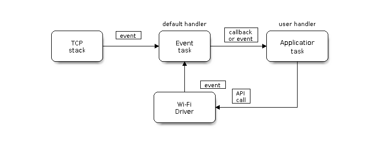
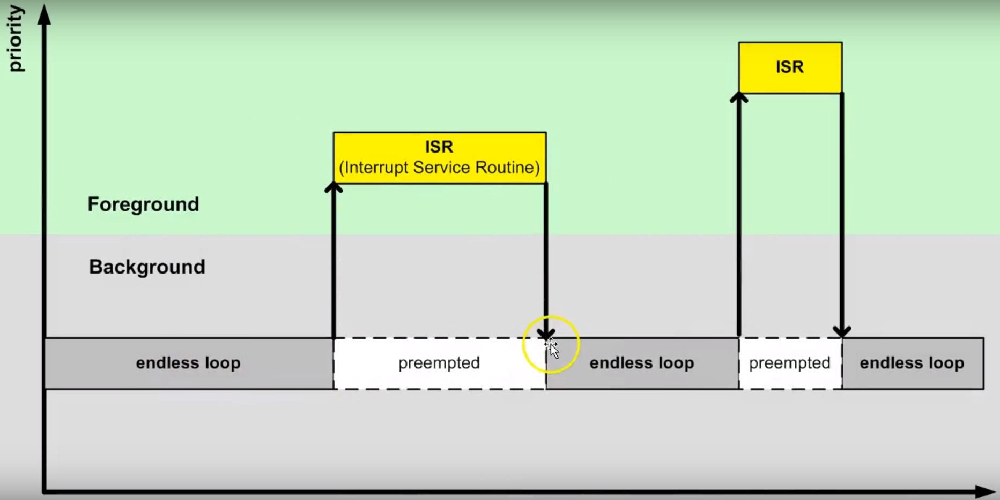
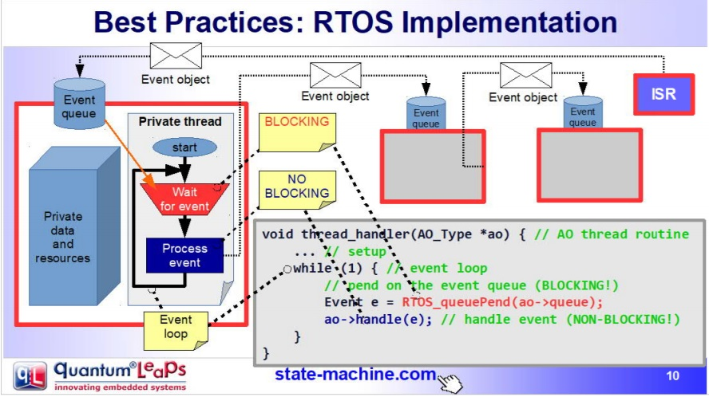
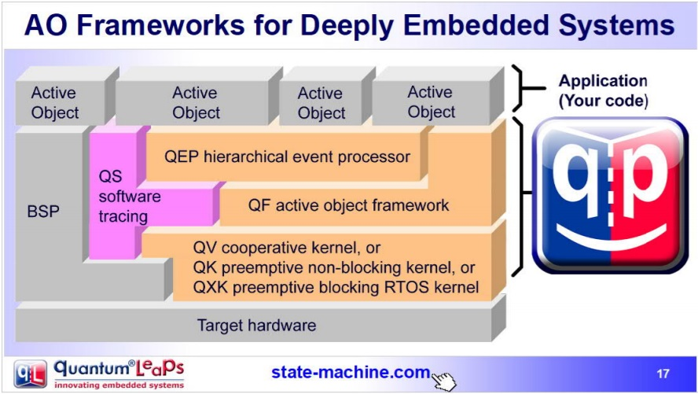
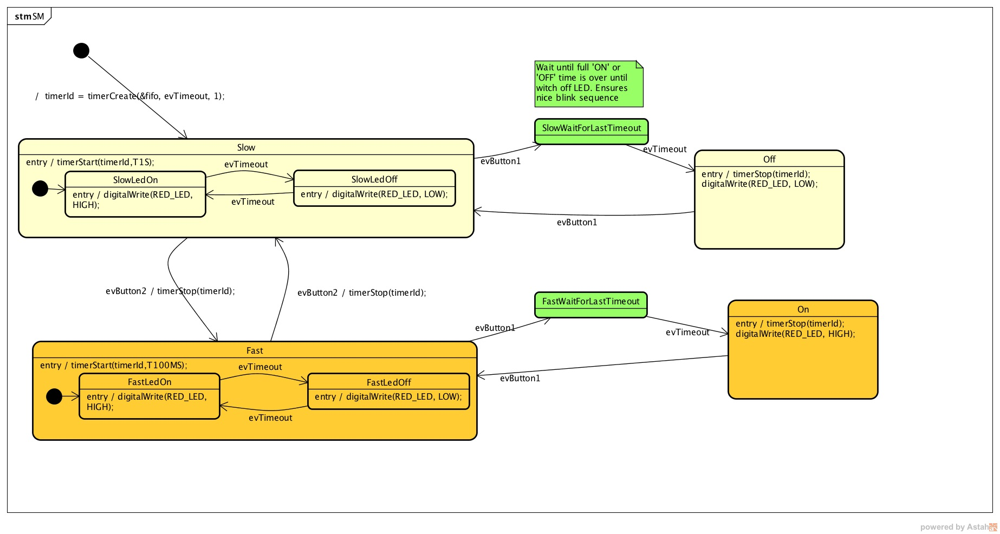

Unidad 4: conexión WiFi
======================================

Sesión 1
-----------

En esta sesión haremos lo siguiente:

Analizaremos la estructura del proyecto ``3_wifi_connection``.

Ejercicios
-----------

Ejercicios 1: introducción al proyecto
^^^^^^^^^^^^^^^^^^^^^^^^^^^^^^^^^^^^^^^^

Abre el proyecto ``3_wifi_connection``. No olvides configurar los puertos 
de entrada-salida correspondientes a tu hardware usando el archivo 
``board_esp32_devkitc.h``.

Lee la descripción de este proyecto `aquí <https://docs.espressif.com/projects/esp-jumpstart/en/latest/wifi.html>`__. 

Ejercicios 2: ejecución del proyecto
^^^^^^^^^^^^^^^^^^^^^^^^^^^^^^^^^^^^^^

Abre el archivo ``app_main.c``. Nota que ahora hay más código en este 
archivo que antes. El código modela los siguientes procesos:

* Inicia la partición NVS.
* Inicia el stack de comunicación TCP/IP.
* Inicia el event loop.
* Inicia el WiFi en modo estación.

Configura las constantes 

.. code:: c 

    #define EXAMPLE_ESP_WIFI_SSID EL_NOMBRE_DE_TU_RED_WIFI
    #define EXAMPLE_ESP_WIFI_PASS LA_CLAVE_DE_TU_RED

Ejecuta el programa y verifica que el ESP32 puede conectarse a tu red WiFi.

¿Qué dirección IP le asigna tu access point al ESP32?

Ejercicio 3: nvs
^^^^^^^^^^^^^^^^^^^^^^^^^^^

Observa de nuevo el siguiente código en ``app_main.c``:

.. code:: c 

    ...
    /* Initialize NVS partition */
    esp_err_t ret = nvs_flash_init();
    if (ret == ESP_ERR_NVS_NO_FREE_PAGES || ret == ESP_ERR_NVS_NEW_VERSION_FOUND) {
        /* NVS partition was truncated
         * and needs to be erased */
        ret = nvs_flash_erase();

        /* Retry nvs_flash_init */
        ret |= nvs_flash_init();
    }
    if (ret != ESP_OK) {
        ESP_LOGE(TAG, "Failed to init NVS");
        return;
    }
    ...

Este código llama la función ``nvs_flash_init``. ¿Para qué? Para inicializar la biblioteca 
Non-volatile storage (`NVS <https://docs.espressif.com/projects/esp-idf/en/stable/esp32/api-reference/storage/nvs_flash.html>`__). 
Este biblioteca sirve para guardar información de tipo CLAVE-VALOR en la memoria flash. Esta 
funcionalidad es utilizada por el `driver de WiFi <https://docs.espressif.com/projects/esp-idf/en/stable/esp32/api-reference/network/esp_wifi.html>`__. 

Ejercicio 4: modelo de programación del WiFi
^^^^^^^^^^^^^^^^^^^^^^^^^^^^^^^^^^^^^^^^^^^^^^

La siguiente figura, tomada de la documentación del fabricante, muestra el modelo de 
programación al usar el WiFi del ESP32:

Nota que uno de los bloques es el stack de TCP/IP. Por tanto en ``app_main.c`` 
se inicializa:

.. code:: c

    /* Initialize TCP/IP and the event loop */
    tcpip_adapter_init();

Ahora mira en el diagrama que la biblioteca produce EVENTOS. Son precisamente los eventos 
la manera con la cual la biblioteca se comunica con tu aplicación.

De regreso a ``app_main.c``, la siguiente línea de código le dice a la biblioteca 
cuál será el callback de tu aplicación que deberá llamar cuando se produzcan los eventos:

.. code:: c

    ESP_ERROR_CHECK(esp_event_loop_init(event_handler, NULL) );

Mira el callback:

.. code:: c

    static esp_err_t event_handler(void *ctx, system_event_t *event)
    {
        switch (event->event_id) {
        case SYSTEM_EVENT_STA_START:
            esp_wifi_connect();
            break;
        case SYSTEM_EVENT_STA_GOT_IP:
            ESP_LOGI(TAG, "Connected with IP Address:%s", ip4addr_ntoa(&event->event_info.got_ip.ip_info.ip));
            break;
        case SYSTEM_EVENT_STA_DISCONNECTED:
            ESP_LOGI(TAG, "Disconnected. Connecting to the AP again...\n");
            esp_wifi_connect();
            break;
        default:
            break;
        }
        return ESP_OK;
    }

Nota que en este caso solo vamos a procesar estos eventos: SYSTEM_EVENT_STA_START, 
SYSTEM_EVENT_STA_GOT_IP, SYSTEM_EVENT_STA_DISCONNECTED; sin embargo, se podrían 
recibir `otros <https://docs.espressif.com/projects/esp-idf/en/stable/esp32/api-guides/wifi.html#esp32-wi-fi-event-description>`__ 
más.

Finalmente, observa que estamos iniciando el ESP32 en modo ``Station`` para poder conectarnos 
a un ``access point`` (el que tienes en tu casa).

.. code:: c

    /* Start the station */
    wifi_init_sta();

La función inicializa el WiFi con valores por defecto (``WIFI_INIT_CONFIG_DEFAULT``)
y en modo STATION. Configura la red a la cual se conectará el ESP32 y dará la 
orden iniciar en modo STATION. De este punto en adelante, la interacción 
con la biblioteca se realizará por medio del administrador de eventos: ``event_handler``.
Una vez la biblioteca configure correctamente el driver WiFi y el modo de operación,
se llamará a ``esp_wifi_start()`` para iniciar al ESP32 en modo STATION.

.. code:: c

    static void wifi_init_sta()
    {
        wifi_init_config_t cfg = WIFI_INIT_CONFIG_DEFAULT();
        ESP_ERROR_CHECK(esp_wifi_init(&cfg));
        ESP_ERROR_CHECK(esp_wifi_set_storage(WIFI_STORAGE_RAM));
        ESP_ERROR_CHECK(esp_wifi_set_mode(WIFI_MODE_STA) );

        wifi_config_t wifi_config = {
            .sta = {
                .ssid = EXAMPLE_ESP_WIFI_SSID,
                .password = EXAMPLE_ESP_WIFI_PASS,
            },
        };
        ESP_ERROR_CHECK(esp_wifi_set_config(ESP_IF_WIFI_STA, &wifi_config) );

        ESP_ERROR_CHECK(esp_wifi_start() );

        ESP_LOGI(TAG, "connect to ap SSID:%s password:%s",
                EXAMPLE_ESP_WIFI_SSID, EXAMPLE_ESP_WIFI_PASS);
    }

Ejercicio 5: EVENTOS
^^^^^^^^^^^^^^^^^^^^^^^^^^^

En el proyecto se están manejando 3 eventos, pero hay 
`más eventos <https://docs.espressif.com/projects/esp-idf/en/latest/esp32/api-reference/system/esp_event_legacy.html?highlight=system_event_sta_start#enumerations>`__ 
para informarle a la aplicación:

* SYSTEM_EVENT_STA_START: el ESP32 ya inició en modo STATION. Y ahora si puede 
  conectarse al ACCESS POINT (AP): ``esp_wifi_connect();``
* SYSTEM_EVENT_STA_GOT_IP: el ESP32 ya se conectó a un Access Point y este le asignó una dirección 
  ip.
* SYSTEM_EVENT_STA_DISCONNECTED: indica que el ESP32 se desconectó del AP.

Ejercicio 6: reto 1
^^^^^^^^^^^^^^^^^^^^

Adicionar un evento más que informe por el puerto serial si el ESP32 ya se 
conectó al AP.

Ejercicio 7: reto 2
^^^^^^^^^^^^^^^^^^^^

* Verifica que al desconectar tu AP de la energía, el ESP32 reporta que se desconectó.
* Vuelve a energizar tu AP y ahora verifica que el ESP32 reporte que está conectado 
  de nuevo.

Ejercicio 8: profundizar un poco más en el funcionamiento
^^^^^^^^^^^^^^^^^^^^^^^^^^^^^^^^^^^^^^^^^^^^^^^^^^^^^^^^^^^

Si quieres profundizar un poco más en el funcionamiento del WiFi dale una mirada 
a `este artículo <https://medium.com/@mahavirj/esp-idf-wifi-networking-3eaebd11eb43>`__.

Te dejo también un `enlace a un blog <https://medium.com/the-esp-journal>`__ donde puedes 
mantenerte actualizo con las novedades del mundo de los ESP32.

Ejercicio 9: networking
^^^^^^^^^^^^^^^^^^^^^^^^

.. warning:: Para que hagas luego del curso

    El estudio de la programación en red (networking programming) nos daría 
    para un curso completo. Una de las ventajas que tiene el esp-idf es que podamos 
    interactuar con el stack de TCPIP usando sockets POSIX.

    Aunque está por fuera de los alcances de este curso corto, me gustaría que al 
    menos le dieras una mirada superficial a algunas partes del material 
    del curso sistemas operativos que dicto en el pregrado ingeniería de sistemas 
    de la UPB en la facultad TIC para que te des una idea de cómo se puede utilizar 
    la interfaz sockets POSIX para hacer networking. El material lo encuentras en 
    `este sitio <https://sistemasoperativos.readthedocs.io/es/v2020.20/_semana15/semana15.html>`__.

    Puedes ver en particular `esta presentación <https://sistemasoperativos.readthedocs.io/es/v2020.20/_semana15/semana15.html#ejemplo>`__ 
    donde se explica qué es un socket y `este ejemplo <https://sistemasoperativos.readthedocs.io/es/v2020.20/_semana15/semana15.html#ejemplo>`__ 
    , donde verás un servidor y un cliente TCP.

    Adicionalmente, cuando termines el curso podrás seguir explorando y aprendiendo más con los 
    ejemplos que vienen directamente con el esp-idf 
    `aquí <https://github.com/espressif/esp-idf/tree/master/examples/protocols/sockets>`__.

Ejercicio 10: RTOS-introducción
^^^^^^^^^^^^^^^^^^^^^^^^^^^^^^^^^^

Los ``RTOS`` (real time operating systems) son una evolución de la arquitectura de programación 
clásica ``background-foreground``. La idea entonces de un RTOS es ofrecernos un ambiente 
de programación con múltiples background funcionando de manera concurrente, es decir, es 
como tener un programa de arduino con múltiples ciclos ``loop()`` concurrentes.

El siguiente código muestra un ejemplo típico de una arquitectura background/foreground:

.. code-block:: c
   :lineno-start: 1

    // background code:
    
    #include <stdint.h>
    #include "bsp.h"

    int main() {
        BSP_init();
        while (1) {
            BSP_ledGreenOn();
            BSP_delay(BSP_TICKS_PER_SEC / 4U);
            BSP_ledGreenOff();
            BSP_delay(BSP_TICKS_PER_SEC * 3U / 4U);
        }
        return 0;
    }

.. code-block:: c
   :lineno-start: 1

    // foreground code: blocking version

    #include <stdint.h>  /* Standard integers. WG14/N843 C99 Standard */
    #include "bsp.h"
    #include "TM4C123GH6PM.h" /* the TM4C MCU Peripheral Access Layer (TI) */

    /* on-board LEDs */
    #define LED_BLUE  (1U << 2)

    static uint32_t volatile l_tickCtr;

    void SysTick_Handler(void) {
        ++l_tickCtr;
    }

    void BSP_init(void) {
        SYSCTL->RCGCGPIO  |= (1U << 5); /* enable Run mode for GPIOF */
        SYSCTL->GPIOHBCTL |= (1U << 5); /* enable AHB for GPIOF */
        GPIOF_AHB->DIR |= (LED_RED | LED_BLUE | LED_GREEN);
        GPIOF_AHB->DEN |= (LED_RED | LED_BLUE | LED_GREEN);
        SystemCoreClockUpdate();
        SysTick_Config(SystemCoreClock / BSP_TICKS_PER_SEC);
        __enable_irq();
    }

    uint32_t BSP_tickCtr(void) {
        uint32_t tickCtr;
        __disable_irq();
        tickCtr = l_tickCtr;
        __enable_irq();
        return tickCtr;
    }

    void BSP_delay(uint32_t ticks) {
        uint32_t start = BSP_tickCtr();
        while ((BSP_tickCtr() - start) < ticks) {
        }
    }

    void BSP_ledGreenOn(void) {
        GPIOF_AHB->DATA_Bits[LED_GREEN] = LED_GREEN;
    }

    void BSP_ledGreenOff(void) {
        GPIOF_AHB->DATA_Bits[LED_GREEN] = 0U;
    }

Es importante notar que el código anterior es bloqueante (¿Qué es eso?). La función 
``BSP_delay(BSP_TICKS_PER_SEC / 4U);`` consume todos los recursos de la CPU en espera ocupada. 
A esto también lo llamamos ``polling``. 

¿Cómo superamos la espera ocupada? Utilizando la excelente técnica de programación 
conocida como máquinas de estado:

.. code-block:: c
   :lineno-start: 1

    /* Blinky polling state machine */
    static enum {
        INITIAL,
        OFF_STATE,
        ON_STATE
    } state = INITIAL;

    // background code: non-blocking version 
    int main() {
        BSP_init();
        while (1) {
            static uint32_t start;
            switch (state) {
                case INITIAL:
                    start = BSP_tickCtr();
                    state = OFF_STATE; /* initial transition */
                    break;
                case OFF_STATE:
                    if ((BSP_tickCtr() - start) > BSP_TICKS_PER_SEC * 3U / 4U) {
                        BSP_ledGreenOn();
                        start = BSP_tickCtr();
                        state = ON_STATE; /* state transition */
                    }
                    break;
                case ON_STATE:
                    if ((BSP_tickCtr() - start) > BSP_TICKS_PER_SEC / 4U) {
                        BSP_ledGreenOff();
                        start = BSP_tickCtr();
                        state = OFF_STATE; /* state transition */
                    }
                    break;
                default:
                    //error();
                    break;
            }
        }
        //return 0;
    }

En ambos códigos, espera ocupada y máquinas de estado, la arquitectura 
background/foreground se puede entender como ilustra la figura:

El código que enciende y apaga el LED corre en el ``background``. Cuando ocurre la 
interrupción ``SysTick_Handler`` el ``background`` será ``despojado`` de la CPU de la cual 
se apropiará (``preemption``) el servicio de atención a 
la interrupción o ``ISR`` en el ``foreground``. Una vez termine la ejecución de la 
ISR, el backgound retomará justo en el punto en el cual fue ``desalojado`` (preempted). 
Nota también que la comunicación entre el background/foreground se realiza 
por medio de la variable ``l_tickCtr``. Adicionalmente, observa como la función 
BSP_tickCtr accede la variable. ¿Por qué se hace de esa manera? Para evitar las 
condiciones de carrera.

¿Qué son las condiciones de carrera?

Son condiciones que se  presentan cuando dos entidades concurrentes compiten por un recurso 
haciendo que el estado del recurso dependa de la secuencia en la cual se accede.

Ejercicio 11: RTOS al rescate
^^^^^^^^^^^^^^^^^^^^^^^^^^^^^^^

Hasta este punto hemos ilustrado dos tipos de arquitecturas ``background/foreground``, bloqueante 
(en espera ocupada) y no bloqueante (máquinas de estado). En este punto vamos a concentrarnos 
en evolucionar la versión bloqueante. Para ello, 
intentaremos crear un programa, bloqueante, que encienda y apague dos LEDs de manera 
independiente y concurrente. El siguiente código ilustra una intento de conseguir lo anterior:

.. code-block:: c 
   :lineno-start: 1

    #include <stdint.h>
    #include "bsp.h"

    int main() {
        volatile uint32_t run = 0U; 
        BSP_init();

        while (1) {
            BSP_ledGreenOn();
            BSP_delay(BSP_TICKS_PER_SEC / 4U);
            BSP_ledGreenOff();
            BSP_delay(BSP_TICKS_PER_SEC * 3U / 4U);

            BSP_ledBlueOn();
            BSP_delay(BSP_TICKS_PER_SEC / 2U);
            BSP_ledBlueOff();
            BSP_delay(BSP_TICKS_PER_SEC / 3U);

        }
    }

Al ejecutar este código claramente se observa que los LEDs no están funcionando de 
manera concurrente e independiente. Aquí es donde entran en juego los sistemas 
operativos de tiempo real. Usando un RTOS se podría escribir la aplicación 
así:

.. code-block:: c 
   :lineno-start: 1

    void main_blinky1() {
        while (1) {
            BSP_ledGreenOn();
            BSP_delay(BSP_TICKS_PER_SEC / 4U);
            BSP_ledGreenOff();
            BSP_delay(BSP_TICKS_PER_SEC * 3U / 4U);
        }
    }

    void main_blinky2() {
        while (1) {
            BSP_ledBlueOn();
            BSP_delay(BSP_TICKS_PER_SEC / 2U);
            BSP_ledBlueOff();
            BSP_delay(BSP_TICKS_PER_SEC / 3U);
        }
    }

Ejercicio 12: FreeRTOS
^^^^^^^^^^^^^^^^^^^^^^^^^^^^^^^

En el caso de FreeRTOS la abstracción que permitiría ejecutar los dos códigos 
del ejercicio anterior se denomina ``TAREA``. La estructura de una tarea en 
FreeRTOS es como muestra el siguiente código:

.. code-block:: c 
   :lineno-start: 1

    void vTaskCode( void * pvParameters )
    {
        for( ;; )
        {
            // Task code goes here.
        }
    }

Una tarea se representa en C con una función. La función NO debe retornar, 
pero puede recibir en la variable ``pvParameters`` una dirección arbitraria.

En el siguiente código te muestro cómo podrías programar dos tareas en
FreeRTOS que sean concurrentes e independientes:

.. code-block:: c 
   :lineno-start: 1

    #include <stdio.h>
    #include "freertos/FreeRTOS.h"
    #include "freertos/task.h"
    #include "esp_system.h"
    #include "esp_spi_flash.h"

    void vTask1( void *pvParameters )
    {
        const char *pcTaskName = "Task 1 is running\n";
        for( ;; )
        {
            printf( pcTaskName );
            vTaskDelay(1000/portTICK_PERIOD_MS);
        }
    }

    void vTask2( void *pvParameters )
    {
        const char *pcTaskName = "Task 2 is running\n";

        for( ;; )
        {
            printf( pcTaskName );
            vTaskDelay(1500/portTICK_PERIOD_MS);
        }
    }

    void app_main()
    {
        /* Create one of the two tasks. */
        xTaskCreate(	vTask1,		/* Pointer to the function that implements the task. */
                        "Task 1",	/* Text name for the task.  This is to facilitate debugging only. */
                        2048,		/* Stack depth - most small microcontrollers will use much less stack than this. */
                        NULL,		/* We are not using the task parameter. */
                        1,			/* This task will run at priority 1. */
                        NULL );		/* We are not using the task handle. */

        /* Create the other task in exactly the same way. */
        xTaskCreate( vTask2, "Task 2", 2048, NULL, 1, NULL ); 
    }

Ejercicio 13: FreeRTOS
^^^^^^^^^^^^^^^^^^^^^^^^^^^^^^^

En este ejercicios veremos que es posible crear tareas completamente independientes 
aunque utilicemos el mismo código. Es algo similar a definir una clase y luego 
instanciar dos objetos.

.. code-block:: c 
   :lineno-start: 1

    #include <stdio.h>
    #include "freertos/FreeRTOS.h"
    #include "freertos/task.h"
    #include "esp_system.h"
    #include "esp_spi_flash.h"

    void vTask( void *pvParameters )
    {
        const char *pcTaskName = (char * )pvParameters;
        for( ;; )
        {
            printf( pcTaskName );
            vTaskDelay(1000/portTICK_PERIOD_MS);
        }
    }

    const char *pcTextForTask1 = "Task 1 is running\n";
    const char *pcTextForTask2 = "Task 2 is running\n";    

    void app_main()
    {
        xTaskCreate(vTask, "Task 1", 2048, (void *) pcTextForTask1, 1, NULL);
        xTaskCreate( vTask, "Task 2", 2048, (void *) pcTextForTask2, 1, NULL ); 
    }

Ejercicio 14: RETO
^^^^^^^^^^^^^^^^^^^

En el ejercicio anterior ambas tareas imprimen su mensaje cada 1000 ms. ¿Qué 
tendrías que hacer para que cada tarea imprima un mensaje diferente y adicionalmente 
lo haga en intervalos de tiempo distintos?

Implementa tu solución.

Ejercicio 15: ¿Luego de los RTOS hay más?
^^^^^^^^^^^^^^^^^^^^^^^^^^^^^^^^^^^^^^^^^^^^^^

En este punto del recorrido hemos visitado diferentes maneras de desarrollar aplicaciones 
para sistemas embebidos. Desde la arquitectura ``background/foreground`` clásica, 
utilizada por Arduino, pasando por las máquinas de estado jerárquicas,
hasta los sistemas operativos de tiempo real ilustrados con FreeRTOS. Finalmente, no 
quiero dejar pasar esta oportunidad sin contarte una técnica de programación moderna de 
sistema embebidos: el patrón de diseño de ``Active Objects``.

Este patrón de diseño sirve para la construcción de software para sistemas de naturaleza 
``reactiva``. Los sistemas reactivos se caracterizan por reaccionar ante la ocurrencia de 
eventos. Por ejemplo, la llegada de un mensaje por un puerto de comunicaciones, 
la disponibilidad de un dato por parte de un sensor, timeouts, una petición HTTP por 
parte de un cliente a un servidor, etc. El software para un sistema reactivo responde a 
la ocurrencia de eventos que no tienen necesariamente un orden establecido. En contraste, 
el software construido con programación secuencial espera de manera secuencial por la ocurrencia 
de un evento específico, haciendo que, mientras espera, no responda a otros eventos.

Por ejemplo, unas líneas de código clásico Arduino: 

.. code:: cpp

    void setup() {
        pinMode(LED_BUILTIN, OUTPUT);
    }

    void loop() {
        digitalWrite(LED_BUILTIN, HIGH);  
        delay(1000);                      
        digitalWrite(LED_BUILTIN, LOW);   
        delay(1000);                     
    }

En este código de Arduino, mientras se espera por el evento de tiempo (``delay(1000)``), 
el programa no responderá a otros eventos, por ejemplo, la llegada de un nuevo dato por el 
puerto serial. Ojo, el framework de arduino si capturará el dato pero tu programa NO 
mientras está en espera ocupada en la función ``delay(1000);``. 

En esta unidad hemos visto que un sistema operativo de tiempo real permite enfrentar 
el problema anterior utilizando ``múltiples loops`` (tareas) corriendo concurrentemente 
en la misma CPU o de manera paralela en múltiples CPUs. De esta manera, 
es posible esperar por múltiples eventos en paralelo. Por ejemplo, una tarea puede esperar 
datos del puerto serial mientras que otra espera eventos de tiempo para encender y apagar un LED; 
sin embargo, los problemas comienzan cuando las tareas deben sincronizarse y comunicarse 
entre ellas. Esto produce una suerte de estado compartido y la necesidad de aplicar 
mecanismos de exclusión mutua para evitar condiciones de carrera. Los RTOS brindan mecanismos 
para lidiar con lo anterior mediante llamadas bloqueantes al sistema, tales como las colas 
de eventos y los semáforos, pero de nuevo, aparecen nuevos problemas como la inanición de 
tareas o ``thread starvation``, abrazos mortales o ``deadlocks`` e inversión de prioridad o 
``priority inversion``.

Debido a lo anterior, actualmente algunos expertos recomiendan mejores prácticas de desarrollo 
para sistemas reactivos:

* No hacer llamados bloqueantes en el código. Más bien comunicar las tareas de manera 
  asíncrona por medio de eventos.
* No compartir datos o recursos entre tareas. Mantener los recursos ``encapsulados`` en 
  cada tareas y mejor utilizar eventos para compartir información.
* Organizar las tareas como ``bombas de mensajes``: con una cola de eventos y un despachador 
  de eventos.

Al uso de estas prácticas se le conoce como ``programación guiada por eventos``. La siguiente 
figura, tomada de la presentación Modern Embedded Systems Programming: Beyond the RTOS de 
Miro Samek, ilustra cómo se podrían implementar las ideas anteriores 
utilizando un sistema operativo de tiempo real:

* Se definen objetos o estructura de datos que indica el evento específico y 
  sus parámetros.
* Cada tarea tendrá su propia cola de mensajes que almacenará los eventos anteriores.
* Las tareas ``SÓLO`` se comunicarán y sincronizarán por medio de eventos enviados a sus 
  colas. No está permitido que las tareas compartan datos o recursos.
* El envío de mensajes es asíncrono, es decir, ninguna tarea puede esperar (espera bloqueada) 
  por el procesamiento del evento.
* El código de la tarea se organiza como una ``bomba de eventos``. La tarea sólo se bloquea 
  cuando su cola está vacía, no en otra parte del código. 
* Cada evento es procesado antes de procesar el siguiente: ``run to completion``.

Entonces ¿Qué es el patrón diseño ``ACTIVE OBJECT``?

A todas las buenas prácticas anteriores y a la estrategia de implementación se le conoce 
como el patrón de Objetos Activos o patrón del Actor. Los objetos activos son objetos de 
software estrictamente encapsulados que corren sobre sus propios hilos (tarea) y se 
comunican de manerá asíncrona utilizando eventos.

Esta idea la propuso en los 70s Carl Hewitt en MIT. En los años 90s la metodología ROOM 
para el modelado de sistemas de tiempo real retomó la idea y posteriormente UML introdujo 
la noción de objetos activos. Tanto los objetos activos de ROOM como los de 
UML emplean máquinas de estado jerárquicas para especificar el comportamiento de dichos objetos.

Es posible implementar el patrón de objetos activos manualmente utilizando FreeRTOS; 
sin embargo, hay opciones MUY INTERESANTES como el ``frameworks`` 
`QP <https://www.state-machine.com>`__ de quantum leaps:

Ejercicio 16: SOLO PARA LOS MÁS CURIOSOS
^^^^^^^^^^^^^^^^^^^^^^^^^^^^^^^^^^^^^^^^^

.. warning:: Lo que verás ahora se sale completamente del alcance del curso; sin embargo, 
             la idea es darte una dulce prueba del ejercicio anterior. Si ves COMPLICADO 
             el programa, tienes razón. Usualmente el código anterior es generado
             automáticamente por una herramienta partiendo del diagrama de estados.

En base a este `ejemplo <https://github.com/sinelabore/examples/tree/master/EnergiaBlink>`__ 
(tomado del proyecto `SinelaboreRT <https://www.sinelabore.de/doku.php>`__), vamos a ilustrar 
la implementación, mediante un objeto activo, de la tarea modelada por la siguiente 
máquina de estados jerárquica:

.. code-block:: c
   :lineno-start: 1

    #include "freertos/FreeRTOS.h"
    #include "freertos/task.h"
    #include "esp_system.h"
    #include "esp_log.h"
    #include "driver/uart.h"
    #include "soc/uart_struct.h"
    #include "string.h"
    #include "freertos/queue.h"
    #include "freertos/timers.h"

    static const int RX_BUF_SIZE = 1024;

    #define TXD_PIN (GPIO_NUM_4)
    #define RXD_PIN (GPIO_NUM_5)
    #define GPIO_OUTPUT_IO_0 GPIO_NUM_18

    typedef enum{
        evTimeout = 0U,
        evButton2,
        evButton1,
        AOBLINK_NO_MSG
    }AOBLINK_EVENT_TYPE;

    /* Event names */
    const char events[] =
        "evTimeout\0evButton2\0evButton1\0NO_MSG\0";

    const unsigned short evt_idx[] = {0, 10, 20, 30};

    QueueHandle_t aoBlinkQueue;

    typedef struct
    {
        AOBLINK_EVENT_TYPE evType;
        uint8_t evData;
    } evAoBlink;

    TimerHandle_t aoTimer;

    const char *getNameByEvent(AOBLINK_EVENT_TYPE evt)
    {
        return (events + evt_idx[evt]);
    }

    void init()
    {
        const uart_config_t uart_config = {
            .baud_rate = 115200,
            .data_bits = UART_DATA_8_BITS,
            .parity = UART_PARITY_DISABLE,
            .stop_bits = UART_STOP_BITS_1,
            .flow_ctrl = UART_HW_FLOWCTRL_DISABLE};
        uart_param_config(UART_NUM_1, &uart_config);
        uart_set_pin(UART_NUM_1, TXD_PIN, RXD_PIN, UART_PIN_NO_CHANGE, UART_PIN_NO_CHANGE);
        // We won't use a buffer for sending data.
        uart_driver_install(UART_NUM_1, RX_BUF_SIZE * 2, 0, 0, NULL, 0);

        // Configure Output
        gpio_intr_disable(GPIO_OUTPUT_IO_0);
        gpio_set_level(GPIO_OUTPUT_IO_0, 0);
        gpio_pullup_dis(GPIO_OUTPUT_IO_0);
        gpio_pulldown_dis(GPIO_OUTPUT_IO_0);
        gpio_set_direction(GPIO_OUTPUT_IO_0, GPIO_MODE_OUTPUT);
    }

    static void aoTimerCallback(TimerHandle_t xTimer)
    {
        BaseType_t xStatus;
        evAoBlink ev;
        //printf("Sending timerEvent\r\n");
        ev.evType = evTimeout;
        ev.evData = 0;
        xStatus = xQueueSendToBack(aoBlinkQueue, &ev, 0);
        if (xStatus != pdPASS)
        {
            printf("aoTimerCallback couldn't send\r\n");
        }
    }

    typedef enum
    {
        Fast,
        FastLedOn,
        FastLedOff,
        Off,
        On,
        SlowWaitForLastTimeout,
        FastWaitForLastTimeout,
        Slow,
        SlowLedOn,
        SlowLedOff,
        NUM_STATES // number of states in the machine
    } States;

    int m_initialized;
    typedef struct
    {
        States stateVar;
        States stateVarSlow;
        States stateVarFast;
    } stateVarsT;

    stateVarsT stateVars;
    stateVarsT stateVarsCopy;

    static void initStateMachine(void)
    {
        BaseType_t xTimerCreatedStatus;

        if (m_initialized == 0U)
        {
            m_initialized = 1U;
            //Create copy of statevar
            stateVarsCopy = stateVars;
            // Set state vars to default states
            stateVarsCopy.stateVar = Slow;          /* set init state of top state */
            stateVarsCopy.stateVarSlow = SlowLedOn; /* set init state of Slow */
            stateVarsCopy.stateVarFast = FastLedOn; /* set init state of Fast */
            aoTimer = xTimerCreate("aoTimer", pdMS_TO_TICKS(1000UL), pdTRUE, NULL, aoTimerCallback);
            if (aoTimer != NULL)
            {
                printf("aoTimer created\r\n");
                xTimerCreatedStatus = xTimerStart(aoTimer, 0);
                if (xTimerCreatedStatus == pdPASS)
                {
                    printf("aoTimer started\r\n");
                }
            }
            gpio_set_level(GPIO_OUTPUT_IO_0, pdTRUE);
            printf("LED OFF \r\n");
            // Copy state variables back
            stateVars = stateVarsCopy;
        }
    }

    static void aoStateMachine(evAoBlink event)
    {

        int evConsumed = 0U;

        if (m_initialized == 0U)
            return;

        //Create copy of statevar
        stateVarsCopy = stateVars;

        switch (stateVars.stateVar)
        {

        case Slow:

            switch (stateVars.stateVarSlow)
            {

            case SlowLedOn:
                if (event.evType == evTimeout)
                {
                    /* Transition from SlowLedOn to SlowLedOff */
                    evConsumed = 1;

                    /* OnEntry code of state SlowLedOff */
                    gpio_set_level(GPIO_OUTPUT_IO_0, pdFALSE);
                    printf("LED OFF\r\n");
                    /* adjust state variables  */
                    stateVarsCopy.stateVarSlow = SlowLedOff;

                }
                else
                {
                    /* Intentionally left blank */
                }      /*end of event selection */
                break; /* end of case SlowLedOn  */

            case SlowLedOff:
                if (event.evType == evTimeout)
                {
                    /* Transition from SlowLedOff to SlowLedOn */
                    evConsumed = 1;

                    /* OnEntry code of state SlowLedOn */
                    gpio_set_level(GPIO_OUTPUT_IO_0, pdTRUE);
                    printf("LED ON\r\n");
                    /* adjust state variables  */
                    stateVarsCopy.stateVarSlow = SlowLedOn;
                }
                else
                {
                    /* Intentionally left blank */
                }      /*end of event selection */
                break; /* end of case SlowLedOff  */

            default:
                /* Intentionally left blank */
                break;
            } /* end switch Slow */

            /* Check if event was already processed  */
            if (evConsumed == 0)
            {

                if (event.evType == evButton1)
                {
                    /* Transition from Slow to SlowWaitForLastTimeout */
                    evConsumed = 1;

                    /* adjust state variables  */
                    stateVarsCopy.stateVar = SlowWaitForLastTimeout;
                }
                else if (event.evType == evButton2)
                {
                    /* Transition from Slow to Fast */
                    evConsumed = 1;

                    /* Action code for transition  */
                    xTimerChangePeriod(aoTimer,pdMS_TO_TICKS(100UL),0);
                    gpio_set_level(GPIO_OUTPUT_IO_0, pdTRUE);
                    printf("LED ON\r\n");
                    stateVarsCopy.stateVar = Fast;          /* Default in entry chain  */
                    stateVarsCopy.stateVarFast = FastLedOn; /* Default in entry chain  */
                }
                else
                {
                    /* Intentionally left blank */
                } /*end of event selection */
            }
            break; /* end of case Slow  */

        case Fast:

            switch (stateVars.stateVarFast)
            {

            case FastLedOn:
                if (event.evType == evTimeout)
                {
                    /* Transition from FastLedOn to FastLedOff */
                    evConsumed = 1;

                    /* OnEntry code of state FastLedOff */
                    gpio_set_level(GPIO_OUTPUT_IO_0, pdFALSE);
                    printf("LED OFF\r\n");
                    /* adjust state variables  */
                    stateVarsCopy.stateVarFast = FastLedOff;
                }
                else
                {
                    /* Intentionally left blank */
                }      /*end of event selection */
                break; /* end of case FastLedOn  */

            case FastLedOff:
                if (event.evType == evTimeout)
                {
                    /* Transition from FastLedOff to FastLedOn */
                    evConsumed = 1;

                    /* OnEntry code of state FastLedOn */
                    gpio_set_level(GPIO_OUTPUT_IO_0, pdTRUE);
                    printf("LED ON\r\n");

                    /* adjust state variables  */
                    stateVarsCopy.stateVarFast = FastLedOn;

                }
                else
                {
                    /* Intentionally left blank */
                }      /*end of event selection */
                break; /* end of case FastLedOff  */

            default:
                /* Intentionally left blank */
                break;
            } /* end switch Fast */

            /* Check if event was already processed  */
            if (evConsumed == 0)
            {

                if (event.evType == evButton1)
                {
                    /* Transition from Fast to FastWaitForLastTimeout */
                    evConsumed = 1;

                    /* adjust state variables  */
                    stateVarsCopy.stateVar = FastWaitForLastTimeout;
                }
                else if (event.evType == evButton2)
                {
                    /* Transition from Fast to Slow */
                    evConsumed = 1;

                    /* Action code for transition  */
                    xTimerChangePeriod(aoTimer,pdMS_TO_TICKS(1000UL),0);
                    gpio_set_level(GPIO_OUTPUT_IO_0, pdTRUE);
                    printf("LED ON\r\n");
                    stateVarsCopy.stateVar = Slow;          /* Default in entry chain  */
                    stateVarsCopy.stateVarSlow = SlowLedOn; /* Default in entry chain  */
                }
                else
                {
                    /* Intentionally left blank */
                } /*end of event selection */
            }
            break; /* end of case Fast  */

        case Off:
            if (event.evType == evButton1)
            {
                /* Transition from Off to Slow */
                evConsumed = 1;

                /* OnEntry code of state Slow */
                xTimerChangePeriod(aoTimer,pdMS_TO_TICKS(1000UL),0);
                gpio_set_level(GPIO_OUTPUT_IO_0, pdTRUE);
                printf("LED ON\r\n");
                stateVarsCopy.stateVar = Slow;          /* Default in entry chain  */
                stateVarsCopy.stateVarSlow = SlowLedOn; /* Default in entry chain  */
            }
            else
            {
                /* Intentionally left blank */
            }      /*end of event selection */
            break; /* end of case Off  */

        case On:
            if (event.evType == evButton1)
            {
                /* Transition from On to Fast */
                evConsumed = 1;

                /* OnEntry code of state Fast */
                xTimerChangePeriod(aoTimer,pdMS_TO_TICKS(100UL),0);
                gpio_set_level(GPIO_OUTPUT_IO_0, pdTRUE);
                printf("LED ON\r\n");
                stateVarsCopy.stateVar = Fast;          /* Default in entry chain  */
                stateVarsCopy.stateVarFast = FastLedOn; /* Default in entry chain  */
            }
            else
            {
                /* Intentionally left blank */
            }      /*end of event selection */
            break; /* end of case On  */

        case SlowWaitForLastTimeout:
            if (event.evType == evTimeout)
            {
                /* Transition from SlowWaitForLastTimeout to Off */
                evConsumed = 1;

                /* OnEntry code of state Off */
                xTimerStop(aoTimer,0);
                gpio_set_level(GPIO_OUTPUT_IO_0, pdFALSE);
                printf("LED OFF\r\n");
                /* adjust state variables  */
                stateVarsCopy.stateVar = Off;
            }
            else
            {
                /* Intentionally left blank */
            }      /*end of event selection */
            break; /* end of case SlowWaitForLastTimeout  */

        case FastWaitForLastTimeout:
            if (event.evType == evTimeout)
            {
                /* Transition from FastWaitForLastTimeout to On */
                evConsumed = 1;

                /* OnEntry code of state On */
                xTimerStop(aoTimer,0);
                gpio_set_level(GPIO_OUTPUT_IO_0, pdTRUE);
                printf("LED ON\r\n");
                /* adjust state variables  */
                stateVarsCopy.stateVar = On;
            }
            else
            {
                /* Intentionally left blank */
            }      /*end of event selection */
            break; /* end of case FastWaitForLastTimeout  */

        default:
            /* Intentionally left blank */
            break;
        } /* end switch stateVar_root */
        // Copy state variables back
        stateVars = stateVarsCopy;
    }

    static void aoBlink(void *pdata)
    {
        BaseType_t xStatus;
        evAoBlink rxEvent;

        initStateMachine();

        while (1)
        {
            xStatus = xQueueReceive(aoBlinkQueue, &rxEvent, portMAX_DELAY);
            if (xStatus == pdPASS)
            {
                printf("EV_type:%s-Data: %d\r\n", getNameByEvent(rxEvent.evType), rxEvent.evData);
                aoStateMachine(rxEvent);
            }
        }
    }

    static void serialTask(void *pdata)
    {
        evAoBlink ev;
        BaseType_t xStatus;
        uint8_t data[2];
        printf("serialTask init\r\n");
        while (1)
        {
            const uint8_t rxBytes = uart_read_bytes(UART_NUM_1, data, 1, 1000 / portTICK_RATE_MS);
            if (rxBytes > 0)
            {
                data[rxBytes] = 0;
                printf("Read: %s\r\n", data);
                ev.evType = AOBLINK_NO_MSG;
                if (data[0] == '1')
                    ev.evType = evButton1;
                if (data[0] == '2')
                    ev.evType = evButton2;
                ev.evData = 0;
                xStatus = xQueueSendToBack(aoBlinkQueue, &ev, 0);
                if (xStatus != pdPASS)
                {
                    printf("Could not send to the queue.\r\n");
                }
            }
        }
    }

    void app_main()
    {
        init();
        aoBlinkQueue = xQueueCreate(10, sizeof(evAoBlink));
        if (aoBlinkQueue != NULL)
        {
            printf("aoBlink state machine created\r\n");
            xTaskCreate(aoBlink, "aoBlink", 1024 * 2, NULL, configMAX_PRIORITIES, NULL);
            xTaskCreate(serialTask, "serialTask", 1024 * 2, NULL, configMAX_PRIORITIES - 1, NULL);
        }
        else
        {
            printf("aoBlinkQueue is not created\r\n");
        }
    }

Sesión 2
-----------

En esta sesión vamos a resolver dudas sobre los ejercicios y escuchar aportes, 
comentarios y/o experiencias de todos.
