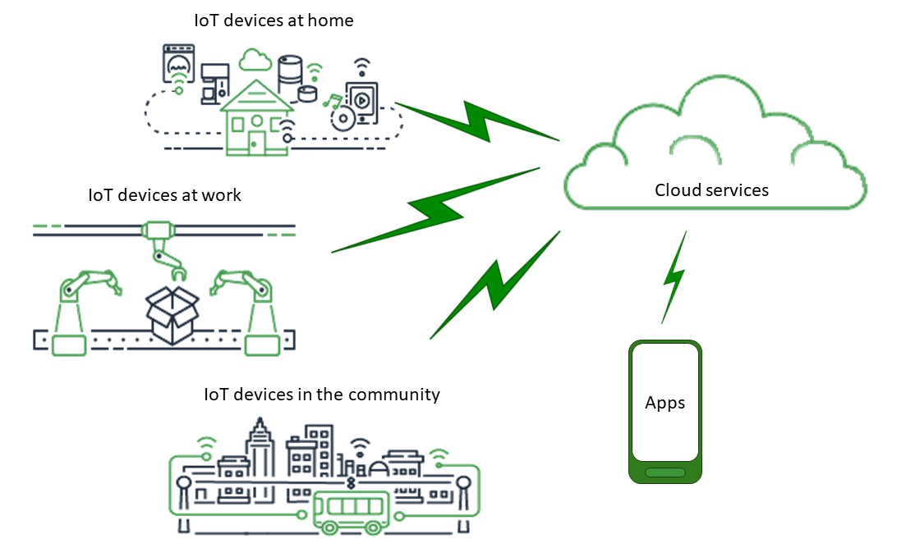
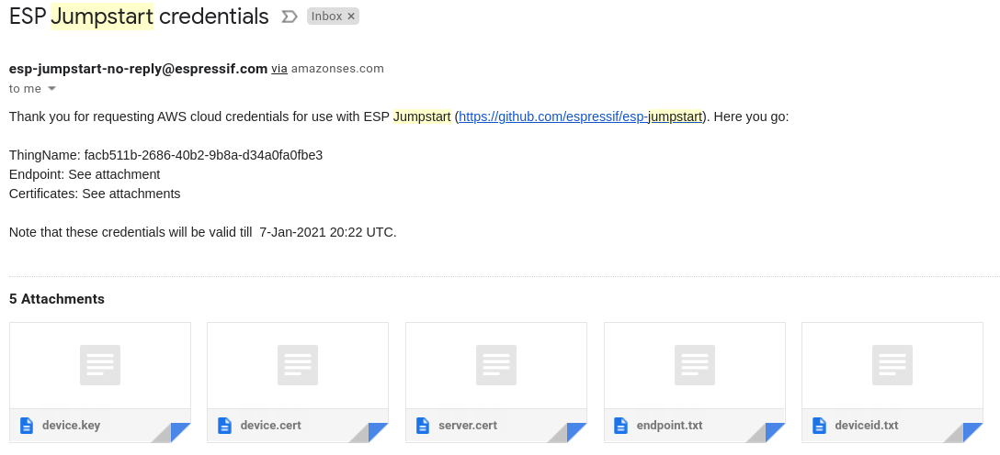
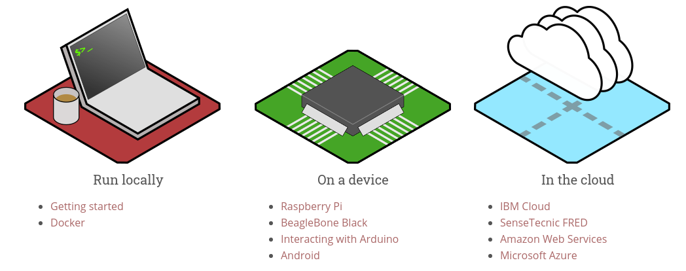
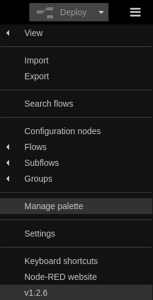
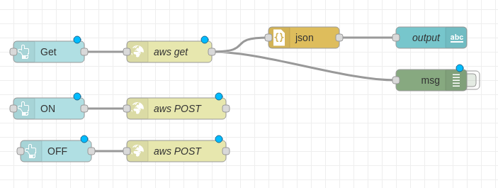
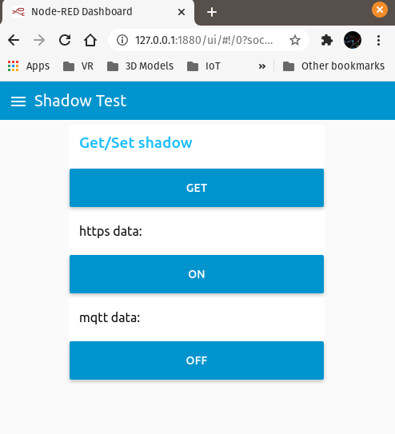
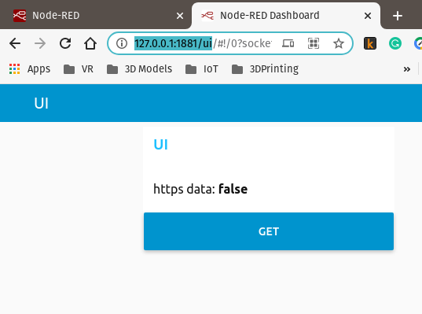
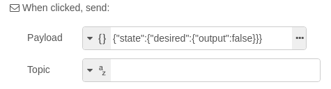
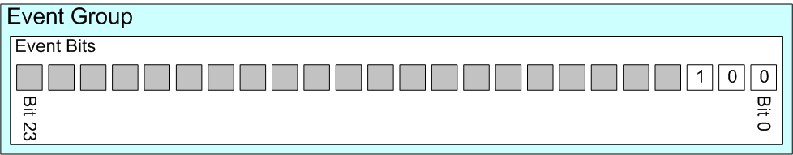

Unidad 6: nube
========================

Sesión 1
-----------

En esta sesión analizaremos la estructura del proyecto ``5_cloud``.

Ejercicios
-----------

En este proyecto vamos a conectar a la Nube el ESP32. Específicamente nos 
vamos a conectar a un servicio de Amazon conocido como AWS IoT Core.

Ejercicios 1: ¿Qué es AWS IoT Core?
^^^^^^^^^^^^^^^^^^^^^^^^^^^^^^^^^^^^^^

`AWS IoT Core <https://docs.aws.amazon.com/iot/latest/developerguide/what-is-aws-iot.html>`__ 
es un servicio de Amazon que 
permite conectar los dispositivo embebidos de una aplicación IoT a la Nube. La ventaja 
del servicio es que no es necesario configurar servidores, solo se necesita provisionar 
el dispositivo embebido con los certificados necesarios para conectarse de manera 
SEGURA al servicio.

Una vez los embebidos estén conectados al servicio podrán enviar y recibir información 
de manera robusta y segura e interactuar con otros servicios de Amazon u otros servidores 
o clientes a través de AWS IoT Core.

El propio Amazon provee una biblioteca escrita en lenguaje C denominada 
`AWS IoT Device SDK for Embedded C <https://github.com/aws/aws-iot-device-sdk-embedded-C>`__ 
para conectar el sistema embebido a AWS IoT Core.

Para integrar la biblioteca anterior a un proyecto con el ESP32 y el esp-idf tenemos 
que adaptarla. Afortunadamente Espressif ya nos hizo el trabajo y la biblioteca está 
lista para integrar como un componente más del proyecto. En 
`este <https://github.com/espressif/esp-aws-iot>`__ enlace se puede ver el código del 
componente; sin embargo, no tenemos que descargarlo porque ya lo tenemos en la carpeta de 
componentes del proyecto de curso junto al componente ``button`` que ya analizamos.

Ejercicios 2: ¿Qué protocolo se utiliza para conectar el ESP32 con IoT Core?
^^^^^^^^^^^^^^^^^^^^^^^^^^^^^^^^^^^^^^^^^^^^^^^^^^^^^^^^^^^^^^^^^^^^^^^^^^^^^^

En la siguiente figura (tomada de `aquí <https://docs.aws.amazon.com/iot/latest/developerguide/aws-iot-how-it-works.html>`__) 
se puede ver una arquitectura típica de una aplicación IoT:

En nuestro caso, el ESP32 se conectará a la Nube por medio del servicio AWS IoT Core 
utilizando el protocolo `MQTT <https://docs.aws.amazon.com/iot/latest/developerguide/mqtt.html>`__. 
De nuevo, IoT Core servirá como una PASARELA entre otros servicios de Amazon u otros 
servidores. AWS IoT Core tendrá un servidor especial conocido como ``MESSAGE BROKER`` al cual 
se conectarán otros dispositivos para ``PUBLICAR`` MENSAJES PARTICULARES o para ``SUSCRIBIRSE`` 
a un mensaje en específico. Un ESP32 podría entonces conectarse al BROKER usando MQTT para 
publicar un mensaje y/o para suscribirse a otro. 

¿Cómo se identifica un mensaje? se identifica por medio de un TÓPICO. Los tópicos 
tienen nombres. Por ejemplo: ``sensor/temperatura/maquina1``. Por tanto, podrías tener 
un ESP32 midiendo la temperatura de la máquina 1 y enviando mensajes a AWS IoT Core 
con el tópico ``sensor/temperatura/maquina1``. Ahora imagina que tienes una aplicación 
móvil para monitorear la temperatura de la máquina 1. Entonces lo que tendrá que hacer 
la aplicación es suscribirse al tópico ``sensor/temperatura/maquina1`` para recibir 
por parte del MESSAGE BROKER notificaciones cada vez que se publique una actualización 
a ese tópico.

Ejercicios 3: ¿Qué necesitas para conectar un ESP32 a AWS IoT Core?
^^^^^^^^^^^^^^^^^^^^^^^^^^^^^^^^^^^^^^^^^^^^^^^^^^^^^^^^^^^^^^^^^^^^^^^^^^^^^^

Se necesita:

* Una cuenta en Amazon.
* Habilitar el servicio AWS IoT Core en tu cuenta.
* Crear una ``Thing`` en AWS IoT Core que represente al ESP32 específico 
  que vas a conectar. 
* En AWS IoT Core cada Thing debe tener configurada una POLÍTICA que 
  indique que servicios de AWS IoT podrá usar la Thing.
* El ESP32 deberá autenticarse con AWS IoT Core utilizando un certificado de cliente 
  X.509. Por tanto, tendrás que generar ese certificado y asociarlo con la 
  Thing de ese ESP32.
* El ESP32 tendrá que enviar a AWS IoT Core toda la información encriptada, 
  por tanto, necesitarás generar una CLAVE privada que almacenarás en el ESP32.
* El ESP32 tendrá que asegurarse que si se está conectando 
  a un servidor VERDADERO de AWS IoT Core. Entonces necesitarás el certificado 
  de la autoridad certificadora que firmó el certificado del servidor.
* Amazon tiene servidores por todo el mundo, entonces tendrás que saber a cuál 
  servidor debes conectar el ESP32. A esto se le conoce como ENDPOINT.

En resumen, necesitarás: 

* El certificado del servidor o AWS CA Certificate (Certificate Authority).
* El certificado del cliente y la clave privada.
* El identificador del Thing asociado con el ESP32.
* La dirección del endpoint.

Todo esto se tendrá que guardar en el dispositivo.

Ejercicios 4: autenticación 
^^^^^^^^^^^^^^^^^^^^^^^^^^^^

En el ejercicio anterior viste que para conectarse a AWS IoT Core es necesario 
que el ESP32 autentique al servidor y a su vez el servidor tendrá que autenticar 
al ESP32.

Para profundizar más al respecto te dejo un 
`EXCELENTE enlace <https://realtimelogic.com/articles/Certificate-Management-for-Embedded-Systems>`__ 
que habla sobre este asunto específicamente para sistemas embebidos.

Ejercicios 5: ¿Debo configurar entonces una cuenta en Amazon? 
^^^^^^^^^^^^^^^^^^^^^^^^^^^^^^^^^^^^^^^^^^^^^^^^^^^^^^^^^^^^^^^

Para este curso no es necesario porque Espressif nos ayuda con todo lo anterior en su 
propia cuenta. En `esta <https://docs.espressif.com/projects/esp-jumpstart/en/latest/remotecontrol.html#quick-setup>`__ 
sección te dan un enlace para enviar un correo que te responderán con todas las credenciales 
necesarias para configurar tu dispositivo. Ten presente que estas credenciales solo 
durarán, en teoría, 14 días. Si llegan a caducar puedes solicitar unas nuevas PERO con 
otro correo.  

Como puedes ver en la figura, te deberán llegar:

* device.key : clave privada para cifrar los mensajes.
* device.cert : certificado del dispositivo para que AWS reconozca como válido
  tu dispositivo.
* server.cert : este es el certificado de CA AWS.
* endpoint.txt: dirección del servidor a la cual se debe conectar tu dispositivo
* deviceid.txt: nombre de la Thing que creo Espressif en su cuenta para 
  tu dispositivo.

Ejercicios 6: demo
^^^^^^^^^^^^^^^^^^^

Abre el proyecto ``5_cloud``. No olvides configurar los puertos de entrada-salida 
correspondientes a tu hardware usando el archivo ``board_esp32_devkitc.h``.

Guarda todos los archivos que te enviaron por correo en la carpeta ``cloud_cfg``. 
La carpeta la encuentras en el directorio main del proyecto.

Compila y ejecuta el programa. Deberás ver algo similar a esto:

.. code-block:: 

    ...
    I (1324) wifi:AP's beacon interval = 102400 us, DTIM period = 1
    I (2324) esp_netif_handlers: sta ip: 192.168.1.1, mask: 255.255.255.0, gw: 192.168.1.254
    I (2324) app_main: Connected with IP Address:192.168.1.1
    Starting cloud
    I (2324) cloud: Shadow Init
    I (2334) cloud: Connecting to AWS...
    I (4844) cloud: Update Shadow: {"state":{"reported":{"output":false}}, "clientToken":"esp32-0"}
    I (7394) cloud: Update accepted

El ESP32 se debe conectar a tu red WiFi y luego a AWS IoT.

Ejercicios 7: control remoto
^^^^^^^^^^^^^^^^^^^^^^^^^^^^^

Recuerda de nuevo la figura con la arquitectura típica de una aplicación IoT:

En este punto ya tienes conectado el dispositivo IoT a AWS IoT Core. Ahora conecta 
un cliente que te permita CONTROLAR REMOTAMENTE el dispositivo.

¿Cómo podemos conectar un cliente?

El cliente puede ser una aplicación desde un computador, el browser desde un 
dispositivo móvil, una app, etc. En este caso vas a utilizar la terminal y un cliente 
conocido como `CURL <https://curl.se/>`__. El protocolo que utilizará el cliente 
para conectarse a AWS IoT Core será `HTTPS <https://en.wikipedia.org/wiki/HTTPS>`__. La 
interacción entre el cliente y AWS IoT Core se hará mediante el llamado 
a funciones especiales en el servidor conocidas como 
`API WEB RESTful <https://en.wikipedia.org/wiki/Representational_state_transfer>`__.

Vas a necesitar entonces a CURL. Para Windows, lo puedes descargar de 
`aquí <https://curl.se/windows/>`__.

Para leer el ESTADO actual del pulsador debes ubicarte en la carpeta 
``esp-jumpstart/5_cloud/main/cloud_cfg`` y ejecutar:

.. code-block:: bash

    curl --tlsv1.2 --cert device.cert --key device.key https://TU-ENDPOINT:8443/things/TU-DEVICEID/shadow | python -mjson.tool

Ten presente:

* Debes ejecutar curl desde el directorio cloud_cfg porque allí están los archivos 
  device.cert y device.key.

* Nota que para el cliente estás usando las mismas credenciales que para el 
  ESP32. En PRODUCCIÓN, deberías tener credenciales diferentes para cada tipo 
  de cliente.

* En la dirección https debes colocar TU-ENDPOINT y TU-DEVICEID que encuentras 
  en los archivos endpoint.txt y deviceid.txt respectivamente.

Para modificar el estado del LED a ALTO ejecuta:

.. code-block:: bash

    curl -d '{"state":{"desired":{"output":true}}}' --tlsv1.2 --cert device.cert --key device.key https://TU-ENDPOINT:8443/things/TU-DEVICEID/shadow | python -mjson.tool

Para colocar un BAJO en el LED ejecuta:

.. code-block:: bash

    curl -d '{"state":{"desired":{"output":false}}}' --tlsv1.2 --cert device.cert --key device.key https://TU-ENDPOINT:8443/things/TU-DEVICEID/shadow | python -mjson.tool

Ejercicios 8: app
^^^^^^^^^^^^^^^^^^^^^

En este ejercicio te voy a proponer que hagamos algo interesante. Que tal si construimos una 
aplicación en un servidor que se conecte a AWS IoT Core y te permita interactuar con 
tu ESP32. Adicionalmente, un cliente web ya sea móvil o no que se pueda conectar al servidor 
y que interactúe, por medio del servidor, con el ESP32 utilizando una interfaz gráfica.

¿Suena complicado? No será así con la herramienta que te voy a proponer.

Para conseguir todo lo anterior vas a construir una aplicación usando 
`Node-red <https://nodered.org/>`__. En este caso el servidor donde estará la aplicación 
lo vas a desplegar en tu propio computador; sin embargo, podrías desplegarlo en otras 
plataformas como ilustra esta figura tomada de `este <https://nodered.org/>`__ sitio.

Sigue los siguientes pasos:

Ingresa a `este <https://nodered.org/docs/getting-started/local>`__ sitio si tienes Linux. 
Si tienes Windows a `este <https://nodered.org/docs/getting-started/windows>`__. Sigue 
los pasos para instalar node-red.

Lanza node-red desde la terminal con el comando ``node-red``.

Puedes ingresar al servidor mediante tu navegador web con: ``http://localhost:1880``

Observa que al lanzar node-red en la terminal verás algo así:

.. code-block:: bash

    Welcome to Node-RED
    ===================

    ...
    18 Feb 10:19:44 - [info] Settings file  : /home/juanfranco/.node-red/settings.js
    18 Feb 10:19:44 - [info] Context store  : 'default' [module=memory]
    18 Feb 10:19:44 - [info] User directory : /home/juanfranco/.node-red
    18 Feb 10:19:44 - [warn] Projects disabled : editorTheme.projects.enabled=false
    18 Feb 10:19:44 - [info] Flows file     : /home/juanfranco/.node-red/flows_pop-os.json
    18 Feb 10:19:44 - [info] Starting flows
    18 Feb 10:19:44 - [info] Started flows
    ...

Nota que el mensaje anterior te informa que flujo ejecutará node-red.
En mi caso será este ``/home/juanfranco/.node-red/flows_pop-os.json``. 
Si quieres crear o abrir un flujo en particular puedes especificar el nombre así:

.. code-block:: bash

    node-red myapp.json

Para construir la interfaz de usuario de la aplicación necesitas incluir un nodo. Ingresa 
al Manage Palette:

En la pestaña Install busca e instala el nodo ``node-red-dashboard``.

Ahora vas a crear el programa como tal. Observa la figura: 

Y se verá así cuando la lances desde tu browser

El primer flujo (get). Colocará el botón GET en la interfaz de usuario. Al presionar 
el botón se disparará el nodo AWS GET. Este nodo realizará una operación GET 
en AWS IoT Core para obtener el estado del pulsador. Dicho estado, una vez se reciba,
será mostrado en la etiqueta ``https data``.

El segundo nodo (ON), disparará un POST en AWS IoT core que encenderá el LED.

El tercer nodo (OFF), disparará un POST en AWS IoT core que apagará el LED.

Ahora vas a construir tu mismo cada flujo.

Flujo 1:

* Selecciona un nodo button (dashboard), http request (network), json (parser), 
  text (dashboard) y debug (common).
* Conecta los nodos tal como está en la figura que te mostré antes.
* Configura cada nodo así:

  .. image:: ../_static/flow1-get.png
   :alt:  flujo 1 GET
   :scale: 75%
   :align: center    

  Ten en cuenta que la propiedad Group la debes crear así:

  .. image:: ../_static/flow1-UI.gif
   :alt:  flujo 1 GET
   :scale: 75%
   :align: center

  Ahora configura el nodo http request: 

  .. image:: ../_static/flow1-Aws-get.png
   :alt:  flujo 1 GET
   :scale: 75%
   :align: center 

  Debes habilitar la opción Enable secure (SSL/TLS) connection y crear 
  una configuración de seguridad así:

  .. image:: ../_static/flow1-Aws-get-security.png
   :alt:  seguridad AWS
   :scale: 75%
   :align: center 

  El nodo json:

  .. image:: ../_static/flow1-json.png
   :alt:  json
   :scale: 75%
   :align: center 

  El nodo text:

  .. image:: ../_static/flow1-text.png
   :alt:  text
   :scale: 75%
   :align: center 

  El nodo debug:

  .. image:: ../_static/flow1-debug.png
   :alt: debug
   :scale: 75%
   :align: center 

* Dale click al botón ``DEPLOY`` para lanzar la aplicación. Verifica que no hay 
  errores. En caso contrario debes corregir los errores.
* Ingresa al sitio ``http://127.0.0.1:1880/ui`` para ver la aplicación. verás algo así:

* Si conoces la dirección IP de tu computador y deshabilitas momentánamente el firewall,
  si estás en Windows, podrás ver también la aplicación desde tu celular mediante 
  el navegador web con ``http://IP-DE-COMPUTADOR:1880/ui``. No olvides que tu celular 
  debe estar en la misma red que tu computador.

Ejercicios 9: reto
^^^^^^^^^^^^^^^^^^^^^

Construye los flujos 2 y 3. TEN PRESENTE ALGO MUY IMPORTANTE. Cuando configures 
los nodos button, debes definir el Payload con el valor apropiado para cada caso.

Mira:

Y no olvides definir también la propiedad Group, para los button, usando el mismo 
valor del button del flujo 1.

Ejercicios 10: análisis del código -  EventGroups
^^^^^^^^^^^^^^^^^^^^^^^^^^^^^^^^^^^^^^^^^^^^^^^^^^^

En esta versión del proyecto se incluye un servicio más de FreeRTOS: los grupos de 
eventos. Un grupo de eventos es una abstracción del sistema operativo que permite 
agrupar un conjunto de eventos cada uno representado por un bit dentro del grupo de 
eventos. Los grupos de eventos permiten sincronizar el funcionamiento de las tareas.

En la siguiente figura se observa cómo son almacenados los eventos en FreeRTOS en 
el esp-idf. Nota que por EventGroup puedes tener hasta 24 eventos de los cuales,
en este ejemplo, solo se están usando 3.

En el archivo ``app_main.c`` se usa un grupo de eventos para esperar que el ESP32 
esté conectado a un AP y con dirección IP antes llamar a la función ``cloud_start()`` 
que permitirá conectarse a AWS IoT Core:

.. code-block:: c

    ...
    #include <freertos/event_groups.h>
    ...

    /* Signal Wi-Fi events on this event-group */
    const int WIFI_CONNECTED_EVENT = BIT0;
    static EventGroupHandle_t wifi_event_group;

    static esp_err_t event_handler(void *ctx, system_event_t *event)
    {
        ...
        case SYSTEM_EVENT_STA_GOT_IP:
        ...
            xEventGroupSetBits(wifi_event_group, WIFI_CONNECTED_EVENT);
        ...
    }

    void app_main()
    {
        ...
        wifi_event_group = xEventGroupCreate();
        ...
        /* Wait for Wi-Fi connection */
        xEventGroupWaitBits(wifi_event_group, WIFI_CONNECTED_EVENT, false, true, portMAX_DELAY);
        cloud_start();
    }

Se debe declarar una variable para almacenar el manejador del 
`EventGroup <https://www.freertos.org/FreeRTOS-Event-Groups.html>`__ 
de tal manera que puedas referirte a ese EventGroup específico en tu código: 
``static EventGroupHandle_t wifi_event_group;``

Se debe `crear el EventGroup <https://www.freertos.org/xEventGroupCreate.html>`__:  
``wifi_event_group = xEventGroupCreate();``

En la función app_main el programa se bloquea hasta que el evento WIFI_CONNECTED_EVENT 
no se de. Nota que el evento será señalizado una vez se obtenga la dirección IP por parte 
del Access Point al cual se conecte el ESP32: ``xEventGroupSetBits(wifi_event_group, WIFI_CONNECTED_EVENT);``

Para `esperar <https://www.freertos.org/xEventGroupWaitBits.html>`__ por la 
señalización del evento se usa: 
``xEventGroupWaitBits(wifi_event_group, WIFI_CONNECTED_EVENT, false, true, portMAX_DELAY);``

En este caso la aplicación espera indefinidamente (portMAX_DELAY) a que se active 
el evento WIFI_CONNECTED_EVENT en el EventGroup wifi_event_group.

Ejercicios 11: análisis del código - Cloud Task
^^^^^^^^^^^^^^^^^^^^^^^^^^^^^^^^^^^^^^^^^^^^^^^^^^^

Luego de esperar por el evento WIFI_CONNECTED_EVENT, se crea la tarea ``aws_iot_task`` 
definida en el archivo ``cloud_aws.c``. Esta tarea tiene por propósito conectarse 
a AWS usando MQTT para reportar cambios en el LED producidos localmente o responder 
a solicitudes de cambio del LED realizadas remotamente.

AWS representa el estado del LED en una abstracción denominada ``SHADOW``. Un 
shadow permite que las apps o servicios remotos tengan acceso al último estado 
del LED reportado por el ESP32 (REPORTED). Así mismo, por medio del shadow las apps remotas
puede indicar el estado deseado para el LED. De esta manera, cuando el dispositivo 
IoT se conecte a AWS por MQTT, este le informará la solicitud realizada por la app (DESIRED) 
y de esta manera el ESP32 podrá hacer el cambio en el estado del LED y REPORTAR ese 
cambio.

Las solicitudes a AWS se deben hacer por medio de un 
`documento en formato JSON <https://docs.aws.amazon.com/iot/latest/developerguide/device-shadow-document.html>`__ 
que tiene la siguiente estructura:

.. code-block:: javascript 

    {
        "state": {
            "desired": {
                "attribute1": integer2,
                "attribute2": "string2",
                ...
                "attributeN": boolean2
            },
            "reported": {
                "attribute1": integer1,
                "attribute2": "string1",
                ...
                "attributeN": boolean1
            }
        },
        "clientToken": "token",
        "version": version
    }

El siguiente código muestra una versión simplificada de la tarea aws_iot_task. Nota 
que hay un comentario al inicio de cada BLOQUE de código:

.. code-block:: c 

    void aws_iot_task(void *param)
    {
        ...
        // (1) Inicia un shadow 
        rc = aws_iot_shadow_init(&mqttClient, &sp);
        ...

        // (2) se queda intentando conectar a AWS IoT
        do {
            rc = aws_iot_shadow_connect(&mqttClient, &scp);
            if(SUCCESS != rc) {
                ESP_LOGE(TAG, "Error(%d) connecting to %s:%d", rc, sp.pHost, sp.port);
                vTaskDelay(1000 / portTICK_RATE_MS);
            }
        } while (SUCCESS != rc);

        ...

        // (3) Crea la información para el JSON Document 
        output_state = app_driver_get_state();
        jsonStruct_t output_handler;
        output_handler.cb = output_state_change_callback;
        output_handler.pData = &output_state;
        output_handler.dataLength = sizeof(output_state);
        output_handler.pKey = "output";
        output_handler.type = SHADOW_JSON_BOOL;
        
        // (4) Registra un callback llamado output_state_change_callback
        // que se activará cada que el shadow del ESP32 lo cambie 
        // una app externa.
        
        rc = aws_iot_shadow_register_delta(&mqttClient, &output_handler);
        ...

        // (5) Reporta el estado inicial del LED

        size_t desired_count = 0, reported_count = 0;
        reported_handles[reported_count++] = &output_handler;
        rc = shadow_update(&mqttClient, reported_handles, reported_count, desired_handles,  desired_count);
        reported_state = output_state;

        // (6) Mantiene viva la conexión y actualiza 
        // el estado del LED en su shadow en Amazon
        // Si LOCALMENTE se solicita un cambio en el estado 
        // se reportará que el nuevo estado del LED y también 
        // que localmente se quería cambiar.

        while (NETWORK_ATTEMPTING_RECONNECT == rc || NETWORK_RECONNECTED == rc || SUCCESS == rc) {

            ...

            output_state = app_driver_get_state();
            if  (reported_state != output_state) {
                reported_handles[reported_count++] = &output_handler;
                if (output_changed_locally == true) {
                    desired_handles[desired_count++] = &output_handler;
                }
                output_changed_locally = true;
                reported_state = output_state;
            }

            if (reported_count > 0 || desired_count > 0) {
                rc = shadow_update(&mqttClient, reported_handles, reported_count, desired_handles,  desired_count);
            }

            vTaskDelay(1000 / portTICK_RATE_MS);
        }
        ...
    }

Sesión 2
-----------

En esta sesión vamos a resolver dudas sobre los ejercicios y escuchar aportes, 
comentarios y/o experiencias de todos.